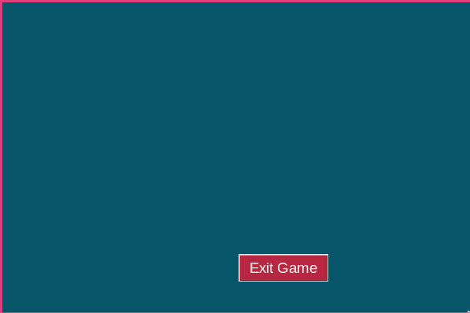
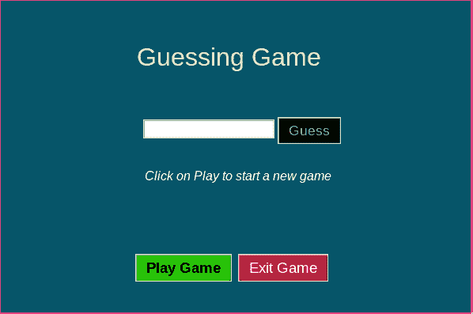
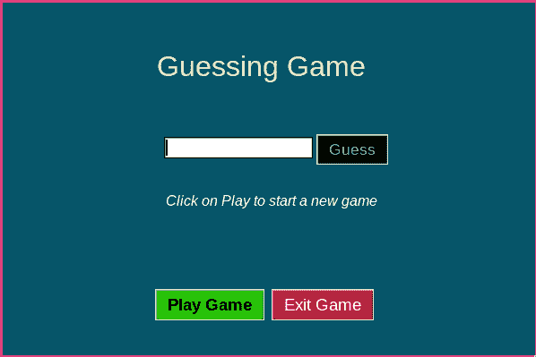
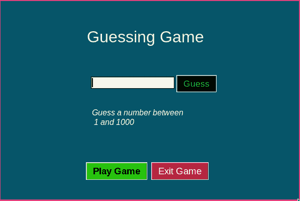
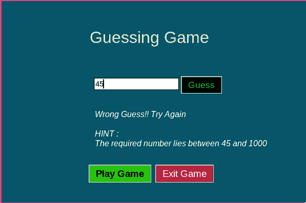
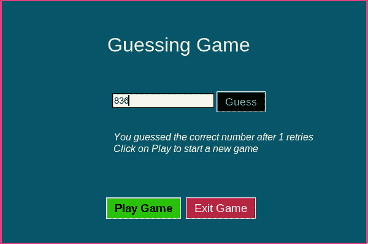

# 用 Python 创建猜数字游戏 GUI:第 2 部分

> 原文：<https://www.askpython.com/python/examples/number-guessing-game-gui>

这是教程的第二部分——用 Python 创建猜数字游戏 GUI。在[的第一部分](https://www.askpython.com/python/examples/number-guessing-game-command-line)中，我们已经看到了如何在命令行界面中实现猜谜游戏。在本教程中，我们将通过制作一个可以与用户互动的图形用户界面应用程序，将它推向一个新的高度。

如果你还没有阅读前一篇文章，我建议你先阅读，因为它解释了游戏的逻辑和主要源代码实现。

## 猜数字游戏图形用户界面的设计

Python 为 GUI 提供了一个名为 Tkinter 的库。Tkinter 是相对轻量级的，为我们的 python 环境提供了许多基本的 3-D 交互元素。因此，在本教程中，我们将使用 Tkinter。读者应该对 Tkinter 有初级的理解。

因此，让我们为我们今天设计的应用程序绘制一个 GUI 草图。以下是 GUI 的基本布局:

*   将会有显示游戏名称的标题。
*   将有一个输入表单元素来接收数字
*   一键开始游戏
*   一键关闭 GUI。

这些列出的要点大部分都很直观，但是这种编码前的设计是一种很好的实践，有助于避免将来的混淆和误解。

## 导入库

我们导入必要的库。我们之前讨论的 Tkinter 将用于 GUI 创建，random 模块用于生成随机数。

```py
import tkinter as tk
import random

```

## 创建空白窗口

首先，我们创建一个空白窗口，它有我们选择的背景，里面没有文本或交互元素。

```py
import tkinter as tk
import random

# Create a new window
window = tk.Tk()

# Set the dimensions of the created window
window.geometry("600x400")

# Set the background color of the window
window.config(bg="#065569")

window.resizable(width=False,height=False)

# Set Window Title
window.title('Number Guessing Game')

# The code for the buttons and text and other 
# interactive UI elements go here 

# Start the window
window.mainloop()

```


Fig 1: A Blank Window like this will appear. If the window does not appear, it is a good time to check if your tkinter installation in done properly.

这是基本的草稿栏。在接下来的步骤中，我们将在该窗口中添加元素。您现在需要强制关闭窗口，因为没有关闭按钮。因此，我们的首要任务是获得一个退出按钮，它可以优雅地关闭应用程序

## 添加退出按钮

要添加一个按钮，我们使用` tkinter.Button()`函数。

```py
# Create exit Button
# We can customize the background(bg) and foreground(fg) color
# Here we have chosen bg to be Red for visual aesthetic

exit_button = tk.Button(window,text="Exit Game",font=("Arial",14), fg="White", bg="#b82741", command=exit)

# Place the exit button at a suitable place
exit_button.place(x=300,y=320)

```



Fig 2: A basic window with close functionality

注意:现在我们有了一个基本的工作退出按钮，我们可以添加其余的元素，并在不强制关闭窗口的情况下重新定位它们。

## 添加其余的数字猜测游戏图形用户界面

### 创建标签

我们需要两个标签来申请。第一个用于游戏标签，另一个用于显示结果和提示。

```py
# Heading of our game
title = tk.Label(window,text="Guessing Game",font=("Arial",24),fg="#fffcbd",bg="#065569")

# Result and hints of our game
result = tk.Label(window, text="Click on Play to start a new game", font=("Arial", 12, "normal", "italic"),fg = "White", bg="#065569", justify=tk.LEFT)

# Display labels
title.place(x=170, y=50)
result.place(x=180, y=210)

```

### 添加按钮

我们需要 3 个按钮——`Play Game`、`Guess`和`Exit`按钮。为了我们的可用性，我们已经实现了`Exit`按钮。

```py
# The play button

play_button = tk.Button(window, text="Play Game", font=("Arial", 14, "bold"), fg = "Black", bg="#29c70a")

# The guess button
# This button initially disabled because we don't want the user to guess a number before the game has started

guess_button = tk.Button(window,text="Guess",font=("Arial",13), state='disabled', fg="#13d675",bg="Black")

# Place the buttons in the window
guess_button.place(x=350, y=147) 
play_button.place(x=170, y=320)

```

*注意:按钮通常与点击按钮时执行的命令相关联。与按钮相关的命令将在下一节讨论。*

### 创建表单/输入字段

最后，我们需要一个输入字段来接收用户输入的数字。我们还需要一个变量来存储表单中输入的值。

```py
# The object that stores the value in the entry field
guessed_number = tk.StringVar()

# Create entry field and attach it the guessed_number object that stores the value
number_form = tk.Entry(window,font=("Arial",11),textvariable=guessed_number)

# Place it in the window
number_form.place(x=180, y=150)

```



Fig 3: The complete GUI Screen

### 实现逻辑

在我们做好用户界面之后。是时候回顾一下我们的游戏逻辑了。我们需要定义当我们按下猜测和播放按钮时会发生什么。因此，我们在应用程序中定义了与这两个按钮相关联的函数。

首先，我们将使用两个全局变量`TARGET`和`RETRIES`来存储目标人数和退休人数，我们将设置它们的初始值。

```py
TARGET = 1.
RETRIES = 0

```

现在我们定义一个相应更新`result`标签的函数。

```py
def update_result(text):
    result.configure(text=text)

```

我们现在已经准备好定义`Play`和`Guess`按钮的功能。

播放按钮应该用正确的值重新初始化[全局变量](https://www.askpython.com/python/built-in-methods/python-globals)，并将`Guess`按钮设置为正常，这样用户可以通过按下该按钮来注册他们的输入。

```py
def new_game():
    # Change the state of guess button
    guess_button.config(state='normal')

    # Mention to use global variables
    global TARGET, RETRIES

    # Create a new target
    TARGET = random.randint(0, 1000)
    # Reset number of retires to 0
    RETRIES = 0
    update_result(text="Guess a number between\n 1 and 1000")

```

`Guess`按钮读取输入表单中的输入，并给出相应的结果和提示。如果用户给出正确的结果，猜测按钮的状态再次被设置为`disabled`，从而迫使用户开始新的游戏或退出应用程序，而不是猜测已经结束的游戏。

```py
def play_game():
    global RETRIES

    choice = int(number_form.get())

    if choice != TARGET:

        RETRIES += 1

        result = "Wrong Guess!! Try Again"
        if TARGET < choice:
            hint = "The required number lies between 0 and {}".format(result)
        else:
            hint = "The required number lies between {} and 1000".format(choice)
        result += "\n\nHINT :\n" + hint

    else:
        result = "You guessed the correct number after {} retries".format(RETRIES)
        # Set the state to disabled again
        guess_button.configure(state='disabled')
        result += "\n" + "Click on Play to start a new game"

    update_result(result)

```

### 添加按钮命令

最后，我们需要给每个按钮分配命令。我们需要将`command`变量附加到函数调用的末尾。新的按钮定义如下所示

```py
# Play Button
play_button = tk.Button(window, text="Play Game", font=("Arial", 14, "bold"), fg = "Black", bg="#29c70a", command=new_game)

# Guess Button
guess_button = tk.Button(window,text="Guess",font=("Arial",13), state='disabled', fg="#13d675",bg="Black", command=play_game)

```

### 最终代码

这是应用程序的最后一块代码。

```py
import tkinter as tk
import random

# Create a new window
window = tk.Tk()

# Set the dimensions of the created window
window.geometry("600x400")

# Set the background color of the window
window.config(bg="#065569")

window.resizable(width=False,height=False)

# Set Window Title
window.title('Number Guessing Game')

# The code for the buttons and text and other 
# interactive UI elements go here 

TARGET = random.randint(0, 1000)
RETRIES = 0

def upate_result(text):
    result.configure(text=text)

# Create a new game
def new_game():
    guess_button.config(state='normal')
    global TARGET, RETRIES
    TARGET = random.randint(0, 1000)
    RETRIES = 0
    update_result(text="Guess a number between\n 1 and 1000")

# Continue the ongoing game or end it
def play_game():
    global RETRIES

    choice = int(number_form.get())

    if choice != TARGET:
        RETRIES += 1

        result = "Wrong Guess!! Try Again"
        if TARGET < choice:
            hint = "The required number lies between 0 and {}".format(result)
        else:
            hint = "The required number lies between {} and 1000".format(choice)
        result += "\n\nHINT :\n" + hint

    else:
        result = "You guessed the correct number after {} retries".format(RETRIES)
        guess_button.configure(state='disabled')
        result += "\n" + "Click on Play to start a new game"

    update_result(result)

# Heading of our game
title = tk.Label(window,text="Guessing Game",font=("Arial",24),fg="#fffcbd",bg="#065569")

# Result and hints of our game
result = tk.Label(window, text="Click on Play to start a new game", font=("Arial", 12, "normal", "italic"),fg = "White", bg="#065569", justify=tk.LEFT)

# Play Button
play_button = tk.Button(window, text="Play Game", font=("Arial", 14, "bold"), fg = "Black", bg="#29c70a", command=new_game)

# Guess Button
guess_button = tk.Button(window,text="Guess",font=("Arial",13), state='disabled', fg="#13d675",bg="Black", command=play_game)

# Exit Button
exit_button = tk.Button(window,text="Exit Game",font=("Arial",14), fg="White", bg="#b82741", command=exit)

# Entry Fields
guessed_number = tk.StringVar()
number_form = tk.Entry(window,font=("Arial",11),textvariable=guessed_number)

# Place the labels

title.place(x=170, y=50)
result.place(x=180, y=210)

# Place the buttons
exit_button.place(x=300,y=320)
guess_button.place(x=350, y=147) 
play_button.place(x=170, y=320)

# Place the entry field
number_form.place(x=180, y=150)

# Start the window
window.mainloop()

```

这是我们游戏的图形用户界面的一些例子。

### 游戏的开始实例



Fig 4: This is how the opening window looks. Notice how the Guess is darkened indicating that it has been disabled.

### 用户开始游戏时的 UI 实例



Fig 5: The user has started a fresh game and the Guess button is now working. The user can now register his/her guess

### 用户猜错时的 UI 实例



Fig 6: User guessed the number wrong. So the application prompts that it is a wrong guess and gives an interesting hint.

### 用户猜对数字时的 UI 实例



Fig 7: User has guess correctly using only 1 retry. Great!!!

### 结论

关于随机猜谜游戏的 2 部分教程到此结束。我鼓励你调整用户界面，使它更适合你的颜色和用户界面偏好。请继续关注更多这样的 python 文章。