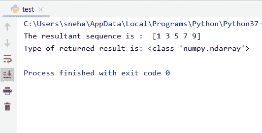
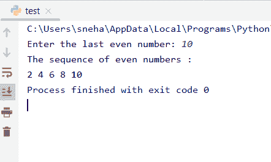

# Python 中的 NumPy arange()方法

> 原文：<https://www.askpython.com/python-modules/numpy/numpy-arange-method-in-python>

## 介绍

在本教程中，我们将讨论 Python 中的 Numpy `arange()`方法。NumPy 是 **Python** 中一个非常受欢迎的模块，主要是因为其更快的性能和代码可靠性而被用户使用。它提供了一种用 Python 编程的矢量化方法，甚至使代码更加简洁易读。

* * *

## Numpy arange()方法基础

基本上，Python 中 NumPy 模块中的`arange()`方法用于根据预设的**开始**和**结束**点以及恒定的**步长生成线性数列。**

**语法，**

```py
import numpy as np
np.arange( start , stop , step ,dtype=nome)

```

这里，

*   `start`是未来生成序列的起点。序列从这个数字开始，
*   `stop`是序列生成的上限。注意，停止是**而不是**包含在序列本身中，只考虑它之前的数字
*   `step`是统一的步长。默认情况下，如果没有任何东西作为步骤传递，解释器会将步骤视为等于一(1)。记住，步长必须是某个**非零**值，否则会出现`ZeroDivisionError`。
*   `dtype`是生成的**n 数组**元素的类型。默认情况下，它从方法内部提供的参数推断类型。dtype 可以是 **none、int** 或 **float** 等。

### Numpy arange()示例

让我们通过一个例子来理解 Numpy `arange()`方法的工作原理:

```py
import numpy as np

#passing start=1, stop=10, and step=2 and dtype=int
res=np.arange(1,10,2,int)

#printing the result
print("The resultant sequence is : ",res)
#analysing the type of the result
print("Type of returned result is:",type(res))

```

**输出**:



Np Arange Example

这里，

*   我们最初将 **NumPy** 模块导入为`np`以供进一步参考。
*   然后，我们使用`arange()`方法，将相应的**开始**、**停止**、**步骤**和**类型**参数作为 1、10、2 和 int 传递，生成一个由 1 到 9 的整数组成的数组，步骤=2。
*   当我们打印结果序列以及返回对象的`type()`时，结果是该对象是`ndarray`类的成员。

* * *

## 在 Python 中使用 Numpy arange()

**arange()** 方法有四个参数 start、stop、step 和 dtype，正如我们在上一节中看到的。现在我们要看看如何以各种方式使用这个方法，以及它如何适用于所有情况。

* * *

### 1.使用带有一个参数的 arange()

当我们只将一个参数传递给 Numpy arange()方法时，默认情况下，它认为该值是 **stop** 参数。看一下下面提到的代码示例，

```py
import numpy as np

#passing only one parameter to the arange() method
res=np.arange(5)

#printing the result
print("The resultant sequence with one argument : ",res)
#analysing the type of the result
print("Type of returned result is:",type(res))

```

**输出:**

```py
The resultant sequence with one argument :  [0 1 2 3 4]
Type of returned result is: <class 'numpy.ndarray'>

```

这里，

*   正如我们前面提到的，我们最初将`numpy`模块作为 np 导入，
*   之后，我们尝试生成一个序列并存储在`res`中，只有一个参数，那就是' **5** '，
*   我们观察到程序将传递的值视为停止点或终点。并创建一个值为`[0 1 2 3 4]`的数组，
*   我们再次确认结果的类型()为 ndarray。

* * *

### 2.无步骤使用 Numpy arange()

当**步骤**参数没有传递给 Python 中的`arange()`方法时，默认情况下它认为它有一个值 **1** 。让我们看一个例子，

```py
import numpy as np

#passing start=5 and stop=8 to arange()
res=np.arange(5,8)

#printing the result
print("The resultant sequence with no step :",res)
#analysing the type of the result
print("Type of returned result is:",type(res))

```

**输出**:

```py
The resultant sequence with no step : [5 6 7]
Type of returned result is: <class 'numpy.ndarray'>

```

因此，这里我们可以清楚地看到，尽管我们没有传递 step 参数，但创建的数组由值 **[5 6 7]组成。**也就是说，在这种情况下，默认值 **1** 用于生成相应的输出。

* * *

### 3.使用带负参数的 arange()

那么，如果传递给 arange()方法的值是**负**呢？工作正常。

如果起点和终点是负的，该方法会以与正数值相同的方式生成一个序列。它从起点开始，并通过用提供的正步长递增来继续该过程。

**注意**:如果提供的步长是负的，那么唯一的差别将是增量部分。在这种情况下，将添加步长，但由于步长值为负，最终生成的数组将是一个**降序**数组。

让我们看一个例子，其中我们传递负的开始和停止值。

```py
import numpy as np

#passing start=-10, stop=-1 and step=3 to arange()
res=np.arange(-10,-1,3)

#printing the result
print("The resultant sequence with negative start and stop :",res)
#analysing the type of the result
print("Type of returned result is:",type(res))

```

**输出**:

```py
The resultant sequence with negative start and stop : [-10  -7  -4]
Type of returned result is: <class 'numpy.ndarray'>

```

如上所述，`arange()`方法生成一个由元素 **[-10 -7 -4]** 组成的数组，因为提供的开始和停止参数是( **-10** )和( **-1** )，步长= **3** 。

* * *

### 4.在 Python 循环中使用 Numpy arange()

在下面的例子中，我们已经将 **arange()** 方法合并到 Python 的本机 [for 循环中。](https://www.askpython.com/python/python-for-loop)

```py
import numpy as np
#to print all even numbers from 2 to nth even number, where n is user input

#user input
n=int(input("Enter the last even number: "))
print("The sequence of even numbers :")

for i in np.arange(2,n+2,2):     #here stop=n+2 so that the nth even number is too printed
    print(i, end=" ")

```

**输出**:



Print Sequence Of Even Numbers

在上面的代码中，

*   `arange()`方法产生与内置`range()`方法相同的输出。这里，我们尝试打印从 2 到用户提供的最后一个的所有偶数。
*   `np.arange(2,n+2,2)`给出了一个包含从 **2** 到 **n** 的所有数字的序列。
*   正如我们前面看到的，arange()方法不包括 stop 或 end 值。因此，为了克服这种情况并打印最后一个用户提供的偶数值，我们认为停止参数为 **(n+2)** ，其中**步长=2** 。

即使我们在 Python 中使用了带有本机 for 循环的`arange()`方法，这也会影响代码的执行速度和性能。它也变得很慢。

* * *

## Python 中的 Numpy arange()与 range()

**NumPy** 模块为我们提供了一些真正有用的，更重要的是更快的方法。在线性序列生成的情况下，Numpy `arange()`方法在性能和速度方面优于内置的`range()`方法，即使两者执行相同的任务。这是因为 numpy 模块使用了矢量化代码。

* * *

## 结论

我们从 **NumPy** 模块中了解了`arange()`方法，它是如何工作的，以及它如何比 Python 中的原生`range()`方法更快更好。

* * *

## 参考

*   [https://docs.scipy.org/doc/numpy/user/whatisnumpy.html](https://numpy.org/doc/stable/user/whatisnumpy.html)
*   https://www.journaldev.com/34380/python-numpy-arange