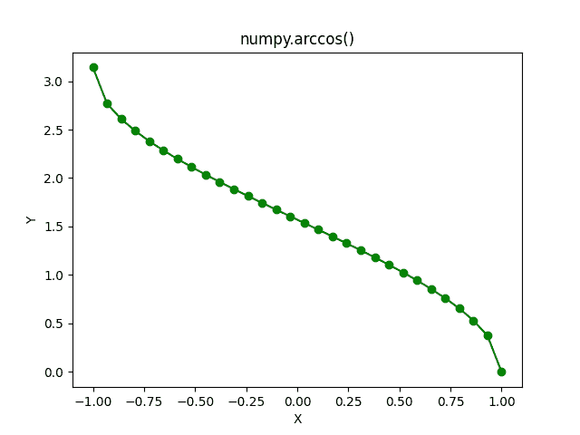

# NumPy Arccos-完全指南

> 原文:# t0]https://www . aspython . com/python-modules/num py/numpy-arccos

读者你好！在本教程中，我们将理解 **NumPy arccos** 函数以及大量的例子。我们还将绘制`arccos`函数的曲线。那么，我们开始吧。

***亦读:[【NumPy Arctan-完全指南】](https://www.askpython.com/python-modules/numpy/numpy-arctan)***

## Arccos 函数-快速概述

*   **arccos** 是**余弦**函数的逆的表示。
*   arccos 函数接受范围为 **[-1，1]** 的输入，并产生范围为 **[0，pi]** 的输出。

## 什么是 NumPy Arccos？

NumPy Arccos 是 NumPy 库提供的三角函数之一。NumPy Arccos 可以将**实数**和**复数**作为输入。

我们可以以`**numpy.arccos**`的身份访问 NumPy Arccos 函数。

## NumPy arccos 的语法

**语法:** `**numpy.arccos(input)**`其中输入可以是单个数字，也可以是数字的 NumPy 数组。

让我们写一些代码。

## 单个数的 NumPy arccos

```py
import numpy as np

import math

print("Printing the Cosine inverse values in radians\n")

print("Cos inverse of 0 is :",np.arccos(0))

print("Cos inverse of 0.5 is :",np.arccos(0.5))

print("Cos inverse of 1/sqrt(2) is :",np.arccos(1/math.sqrt(2)))

print("Cos inverse of 1 is :",np.arccos(1))

print("Cos inverse of -1 is :",np.arccos(-1))

print("\n")

print("Cosine inverse values in degrees\n")

print("Cos inverse of 1/sqrt(2) is :",np.degrees(np.arccos(1/math.sqrt(2))))

print("Cos inverse of -1 is :",np.degrees(np.arccos(-1)))

```

**输出**

```py
Printing the Cosine inverse values in radians

Cos inverse of 0 is : 1.5707963267948966
Cos inverse of 0.5 is : 1.0471975511965979
Cos inverse of 1/sqrt(2) is : 0.7853981633974484
Cos inverse of 1 is : 0.0
Cos inverse of -1 is : 3.141592653589793

Cosine inverse values in degrees

Cos inverse of 1/sqrt(2) is : 45.00000000000001
Cos inverse of -1 is : 180.0

```

让我们以 0 的 cos 逆为例，它等于 90 度。因为 90 度的余弦是 0，所以 0 的反余弦是 90 度。这是理解反三角函数如何计算结果的一种有趣方式。

任务:尝试将 NumPy Arccos 函数与其他输入一起使用，并观察输出。

### 复数的 NumPy arccos

```py
import numpy as np

print("Cosine inverse of 1+5j is: ",np.arccos(1+5j))

print("Cosine inverse of 2+3j is: ",np.arccos(2+3j))

print("Cosine inverse of 0.5+0.5j is: ",np.arccos(0.5+0.5j))

```

**输出**

```py
Cosine inverse of 1+5j is:  (1.3770031902399644-2.3309746530493123j)
Cosine inverse of 2+3j is:  (1.0001435424737972-1.9833870299165355j)
Cosine inverse of 0.5+0.5j is:  (1.118517879643706-0.5306375309525179j)

```

### 无效数字的 NumPy arccos

如果将无效输入作为参数传递给 arccos 函数，则输出将为 **`nan`** 。

```py
import numpy as np

print("Cosine inverse of -3 is :",np.arccos(5))

```

输出

```py
Cosine inverse of -3 is : nan

```

**注意:**超出范围[-1，1]的每个数字都被视为`arccos`函数的无效输入。

## 多个数字上的 NumPy Arccos

arccos 函数也将 NumPy 数字数组作为参数。

### 将 NumPy 数组与 Arccos 相结合

```py
import numpy as np

a = np.array((-1 , 0 , 0.5 , 0.3 , 1))

print("Cosine Inverse Values in radians :\n",np.arccos(a))

print("Cosine Inverse Values in degrees :\n",np.degrees(np.arccos(a)))

```

**输出**

```py
Cosine Inverse Values in radians :
 [3.14159265 1.57079633 1.04719755 1.26610367 0\.        ]
Cosine Inverse Values in degrees :
 [180\.          90\.          60\.          72.54239688   0\.        ]

```

### 均匀间隔的数字阵列

在这个例子中，我们将使用`**numpy.linspace**`创建一个由 20 个等距值组成的 NumPy 数组。

```py
import numpy as np

a = np.linspace(-1 , 1 , 20)

print("Cosine Inverse Values in radians: ",np.arccos(a))

print("Cosine Inverse Values in degrees: ",np.degrees(np.arccos(a)))

```

**输出**

```py
Cosine Inverse Values in radians:  [3.14159265 2.67863793 2.48074736 2.32431694 2.18823343 2.06426572
 1.94810636 1.83709034 1.72935461 1.62345224 1.51814042 1.41223805
 1.30450231 1.19348629 1.07732693 0.95335922 0.81727571 0.6608453
 0.46295473 0\.        ]
Cosine Inverse Values in degrees:  [180\.         153.47464798 142.13635364 133.17355111 125.37654015
 118.27371363 111.61827242 105.25752329  99.08472029  93.01696131
  86.98303869  80.91527971  74.74247671  68.38172758  61.72628637
  54.62345985  46.82644889  37.86364636  26.52535202   0\.        ]

```

## 可视化 Arccos 函数

```py
import numpy as np

# Importing the Matplotlib Library
import matplotlib.pyplot as plt

# Creating a NumPy Array of 30 evenly-spaced elements
a = np.linspace(-1,1,30)

# Storing the computed arccos values in a NumPy Array
b = np.arccos(a)
plt.plot(a, b, color = "green", marker = "o")
plt.title("numpy.arccos()")
plt.xlabel("X")
plt.ylabel("Y")
plt.show()

```

**输出**



**Arccos Plot**

**注:**在图中，Y 轴(纵轴)上的数值是`**arccos**`函数的输出，单位为**弧度**。

`**plt.plot()**`该函数用于绘制带三个参数的 **arccos** 函数。

*   第**个**参数是数字的 **NumPy 数组**(在第 3 行创建)，绘制在 X 轴(水平轴)上。
*   第二个参数**是`**arccos**`函数的输出，绘制在 Y 轴(垂直轴)上。**
*   第三个参数是绘图的颜色。
*   **第四个**参数是标记值，用指定的标记强调每个点。有不同类型的标记可用于表示曲线上的点。

好了，你已经使用 Matplotlib 库绘制了`**arccos**`曲线。

## 摘要

所以，我们学习了 NumPy 库的`**arccos**`函数。在下一个教程中，我们将介绍 [**`arctan`** 功能](https://www.askpython.com/python-modules/numpy/numpy-arctan)。直到那时继续学习，继续编码:)。

## 参考

[num py documentation–num py arccos](https://numpy.org/doc/stable/reference/generated/numpy.arccos.html)

[Matplotlib–开始使用](https://matplotlib.org/stable/users/getting_started/)