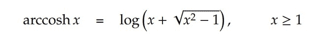

# NumPy arc cosh–完整指南

> 原文:# t0]https://www . aspython . com/python-modules/num py/numpy-arccosh

读者你好！欢迎来到另一个关于 NumPy 数学函数的教程。在本教程中，我们将理解 NumPy arccosh 函数，并练习许多例子。我们还将使用 Matplotlib 库绘制图形。

没有别的事了，让我们开始吧。

***也读作:[NumPy Arcsinh——完全指南](https://www.askpython.com/python-modules/numpy/numpy-arcsinh)***

## 什么是双曲余弦(逆余弦)-快速概述

*   arccosh 是反双曲余弦函数。
*   反余弦的等效表达式为:



**Arccosh Expression**

*   反正切函数的定义域是**【1，无穷大】**。这里，无限不包括在内。
*   arccosh 函数的范围是**【1，无穷大】**。

***也读: [NumPy 面试问题:为你的 Python 工作面试做好准备](https://www.askpython.com/python/numpy-interview-questions)***

## 什么是 NumPy Arccosh？

**NumPy Arccosh** 函数也是 NumPy 库提供的反双曲三角函数之一。使用这个函数，我们可以计算传递给反余弦函数的输入的反双曲余弦值。

numpy arccosh 函数可以作为`numpy.arccosh()`访问。

语法:numpy.arccosh(input)其中输入可以是单个数字、复数以及 numpy 数字数组。

## 使用 numpy arccosx

让我们试一些例子。

### 对包含数字的 numpy 数组使用 numpy.arccosh()

```py
import numpy as np

a = np.array(( 2 , 3 , 10 , 90 , 100))

b = np.arccosh(a)

print("Input Values:\n",a)

print("Arccosh values:\n",b)

```

**输出**

```py
Input Values:
 [  2   3  10  90 100]
Arccosh values:
 [1.3169579  1.76274717 2.99322285 5.19292599 5.29829237]

```

让我们将一些 pi 值作为参数传递给 arccosh 函数，并观察输出🙂

### 对具有弧度角度的 numpy 数组使用 numpy.arccosh()函数

```py
import numpy as np

a = np.array((np.pi/2 , 3*np.pi/2 , np.pi))

b = np.arccosh(a)

print("Input Array:\n",a)

print("Arccosh Values:\n",b)

```

**输出**

```py
Input Array:
 [1.57079633 4.71238898 3.14159265]
Arccosh Values:
 [1.02322748 2.23188925 1.81152627]

```

这里，我们不能传递一个小于 1 的值，因为它将超出 arccosh 函数的范围，该函数将给出 **nan** 作为输出。

**Task:** 尝试将 1 作为参数传递给 arccosh 函数，并观察输出。

## 使用复数

```py
import numpy as np

print("Arccosh of 2+3j is :\n",np.arccosh(2+3j))

print("Arccosh of 1+5j is :\n",np.arccosh(1+5j))

print("Arccosh of 0.5+0.5j is :\n",np.arccosh(0.5+0.5j))

print("Arccosh of -1-1j is :\n",np.arccosh(-1-1j))

```

**输出**

```py
Arccosh of 2+3j is :
 (1.9833870299165355+1.0001435424737972j)
Arccosh of 1+5j is :
 (2.3309746530493123+1.3770031902399644j)
Arccosh of 0.5+0.5j is :
 (0.5306375309525179+1.118517879643706j)
Arccosh of -1-1j is :
 (1.0612750619050357-2.2370357592874117j)

```

## 使用无效数字

这里，我们将一些无效的输入传递给 arccosh 函数，并观察输出。

```py
import numpy as np

print("The arccosh of 0 is:",np.arccosh(0))

print("The arccosh of -1 is:",np.arccosh(-1))

print("The arccosh of 0.5 is:",np.arccosh(0.5))

```

**输出**

在上述所有情况下，输出将是 **`nan`** 。

这就是向 arccosh 函数传递不同的参数。现在，让我们使用 Matplotlib 库绘制 arccosh 函数的曲线。

## 可视化 arccosx 函数

```py
import numpy as np

import matplotlib.pyplot as plt

a = np.linspace(1 , 20 , 50)

b = np.arccosh(a)

plt.plot(a , b , color = "blue" , marker = "o")

plt.title("numpy.arccosh()")

plt.xlabel("X")

plt.ylabel("Y")

plt.show()

```

**输出**


**ArccoshPlot**

这就是关于反余弦函数的全部内容。这个函数使用起来非常简单。点击这里继续探索关于各种 python 主题的精彩帖子[。](https://www.askpython.com/)

## 参考

*   [num py documentation–num py arccosh](https://numpy.org/doc/stable/reference/generated/numpy.arccosh.html)
*   [Matplotlib 文件](https://matplotlib.org/)