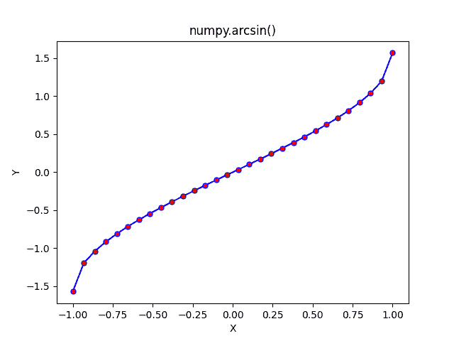

# NumPy Arcsin-完全指南

> 原文:# t0]https://www . aspython . com/python-modules/num py/numpy-arcsin

读者你好！欢迎来到系列 [NumPy 三角函数](https://www.askpython.com/python/numpy-trigonometric-functions)的第四篇教程。从本教程开始，我们将从 NumPy 库提供的反三角函数开始。

在本教程中，我们将了解 **NumPy arcsin** 函数，并练习大量示例。我们还将使用 **Matplotlib 库**绘制 arcsin()函数。让我们开始吧。

***也读:[【NumPy Cos——完全指南](https://www.askpython.com/python-modules/numpy/numpy-cos)***

## 反正弦函数–快速概述

*   关于这些反三角函数，有一个有趣的事实需要了解，这些函数的输出是一个**角度**，输入是一个**数**。
*   **反正弦**是正弦函数的反函数的表示。
*   **arcsin** 函数接受 **[-1，1]** 范围内的输入，并产生 **[-pi/2，pi/2]** 之间的输出。

## 什么是 NumPy arcsin？

NumPy arcsin 是 NumPy 库提供的三角函数之一。**实数**和**复数**可以作为输入传递给 NumPy 反正弦函数。

NumPy arcsin 可以作为`**numpy.arcsin**` **`(input)`** 访问。

## NumPy arcsin 的语法

**语法:** `**numpy.arcsin(input)**`其中输入可以是单个数字，也可以是数字的 NumPy 数组。

## 单个数的 NumPy 反正弦

让我们尝试一些 NumPy arcsin 函数的例子来帮助我们更好地理解它。

```py
import numpy as np

import math

print("Printing the Sine inverse values in radians\n")

print("Sin inverse of 0 is :",np.arcsin(0))

print("Sin inverse of 0.5 is :",np.arcsin(0.5))

print("Sin inverse of 1/sqrt(2) is :",np.arcsin(1/math.sqrt(2)))

print("Sin inverse of 1 is :",np.arcsin(1))

print("Sin inverse of -1 is :",np.arcsin(-1))

print("\n")

print("Sine inverse values in degrees\n")

print("Sin inverse of 1/sqrt(2) is :",np.degrees(np.arcsin(1/math.sqrt(2))))

print("Sin inverse of -1 is :",np.degrees(np.arcsin(-1)))

```

**输出**

```py
Printing the Sine inverse values in radians

Sin inverse of 0 is : 0.0
Sin inverse of 0.5 is : 0.5235987755982989
Sin inverse of 1/sqrt(2) is : 0.7853981633974482
Sin inverse of 1 is : 1.5707963267948966
Sin inverse of -1 is : -1.5707963267948966

Sine inverse values in degrees

Sin inverse of 1/sqrt(2) is : 44.99999999999999
Sin inverse of -1 is : -90.0

```

让我们以 1/sqrt(2)的正弦倒数为例，它等于 45 度。因为 45 度的正弦是 1/sqrt(2 ),所以 1/sqrt(2)的正弦倒数是 45 度。这是理解反三角函数如何计算结果的一种有趣方式。

上面的代码片段非常清楚，其中范围[-1，1]内的一个数字作为参数传递给`**arcsin**`函数，输出是一个以弧度表示的角度。

**注意:**我已经用`**np.degrees()**`一个函数把输出角度转换成度数。

在上述所有情况下，反正弦函数的输出都在范围 **[-pi/2，pi/2]** 内。

### 复数的 NumPy 反正弦

NumPy 反正弦函数以一个**复数**作为参数。

```py
import numpy as np

print("Sin inverse of 1+5j is: ",np.arcsin(1+5j))

print("Sin inverse of 2+3j is: ",np.arcsin(2+3j))

print("Sin inverse of 0.5+0.5j is: ",np.arcsin(0.5+0.5j))

```

**输出**

```py
Sin inverse of 1+5j is:  (0.1937931365549322+2.3309746530493123j)
Sin inverse of 2+3j is:  (0.5706527843210994+1.9833870299165355j)
Sin inverse of 0.5+0.5j is:  (0.45227844715119064+0.5306375309525179j)

```

输出也是一个复数。

**注意:**当 arcsin 函数的输入是复数时，我们不能对 numpy.arcsin()使用 np.degrees()函数。

### 无效数字的 NumPy arcsin

如果一个不在反正弦函数域内的数字作为参数传递给该函数，那么输出是 **nan** 。

```py
import numpy as np

print("Sin inverse of 5 is :",np.arcsin(5))

```

**输出**

```py
Sin inverse of 5 is : nan

```

**注意:**超出范围[-1，1]的每个数字都被视为`**arcsin**`函数的无效输入。

## 多重数上的 NumPy 反正弦

NumPy arcsin 函数也可以接受一个 NumPy 数字数组作为参数。

### 将 NumPy 数组与反正切相结合

```py
import numpy as np

a = np.array((-1 , 0 , 0.5 , 0.3 , 1))

print("Sine Inverse Values in radians :\n",np.arcsin(a))

print("Sine Inverse Values in degrees :\n",np.degrees(np.arcsin(a)))

```

**输出**

```py
Sine Inverse Values in radians :
 [-1.57079633  0\.          0.52359878  0.30469265  1.57079633]
Sine Inverse Values in degrees :
 [-90\.           0\.          30\.          17.45760312  90\.        ]

```

### 均匀间隔的 NumPy 数组上的 NumPy 反正弦

在这个例子中，我们将使用`**numpy.linspace**`创建一个由 20 个等距值组成的 NumPy 数组。

```py
import numpy as np

a = np.linspace(-1 , 1 , 20)

print("Sin Inverse Values in radians: ",np.arcsin(a))

print("Sin Inverse Values in degrees: ",np.degrees(np.arcsin(a)))

```

**输出**

```py
Sin Inverse Values in radians:  [-1.57079633 -1.1078416  -0.90995103 -0.75352062 -0.6174371  -0.49346939
 -0.37731003 -0.26629402 -0.15855828 -0.05265591  0.05265591  0.15855828
  0.26629402  0.37731003  0.49346939  0.6174371   0.75352062  0.90995103
  1.1078416   1.57079633]
Sin Inverse Values in degrees:  [-90\.         -63.47464798 -52.13635364 -43.17355111 -35.37654015
 -28.27371363 -21.61827242 -15.25752329  -9.08472029  -3.01696131
   3.01696131   9.08472029  15.25752329  21.61827242  28.27371363
  35.37654015  43.17355111  52.13635364  63.47464798  90\.        ]

```

## 可视化反正弦函数

```py
import numpy as np

# Importing the Matplotlib Library
import matplotlib.pyplot as plt

# Creating a NumPy Array of 30 evenly-spaced elements
a = np.linspace(-1,1,30)

# Storing the computed arcsin values in a NumPy Array
b = np.arcsin(a)

plt.plot(a, b, color = "blue", marker = "o" , ms = 5,mfc = "r")
plt.title("numpy.arcsin()")
plt.xlabel("X")
plt.ylabel("Y")
plt.show()

```

**输出**



**Arcsin Plot**

在图中，Y 轴(纵轴)上的值是`**arcsin**`函数的输出，单位为弧度。

`**plt.plot()**`该函数用于绘制带六个参数的反正弦函数。

*   第**个**参数是数字的 **NumPy 数组**(在第 7 行创建)，绘制在 X 轴(水平轴)上。
*   第二个参数**是`**arcsin**`函数的输出，绘制在 Y 轴(垂直轴)上。**
*   第三个参数是绘图的颜色。
*   **第四个**参数是标记值，用指定的标记强调每个点。有不同类型的标记可用于表示曲线上的点。
*   **第五个**参数是曲线上点的**大小**。(ms 是标记大小)
*   第六个参数是标记的颜色。(mfc 是标记面颜色)

## 摘要

在本教程中，我们学习了 numpy.arcsin()函数接受的各种输入。请在阅读文章的同时练习这些代码。在下一个教程中，我们将详细介绍 [NumPy Arccos 函数](https://www.askpython.com/?p=35977)。

## 参考

[num py documentation–num py arcsin](https://numpy.org/doc/stable/reference/generated/numpy.arcsin.html)

[Matplotlib–开始使用](https://matplotlib.org/stable/users/getting_started/)

[Matplotlib 文件](https://matplotlib.org/stable/index.html)