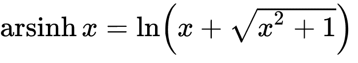
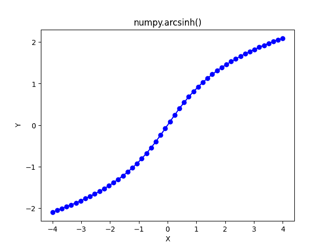

# NumPy Arcsinh–完整指南

> 原文:# t0]https://www . aspython . com/python-modules/num py/numpy-arcsinh

欢迎来到另一个关于 NumPy arcsinh 函数的精彩教程。在这里，我们将详细了解 NumPy arcsinh 函数。没有任何进一步的到期让我们开始吧！

***也读作:[Numpy sinh——双曲正弦，逐元素](https://www.askpython.com/python-modules/numpy/numpy-sinh-hyperbolic-sine)***

## 什么是双曲反正弦(反正弦)？快速概述

*   **arcsinh** 是反双曲正弦函数。
*   arcsinh 的等效表达式为:



**Arcsinh Equivalent Expression**

*   反正切函数的定义域是一组实数。
*   arcsinh 函数的值域也是一组实数。

## NumPy.arcsinh()是什么？

NumPy arcsinh 是 NumPy 库提供的反双曲函数之一。它接受单个数字、一个复数以及一个 NumPy 数字数组作为输入。

NumPy arcsinh 函数可以作为`numpy.arcsinh()`访问。

**语法:** `numpy.arcsinh(input)`其中输入可以是一个单一的数字，一个复杂的数字以及一个 NumPy 数组的数字。

## 使用 NumPy Arcsinh

让我们编写一些代码来更好地理解 arcsinh 函数。

### 对包含数字的 numpy 数组使用 numpy.arcsinh()函数

```py
import numpy as np

a = np.array((0 , 2 , 3 , 10 , 90 , 100))

arcsinh_values = np.arcsinh(a)

print("Input Array: \n",a)

print("Arcsinh Values:\n",arcsinh_values)

```

**输出**

```py
Input Array: 
 [  0   2   3  10  90 100]
Arcsinh Values:
 [0\.         1.44363548 1.81844646 2.99822295 5.19298771 5.29834237]

```

如果您想知道这些值是如何计算的，您可以简单地将输入数组的值放入在**arcsinh–快速概述**部分中讨论的 Arcsinh 函数的等效表达式中。

让我们尝试将一些 **pi** 值传递给 arcsinh 函数。

### 将 numpy.arcsinh()与角度以弧度表示的 numpy 数组一起使用

```py
import numpy as np

a = np.array((np.pi/2 , np.pi/4 , np.pi/6 , 3*np.pi/2))

arcsinh_values = np.arcsinh(a)

print("Input Array :\n",a)

print("Arcsinh values :\n",arcsinh_values)

```

**输出**

```py
Input Array :
 [1.57079633 0.78539816 0.52359878 4.71238898]
Arcsinh values :
 [1.23340312 0.72122549 0.50221899 2.25441459]

```

**任务:**尝试使用带欧拉数的反正切函数，即`numpy.e`欧拉常数的值为 2.718281828。

### 具有复数的 NumPy Arcsinh

```py
import numpy as np

print("The arcsinh value of 1+2j is: \n",np.arcsinh(1+2j))

print("The arcsinh value of -1+3j is: \n",np.arcsinh(-1+3j))

```

**输出**

```py
The arcsinh value of 1+2j is: 
 (1.4693517443681852+1.0634400235777521j)
The arcsinh value of -1+3j is:
 (-1.8241987021938828+1.2330952175293441j)

```

**注意:**如果一个数不能表示为实数或无穷大，则返回`**nan**`。

这就是使用具有不同值的 arcsinh 函数的全部内容。现在，让我们使用 python 中的 Matplotlib 库来绘制 arcsinh 函数。

### 可视化反正切函数

```py
import numpy as np

# Importing the Matplolib library
import matplotlib.pyplot as plt

a = np.linspace(-4 , 4 , 50)

# Storing the arcsinh values
b = np.arcsinh(a)

plt.plot(a , b , color = "blue" , marker = "o")

plt.title("numpy.arcsinh()")
plt.xlabel("X")
plt.ylabel("Y")

plt.show()

```

**输出**



**Arcsinh Plot**

您已经成功绘制了反正切函数。

## 结论

这就是关于 arcsinh 函数的全部内容，这个函数非常容易理解和使用。在下一个教程中，我们将详细介绍 NumPy Arccosh 函数。在那之前请继续关注🙂

## 参考

*   [num py documentation–num py arcsinh](https://numpy.org/doc/stable/reference/generated/numpy.arcsinh.html#numpy.arcsinh)
*   [Matplotlib 文件](https://matplotlib.org/)