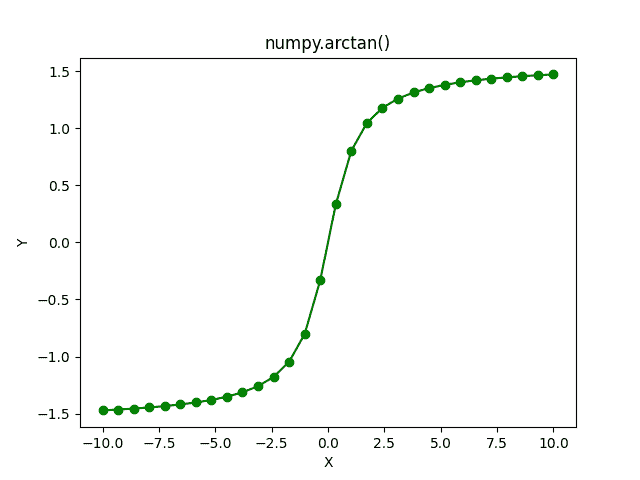

# NumPy Arctan–完整指南

> 原文:# t0]https://www . aspython . com/python-modules/num py/numpy-arctan

读者你好！在本教程中，我们将通过大量的例子了解 NumPy arctan 函数，我们还将使用 Matplotlib 库绘制**的图形**arctan**函数。**

**那么，我们开始吧。**

## **什么是 Arctan？**

*   ****反正切**是反正切(tan)函数的表示。**
*   ****arctan** 函数将所有实数作为输入，并产生范围为 **(-pi/2，pi/2)** 的输出。**
*   **需要注意的一个有趣事实是，我们可以将反正切函数扩展到复数[](https://www.cuemath.com/numbers/complex-numbers/)**。在这种情况下，arctan 的域(输入)将全部是复数。****

## ****什么是 NumPy Arctan？****

****NumPy Arctan 是 NumPy 库提供的三角函数之一。NumPy Arctan 可以将**实数**和**复数**作为输入。****

****我们可以像`**numpy.arctan**`一样访问 NumPy Arctan 函数。****

## ****NumPy arctan 的语法****

******语法:** `numpy.arctan(input)`其中输入可以是单个数字，也可以是数字的 NumPy 数组。****

****让我们写一些代码。****

## ****单个数的 NumPy 反正切****

```py
**import numpy as np

import math

print("Printing the Tan inverse values in radians\n")

print("Tan inverse of 0 is :",np.arctan(0))

print("Tan inverse of 0.5 is :",np.arctan(0.5))

print("Tan inverse of 1/sqrt(2) is :",np.arctan(1/math.sqrt(2)))

print("Tan inverse of 1 is :",np.arctan(1))

print("Tan inverse of -1 is :",np.arctan(-1))

# Tan inverse of a very large number
print("Tan inverse of 10000000 is :",np.arctan(10000000))

print("\n")

print("Tan inverse values in degrees\n")

print("Tan inverse of 1/sqrt(2) is :",np.degrees(np.arctan(1/math.sqrt(2))))

print("Tan inverse of -1 is :",np.degrees(np.arctan(-1)))

print("Tan inverse of 10000000 is :",np.degrees(np.arctan(10000000)))** 
```

******输出******

```py
**Printing the Tan inverse values in radians

Tan inverse of 0 is : 0.0
Tan inverse of 0.5 is : 0.4636476090008061
Tan inverse of 1/sqrt(2) is : 0.6154797086703873
Tan inverse of 1 is : 0.7853981633974483
Tan inverse of -1 is : -0.7853981633974483
Tan inverse of 10000000 is : 1.5707962267948967

Tan inverse values in degrees

Tan inverse of 1/sqrt(2) is : 35.264389682754654
Tan inverse of -1 is : -45.0
Tan inverse of 10000000 is : 89.99999427042206** 
```

****在最后一个示例中，我们计算了一个非常大的数的反正切，即 10，000，000，输出为π/2 弧度或 90 度。这是因为反正切的输入是一个非常大的量，其输出往往是π/2 弧度或 90 度。****

### ****复数的 NumPy 反正切****

```py
**import numpy as np

print("Tan inverse of 1+5j is: ",np.arctan(1+5j))

print("Tan inverse of 2+3j is: ",np.arctan(2+3j))

print("Tan inverse of 0.5+0.5j is: ",np.arctan(0.5+0.5j))** 
```

******输出******

```py
**Tan inverse of 1+5j is:  (1.530881333938778+0.1944261421470021j)
Tan inverse of 2+3j is:  (1.4099210495965755+0.22907268296853878j)
Tan inverse of 0.5+0.5j is:  (0.5535743588970452+0.40235947810852507j)** 
```

## ****多重数上的 NumPy 反正切****

****现在，让我们看看如何计算一组数字的反正切值。****

### ****结合 NumPy 阵列和 Arctan****

```py
**import numpy as np

import math

a = np.array((-1 , 0 , 1/math.sqrt(3) , math.sqrt(3) , 1))

print("Tan Inverse Values in radians :\n",np.arctan(a))

print("Tan Inverse Values in degrees :\n",np.degrees(np.arctan(a)))** 
```

******输出******

```py
**Tan Inverse Values in radians :
 [-0.78539816  0\.          0.52359878  1.04719755  0.78539816]
Tan Inverse Values in degrees :
 [-45\.   0\.  30\.  60\.  45.]** 
```

### ****均匀间隔的数字阵列****

****在这个例子中，我们将使用`**numpy.linspace**`创建一个由 20 个等距值组成的 NumPy 数组。****

```py
**import numpy as np

a = np.linspace(-2 , 2 , 20)

print("Tan Inverse Values in radians: ",np.arctan(a))

print("Tan Inverse Values in degrees: ",np.degrees(np.arctan(a)))** 
```

******输出******

```py
**Tan Inverse Values in radians:  [-1.10714872 -1.06120406 -1.00622693 -0.93971694 -0.85843873 -0.75837771
 -0.63502674 -0.48447793 -0.30587887 -0.10487694  0.10487694  0.30587887
  0.48447793  0.63502674  0.75837771  0.85843873  0.93971694  1.00622693
  1.06120406  1.10714872]
Tan Inverse Values in degrees:  [-63.43494882 -60.80251395 -57.6525565  -53.84181456 -49.18491613
 -43.4518423  -36.38435182 -27.7585406  -17.52556837  -6.00900596
   6.00900596  17.52556837  27.7585406   36.38435182  43.4518423
  49.18491613  53.84181456  57.6525565   60.80251395  63.43494882]** 
```

## ****可视化反正切函数****

```py
**import numpy as np

# Importing the Matplotlib Library
import matplotlib.pyplot as plt

# Creating a NumPy Array of 30 evenly-spaced elements
a = np.linspace(-10,10,30)

# Storing the computed arctan values in a NumPy Array
b = np.arctan(a)
plt.plot(a, b, color = "green", marker = "o")
plt.title("numpy.arctan()")
plt.xlabel("X")
plt.ylabel("Y")
plt.show()** 
```

******输出******

****

**Arctan Plot****** 

******注意:**如果你仔细观察曲线，你会注意到反正切函数的**最大值**小于**π/2**，而**最小值**大于**-π/2**。****

****`**plt.plot()**`该函数用于绘制带三个参数的**反正切**函数。****

*   ******第一个**参数是数字的 **NumPy 数组(在第 3 行创建)，它也是绘制在 X 轴(水平轴)上的 **arctan** 函数的输入。******
*   **第二个参数**是绘制在 Y 轴(垂直轴)上的`**arctan**`函数的输出，单位为**弧度**。****
*   **第三个参数是绘图的颜色。**
*   ****第四个**参数是标记值，强调曲线上绘制的点。**

**您已经成功绘制并理解了反正切函数的性质。**

## **摘要**

**这就完成了我们的 NumPy 三角函数教程系列。在本教程中，我们通过大量示例代码片段学习了 arctan 函数，并在整个教程中练习这些代码。到现在为止，你一定已经熟悉了 NumPy 三角函数，它们非常容易使用🙂**

**在下一篇教程中，我将会详细讲述一个特殊的三角函数 **arctan2** ，并给出许多不同的例子。在那之前继续编码。**

## **参考**

**[num py documentation–num py arctan](https://numpy.org/doc/stable/reference/generated/numpy.arctan.html)**

**[Matplotlib–开始使用](https://matplotlib.org/stable/users/getting_started/)**