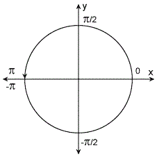

# NumPy arctan 2–完整指南

> 原文:# t0]https://www . aspython . com/python-modules/num py/numpy-arctan2

读者你好！欢迎学习 NumPy Arctan2 教程。在本教程中，我们将了解 NumPy 库提供的一个特殊三角函数，即 arctan2。让我们开始吧。

***亦读:[【NumPy Arctan-完全指南】](https://www.askpython.com/python-modules/numpy/numpy-arctan)***

## arctan 2–快速概述

*   **反正切 2** 是一个四象限反三角函数，这意味着反正切 2 函数的输出角度可以在四个象限中的任何一个。
*   它以**两个数**作为参数。
*   该函数根据传递给它的值返回一个在范围 **[-pi，pi]** 内的值。



## 什么是 NumPy Arctan2？

NumPy Arctan2 是 NumPy 库提供的三角函数之一。

它采用**两个参数** x1 和 x2，并返回正确选择象限的 **x1/x2** 的**反正切**(反正切)。​

我们可以通过 **NumPy.arctan2()** 来访问该函数。

语法:`**numpy.arctan2(x1, x2)**`其中 **x1** 和 **x2** 分别代表点的 Y 坐标和 X 坐标。

***也读作:[【NumPy Arccos-完全指南】](https://www.askpython.com/python-modules/numpy/numpy-arccos)***

## 象限中的符号约定

XY 平面被分成四个相等的部分，称为象限。每个象限中的点对于 X 坐标和 Y 坐标具有不同的符号。

| **象限** | ****x 坐标**** | **y 坐标** |
| 第一象限 | 阳性(+) | 正(+)
 |
| 第二象限 | 负(-) | 阳性(+) |
| 第三象限 | 负(-) | 负(-) |
| 第四象限 | 阳性(+) | 负(-) |

## 使用 NumPy Arctan2 函数

我们已经完成了理论部分，让我们写一些代码来使我们的理解更加清晰。

```py
import numpy as np

# Output angle is in first quadrant
print("Arctan2 of (1,1) in radians is:",np.arctan2(1,1))
print("Arctan2 of (1,1) in degrees is:",np.degrees(np.arctan2(1,1)))

# Output angle is in second quadrant
print("\nArctan2 of (1,-1) in radians is:",np.arctan2(1,-1))
print("Arctan2 of (1,-1) in degrees is:",np.degrees(np.arctan2(1,-1)))

# Output angle is in third quadrant
print("\nArctan2 of (-1,-1) in radians is:",np.arctan2(-1,-1))
print("Arctan2 of (-1,-1) in degrees is:",np.degrees(np.arctan2(-1,-1)))

# Output angle is in fourth quadrant
print("\nArctan2 of (-1,1) in radians is:",np.arctan2(-1,1))
print("Arctan2 of (-1,1) in degrees is:",np.degrees(np.arctan2(-1,1)))

```

**输出**

```py
Arctan2 of (1,1) in radians is: 0.7853981633974483
Arctan2 of (1,1) in degrees is: 45.0

Arctan2 of (1,-1) in radians is: 2.356194490192345
Arctan2 of (1,-1) in degrees is: 135.0

Arctan2 of (-1,-1) in radians is: -2.356194490192345
Arctan2 of (-1,-1) in degrees is: -135.0

Arctan2 of (-1,1) in radians is: -0.7853981633974483
Arctan2 of (-1,1) in degrees is: -45.0

```

**注意:**在所有示例中，arctan2 函数的第一个参数是该点的 Y 坐标值，第二个参数是该点的 X 坐标值。

让我们来理解上面的每一个例子。

*   **第 4 行:**在本例中，两个参数都是正的，因此点位于第一象限，计算出 x1/x2 的反正切等于 45 度。
*   **第 8 行:**在本例中，第一个参数(Y 坐标)是正的，但第二个参数(X 坐标)是负的，因此该点位于第二象限，计算 x1/x2 的反正切等于 135 度(这也是第二象限中的角度)。
*   **第–12 行:**在本例中，第一个参数(Y 坐标)是负的，第二个参数(X 坐标)也是负的，因此该点位于第三象限，计算 x1/x2 的反正切等于-135 度(这也是第三象限中逆时针方向的角度)。
*   **第 16 行:**在本例中，第一个参数(Y 坐标)为负，第二个参数(X 坐标)为正，因此该点位于第四象限，计算 x1/x2 的反正切等于-45 度(也是第四象限的角度)

**要点:**反正切 2 通过正确选择象限计算反正切。

## 结合 NumPy 数组和 Arctan2

#### 示例–1

```py
import numpy as np

# Example 1

# Creating a NumPy Array of the y-coordinates of the points
x1 = np.array((-1 , 1.732 , 1.414 , 0.5 , 1))

# Creating a NumPy Array of the y-coordinates of the points
x2 = np.array((1 , -1 , -0.5 , 0.5 , 1))

print("Arctan2 Values in radians :\n",np.arctan2(x1 , x2))

print("Arctan2 Values in degrees :\n",np.degrees(np.arctan2(x1 , x2)))

```

**输出**

```py
Arctan2 Values in radians :
 [-0.78539816  2.0944078   1.9106807   0.78539816  0.78539816]
Arctan2 Values in degrees :
 [-45\.         120.00072778 109.47394016  45\.          45\.        ]

```

#### 示例–2

```py
import numpy as np

# Example 2

# Creating a NumPy Array of the y-coordinates of the points
a = np.array((-5 , 0.5 , 1 , -1))

# Creating a NumPy Array of the y-coordinates of the points
b = np.array((4 , 1 , -1 , -1.732))

print("Arctan2 Values in radians :\n",np.arctan2(a , b))

print("Arctan2 Values in degrees :\n",np.degrees(np.arctan2(a , b)))

```

**输出**

```py
Arctan2 Values in radians :
 [-0.89605538  0.46364761  2.35619449 -2.61798118]
Arctan2 Values in degrees :
 [ -51.34019175   26.56505118  135\.         -149.99927222]

```

在示例 1 中， **x1** 是点的 Y 坐标值的 NumPy 数组。类似地， **x2** 是点的 X 坐标值的 NumPy 数组，这两个数组作为参数传递给 arctan2 函数，该函数计算 x1/x2 的**元素的 arctan** 。

在示例 2 中， **a** 是点的 Y 坐标值的 NumPy 数组， **b** 是点的 X 坐标值的 NumPy 数组，这两个数组作为参数传递给 arctan2 函数，该函数计算 a/b 的**元素-arctan2**

**任务:**使用 NumPy arctan2 函数和 NumPy 的`**linspace**`函数，观察输出。

## Arctan 和 Arctan2 的区别

| **NumPy arctan** | **Numpy arctan2** |
| arctan 是一个 2 象限反函数。 | arctan2 是一个四象限反函数。 |
| 范围从-90 度到 90 度。 | 范围从-180 度到 180 度。 |
| 接受单个输入。 | 接受两个输入。 |
| 接受单个 NumPy 数组作为输入。 | 接受两个 NumPy 数组作为输入。 |

以上是对 NumPy 库的 **[arctan](https://www.askpython.com/python-modules/numpy/numpy-arctan)** 和 **arctan2** 函数的快速概述。

## 摘要

这就是关于 NumPy Arctan2 函数的全部内容。从本教程中得到的关键信息是，arctan2 函数是 arctan 函数的扩展。我们正在计算反正切，选择正确的象限。

通读两遍这篇文章，让你对 arctan2 函数有一个清晰的了解。我将发表更多关于 Python 各种主题的文章。在此之前，请继续学习并探索更多有趣的文章。

## 参考

[num py documentation–num py arctan 2](https://numpy.org/doc/stable/reference/generated/numpy.arctan2.html)