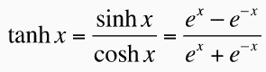

# numpy arctanh–反双曲正切元素

> 原文:# t0]https://www . aspython . com/python-modules/num py/numpy-arctanh

今天，我们将学习如何实现反双曲函数的元素方式。这将包括查看公式、函数和所需的库。我们还将学习这个函数的域和范围。最后，我们将有一些在代码片段中实现我们的功能的例子。

***亦读:[【NumPy Arctan-完全指南】](https://www.askpython.com/python-modules/numpy/numpy-arctan)***

## 什么是反正切双曲函数？

反正切双曲函数接受 x 的输入并返回 y 的输出，因此`tanh(y) = x.`是反正切双曲函数的反函数。正切和反正切双曲函数的公式如下所示。



你可能已经知道 tanh(y) = x 的定义域和值域分别是[-∞，∞]和[-1，1]。

因为我们今天要取反函数。我们函数的定义域是[-1，1]，范围是[-∞，∞]。该函数的图表如下所示。


Tanh Inverse Graph

## NumPy.arctanh()的语法

```py
numpy.arctanh(x, out=None, where=True, casting='same_kind', order='K', subok : [bool, datatype])

```

上述代码片段中使用的参数如下:

*   x: 它可以是包含弧度值的变量，也可以是包含某个值的数组
*   **out:** 存储结果的位置。如果提供了，它必须具有与输入 x 相似的形状。如果没有提供或没有提供，则返回新的值或结果。这是可选的。
*   当条件为真时，我们必须得到我们的结果或输出；当条件为假时，我们将得不到任何结果。这是可选的。y 默认其值为真。
*   **casting='same_kind':** 表示只允许 float64 到 float32 的值或结果。该函数在此范围或数据类型中呼喊 cast 值。
*   **order = 'K':** 它总是以 K 排序的形式产生一个输出数组。(注意:有四种类型的订单:**{‘K’，‘C’，‘F’，‘A’}**)。这是可选的。
*   **subok**:【bool，datatype】**是否生成结果的子类**。如果为真，则提供子类的名称。它返回一个与给定数组具有相同形状和类型的数组。也是可选的。

## 实现 numpy.arctanh()方法

现在，我们将看到如何在我们的代码片段中使用下面的两个例子来实现这个函数，以及如何在图中表示我们的函数。

### 传递域范围[-1，1]中的值

```py
import numpy as np
import math
input = [-0.15, -0.75, 0, 0.25, 0.75]  
output1 = np.arctanh(input)
output2 = np.arctanh(0.586)
print(output1)
print(output2)

#output
     [-0.15114044 -0.97295507  0\.          0.25541281  0.97295507]
     0.6715522141847394

```

我们已经在上面的代码片段中成功实现了我们的方法。我们导入了所需的模块 Numpy，创建了一个输入值数组，并将其传递给我们的函数。然后将结果加载到 output1 中。我们再次将单个值传递到函数中，并将结果加载到 output2 中，并打印出来。

### 传递域范围[-1，1]之外的值

```py
import numpy as np
input = [-1.25, 5.25]  
output = np.arctanh(input)
print(output)

#output
     [nan nan]
/usr/local/lib/python3.7/dist-packages/ipykernel_launcher.py:5: RuntimeWarning: invalid value encountered in arctanh
  """

```

正如我们所看到的，我们传递了域范围之外的两个值，但是它没有实现函数，而是抛出了错误“在 arctanh 中遇到无效值”。它无法处理这些值。

### 在图表上绘制 numpy.arctanh()

```py
import matplotlib.pyplot as plt
import numpy
x=[]
y=[]
i=-0.99
while (i<1):
    x.append(i)
    y.append(numpy.arctanh(i))
    i=i+0.01

plt.xlabel("Domain = [-1,1]")
plt.ylabel("Range = [-∞, ∞]")
plt.grid(linestyle='-', linewidth=0.5,color='red')
plt.plot(x,y, linewidth=3, color = 'black')

```

我们也创建了两个 x 和 y 的数组。我们在 x 数组中取值，从-0.99 开始，逐渐增加 0.01，直到 1.00。在整个循环中实现该函数后，将所有相应的结果值加载到 y 数组中。然后使用上面获得的数组绘制相同的图，将得到如下所示的结果。


## 结论

最后，我们完成了今天的主题，希望你们已经通过代码片段理解了它。通过传递一些不同类型的参数并观察结果，你可以更好地理解。