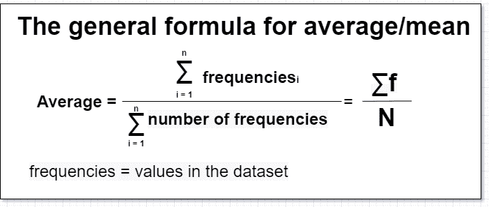
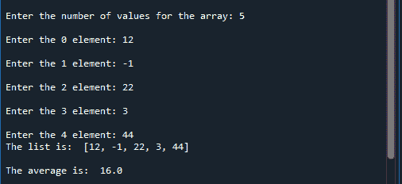

# Numpy average()函数–简要概述

> 原文：<https://www.askpython.com/python-modules/numpy/numpy-average-function>

首先这篇文章的主要标题给了我们所有人一个聪明的想法，这个函数的用途是什么。一些有统计学背景的人非常了解平均术语。数据科学和人工智能从业者有意或无意地在预处理方法中使用这个术语。让我们进一步了解更多的细节。

## 介绍

在一般统计中，平均值是所有数字的值除以它们的总数。这背后的主要工作有助于我们理解数据集的核心价值。

**举个例子:**我们有六个不同的值，彼此略有不同。它们是一些公司员工的工资。任务是找出每个人每年的最佳收入。

**解决方案:**假设我们有**LPA**as:

1.  Four hundred thousand
2.  Four hundred and fifty thousand
3.  Five hundred thousand
4.  Four hundred and seventy thousand
5.  Four hundred and sixty thousand
6.  Five hundred thousand

然后我们取平均值。下面是这个的公式:



Average/Mean Formula

因此，我们计算平均值如下:

平均值=**(400000+450000+500000+470000+460000+500000)/6**

答案是:每年 463333.3334 万卢比。这是每人一年的平均工资。

## 基本概念

从上面的例子中，我们知道了主要的优点。最佳值是计算各种参数所必需的。均值在现实世界中有各种各样的应用。

1.  预测一个州的平均收入。
2.  决定商品在市场上的最佳销售价格。
3.  测试分数的标准化涉及平均值计算。

这些值相差很大，对这个术语有各种各样的修改:

1.  **算术手段:用于统计分析表格数据。**
2.  **常规均值/平均值:常用于常见的数学运算。**

现在，我们将使用第二种形式。

## 在 Python 中实现平均函数

这有两种方法。

1.  为我们的任务创建一个 average()函数。
2.  使用 numpy 内置的 numpy 库。**平均值()** **函数。**

### 为任务创建一个 average()函数

这个函数的创建非常简单明了。但是，我们需要注意一点，我们应该使用哪种格式的输入。所以数组是正确的格式。因为在数组中我们可以存储不同数量的值。

**代码:**

```py
# function that takes the average of the elements
def average(value): 
    avg = sum(value)/len(value)
    print('The average is: ', abs(avg))

# main method for the user input
def main():
    'For the input arguments'
    li = [] # declaring an empty list
    a = int(input('Enter the number of values for the array: '))

    for i in range(a):
        li.append(int(input('Enter the {0} element: '.format(i+1))))

    print('The list is: ', li, '\n')

    average(li)

main()

```

**输出:**



Output For The Created Function

**说明:**

1.  声明一个函数即 average()。然后给出里面的**均值**的必要公式。所有值之和与几个值之和的除法。
2.  然后主函数让核心工作。它将数组作为用户的输入。然后，它获取输入的数量并打印数组。
3.  然后我们在 main 函数中调用 average 函数，它将同一个数组作为输入参数。然后我们得到所有元素的平均值。

### 为任务使用 numpy 库

Numpy 库的 average()函数使我们的任务变得简单了一些。我们都知道这个 API 是著名的数组操作库之一。几个内置的方法减少了我们的代码，使一些事情更容易实现。它的类型是 NumPy ndarray。在开始使用**average()**函数之前，我们将首先声明一些核心步骤。

1.  将 NumPy 模块作为 np 导入。
2.  通过 np.array()方法声明一个数组。
3.  然后调用 average()函数，并将数组作为其内部的输入参数。
4.  将所有这些存储在一个变量中，并将结果打印在屏幕上。

**1D 阵列代码:**

```py
import numpy as np
array = np.array([22, 12, 3, -1, -3, 98])
a = np.average(array)
print('The average of the elements in the array is: ', abs(round(a, 3)))

# output:
# The average of the elements in the array is:  21.833

```

**说明:**

1.  在 NumPy 模块的 array()方法中声明一个数组。
2.  然后声明一个存储平均值的变量。然后调用 average()函数，并将其中的同一个数组作为参数。
3.  我们使用 **abs()** 函数来获得绝对值。然后我们使用**round()**函数将它四舍五入到小数点后三位。
4.  将数值打印在屏幕上。

**三维阵列代码:**

```py
import numpy as np
array = np.array([[22, 12, 3],[-1, -3, 98], [3, 44, 0]])
a = np.average(array)
print('The average of the elements in the array is: ', abs(round(a, 3)))

# Output:
# The average of the elements in the array is:  19.778

```

我们有一个 3D 数组来检查函数是否对那些数组有用。使用纸和笔来解决这个问题是一项非常繁琐的任务。我们已经得到了所需的结果。

## 结论

结束这个话题并不容易，因为还有很多事情要做。这是一个有趣的话题，人们可以从中获得 Numpy 库为特殊数学运算提供的各种函数的核心知识。因此，请再次查看代码实现，以便更好地理解。