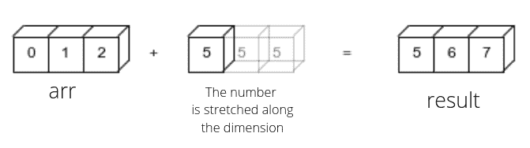
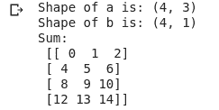
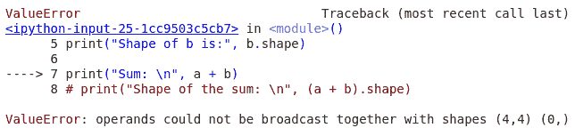
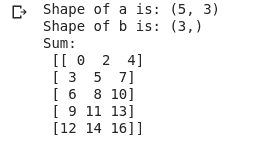
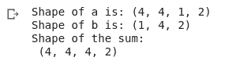

# 数字广播:初学者指南

> 原文：<https://www.askpython.com/python-modules/numpy/numpy-broadcasting>

在本指南中，我们将从初学者的角度讨论 Numpy 广播。本指南假定您对该主题没有任何先验知识，因此我们将从基础开始帮助您入门。

## 什么是 Numpy 广播？

*“广播”一词描述了 numpy 在算术运算中如何处理不同形状的数组。在某些约束条件下，较小的阵列在较大的阵列中“广播”,以便它们具有兼容的形状。广播提供了一种向量化数组操作的方法，因此循环在 C 而不是 Python 中发生。*

让我们举个小例子来理解这一点。我们将两个数组添加到不同的维度，以理解 NumPy 的广播机制。

```py
import numpy as np

arr = np.arange(3)
result = arr + 4

```

这里 arr 有一个维度(轴)，长度为 3，另一方面，长度为 5。是一个简单的整数，理论上有 0 维。由于它们具有不同的维度，Numpy 试图沿着特定的轴传播(简单地拉伸)较小的数组，使其适合进行数学运算。



## Numpy 广播规则

Numpy broadcasting 有一套严格的规则来保证阵列操作的一致性和防故障性。这是 numpy 广播的两条一般规则:

*   当我们在 [NumPy 数组](https://www.askpython.com/python-modules/numpy/python-numpy-arrays)上执行操作时，NumPy 从右到左逐个元素地比较数组的形状。只有当两个维度相等或其中一个为 1 时，它们才是相容的。如果两个维度相等，则数组保持不变。如果维度为 1，则数组沿该维度传播。如果两个条件都不满足，NumPy 抛出一个 ValueError，表示数组不能被广播。*数组广播当且仅当所有维度兼容。*
*   被比较的数组不需要具有相同的维数。具有较少维数的阵列可以容易地沿着缺少的维数缩放。

## 实现数字广播

这里有几个例子可以更好地理解这些规则:

```py
a = np.arange(12).reshape(4, 3)
print("Shape of a is:", a.shape)

b = np.arange(4).reshape(4, 1)
print("Shape of b is:", b.shape)

print("Sum: \n", a + b)

```



具有兼容维数的数组之和:数组具有兼容的维数(4，3)和(4，1)。数组 b 沿第二维拉伸，以匹配 a 的维度。

```py
a = np.arange(16).reshape(4, 4)
print("Shape of a is:", a.shape)

b = np.arange(4).reshape(4, 2)
print("Shape of b is:", b.shape)

print("Sum: \n", a + b)

```



维数是(4，4)和(4，2)。广播失败，因为广播的维度最初必须为 1。

```py
a = np.arange(15).reshape(5, 3)
print("Shape of a is:", a.shape)

b = np.arange(3)
print("Shape of b is:", b.shape)

print("Sum: \n", a + b)

```



这里数组的维数是(5，3)和(3)。数组 b 少了一个维度。因为维度的比较是从右到左进行的，所以 b 沿着第一维被拉伸。

```py
a = np.arange(32).reshape(4, 4, 1, 2)
print("Shape of a is:", a.shape)

b = np.arange(8).reshape(1,4,2)
print("Shape of b is:", b.shape)

print("Shape of the sum: \n", (a + b).shape)

```



值得注意的是，可以沿多个维度广播多个阵列。数组 a 的维数为(4，4，1，2)，数组 b 的维数为(1，4，2)。数组 a 沿第三个维度拉伸，而数组 b 沿第一个和第二个维度拉伸，得到的数组的维度为(4，4，4，2)。

## 速度广播的好处

Numpy 广播比在阵列上循环更快。让我们举第一个例子。用户可以决定不使用广播机制，而是循环遍历整个数组，将相同的数字添加到数组中的每个元素。这可能会很慢，主要有两个原因——循环涉及到与 [python 循环](https://www.askpython.com/python/python-loops-in-python)的交互，这会降低 C 实现的速度。其次，NumPy 使用大踏步而不是循环。将步幅大小设置为 0 可以让您无限重复这些元素，而不会产生任何内存开销。

## 结论

Numpy 广播提供了一种处理两个不同形状的数组的快速和内存高效的方法。在广播两个阵列之前，用户需要注意某些规则。

### 参考文献:

*   [数量文件](https://numpy.org/doc/stable/user/basics.broadcasting.html)
*   [Numpy 关于广播的文章](https://numpy.org/devdocs/user/theory.broadcasting.html)