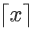
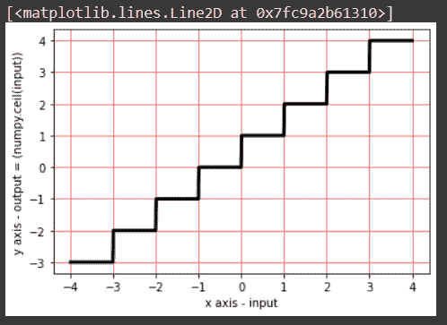

# numpy ceil–返回输入的上限，以元素为单位

> 原文:# t0]https://www . aspython . com/python-modules/num py/numpy-ceil

在本教程中，我们今天将讨论如何返回输入的上限。这将通过使用 python 和 google collab 来完成。回想一下，你年轻的时候可能尝试过最大整数函数和最小整数函数。ceil 函数是最小的整数函数，而 floor 函数是最大的整数函数。我们将在今天的代码片段中实现所有这些。让我们开始吧。

***也读作:[Numpy floor–返回输入的楼层，逐点](https://www.askpython.com/python-modules/numpy/numpy-floor)***

## 什么是天花板功能？

输入 *x* 的上限函数是最近的最小整数 I，因此 I 应该大于或等于 x。它被表示为。让我们观察下面的例子。

*   0.366 的上限函数将是 1。因为 1 是大于 0.366 的最近的最小整数。
*   -0.366 的上限函数将是 0。因为 0 是大于-0.366 的最近的最小整数。
*   -3 的上限函数是-3。因为-3 是大于或等于-3 的最近的最小整数。

NumPy.ceil()函数用于将一个数字向上舍入到最接近的整数。这个函数是从 [Numpy 库](https://www.askpython.com/python-modules/numpy/python-numpy-module)导入的，这是一个 Python 编程语言的库，支持对数组和矩阵进行[数学运算](https://www.askpython.com/python-modules/numpy/numpy-universal-functions)。此函数可应用于单值输入以及数组。

## 实现 Numpy.ceil()方法

今天我们将看到如何为一个正值、一个负值、一个整数和一个数组实现这个函数。让我们看看下面使用这个函数的语法。

```py
numpy.ceil(x, out=None, where=True, casting='same_kind', order='K', subok : [bool, datatype])

```

上述代码片段中使用的参数如下:

*   x: 它可以是包含弧度值的变量，也可以是包含某个值的数组
*   **out:** 存储结果的位置。如果提供了，它必须具有与输入 x 相似的形状。如果没有提供或没有提供，则返回新的值或结果。这是可选的。
*   当条件为真时，我们必须得到我们的结果或输出；当条件为假时，我们将得不到任何结果。这是可选的。y 默认其值为真。
*   **casting='same_kind':** 表示只允许 float64 到 float32 的值或结果。该函数在此范围或数据类型中呼喊 cast 值。
*   **order = 'K':** 它总是以 K 排序的形式产生一个输出数组。(注意:有四种类型的订单:**{‘K’，‘C’，‘F’，‘A’}**)。这是可选的。
*   **subok**:【bool，datatype】**是否生成结果的子类**。如果为真，则提供子类的名称。它返回一个与给定数组具有相同形状和类型的数组。也是可选的。

现在，我们将在下面的代码片段中实现相同的功能。通过在每个代码片段中传递不同的输入，我们将有四个代码片段来实现这个功能。让我们得到它。

## 正数的 Numpy.ceil()函数

```py
import numpy as np
a = np.ceil(0.366)
a

#output 
    1.0

```

在上面的代码片段中，我们在导入 Numpy 库之后实现了我们的`Numpy.ceil()`函数。我们传递了一个正的小数值作为它的参数，得到了与上面例子中相同的结果。

## 负数的上限函数

类似地，让我们尝试传递一个负的小数值，看看下面的结果。

```py
import numpy as np
b = np.ceil(-0.366)
b

#output 
    -0.0

```

## 阵列的上限函数

这一次，我们将传递一个包含如下值的数组。让我们看看结果如何。

```py
import numpy as np
import math

input = np.array([-2.35,-1,  -0.36, 0, 0.36, 1, 5.69, 5%2, 5/2, math.pi ])
c = np.ceil(input)
c

#output 
    array([-2., -1., -0.,  0.,  1.,  1.,  6.,  1.,  3.,  4.])

```

你可以看到它给了我们一个数组，输入数组中所有元素的上限函数。让我们关注最后两个元素，我们已经通过了 5%2、5/2 和 math.pi。您分析它对这种类型的输入有什么反应吗？它分别计算出 5%2 = 1、5/2 = 2.5 和 math.pi = 22/7 =3.142857142857…‬的值，然后分别为 1、2.5 和 3.142857142857…‬实现上限函数。

还有一点，我们都需要注意，输出数组包含了 float 数据类型的所有值。所以，请确定，我们语法中的数据类型默认为 float，它总是以 float 或 decimal 给出输出。

## 复数的上限函数

```py
import numpy as np
import cmath
x=5
y=6
z=complex(x,y)
print(z)

d = np.ceil(z)
print(d)

```

正如我们所看到的，我们导入了 **" `cmath` "** 模块，使用 **`complex()`** 方法创建了一个复杂的数字，并最终将其传递给我们的 **`numpy.ceil()`** 函数。让我们看看它对我们的输入是如何反应的。让我们打印出 d 的值。

```py
print(z)
print(d)

(5+6j) #value of z
---------------------------------------------------------------------------
TypeError                                 Traceback (most recent call last)
<ipython-input-12-b0ea321d89b0> in <module>
      5 z=complex(x,y)
      6 print(z)
----> 7 d = np.ceil(z)
      8 print(b)

TypeError: ufunc 'ceil' not supported for the input types, and the inputs could not be safely coerced to any supported types according to the casting rule ''safe''

```

您可以看到它抛出了一个错误。你知道错误是什么吗？**ceil 功能不支持这种类型的输入。**

## 在图形上绘制 numpy.ceil()

在下面的代码片段中，我们创建了空数组 x[]和 y[]。使用 while 循环，我们已经将输入值从-3.99 开始加载到 x[]数组中，从 4.00 开始按顺序增加 0.01。在实现了`ceil`函数之后，我们将各自的结果加载到 y[]数组中。使用 x[]和 y[]数组，我们使用`matplotlib.pyplot` 库及其支持方法绘制了我们的图表。

```py
import matplotlib.pyplot as plt
import numpy
x=[]
y=[]
i=-3.99
while (i<4.00):
    x.append(i)
    y.append(numpy.ceil(i))
    i=i+0.01

plt.xlabel("x axis - input")
plt.ylabel("y axis - output = (numpy.ceil(input))")
plt.grid(linestyle='-', linewidth=0.5,color='red')
plt.plot(x,y, linewidth=3, color = 'black')

```



## 结论

今天尝试了我们的天花板功能后，发现它更容易理解和学习。我们尝试了不同类型的输入，得到了不同的输出。我们现在更明白了。我们将带着一些更激动人心的话题回来。谢谢你。