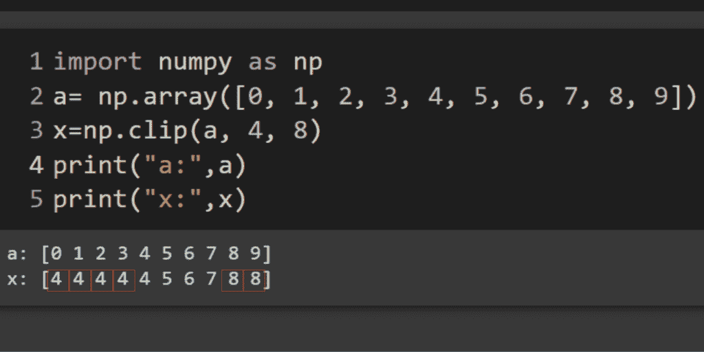
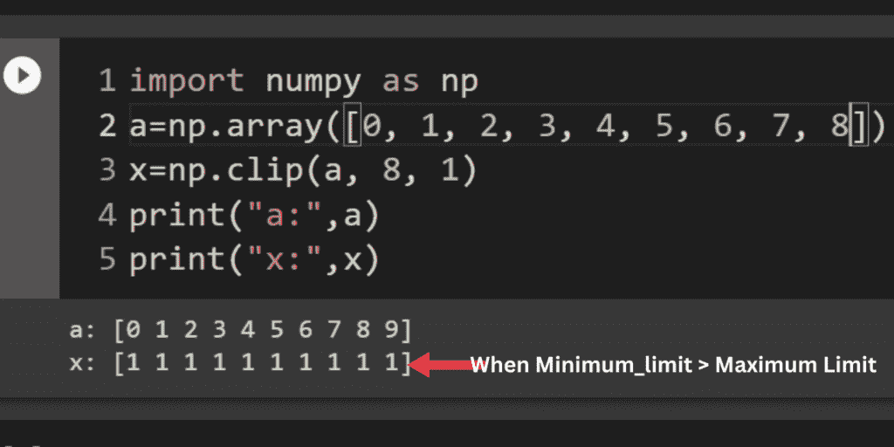
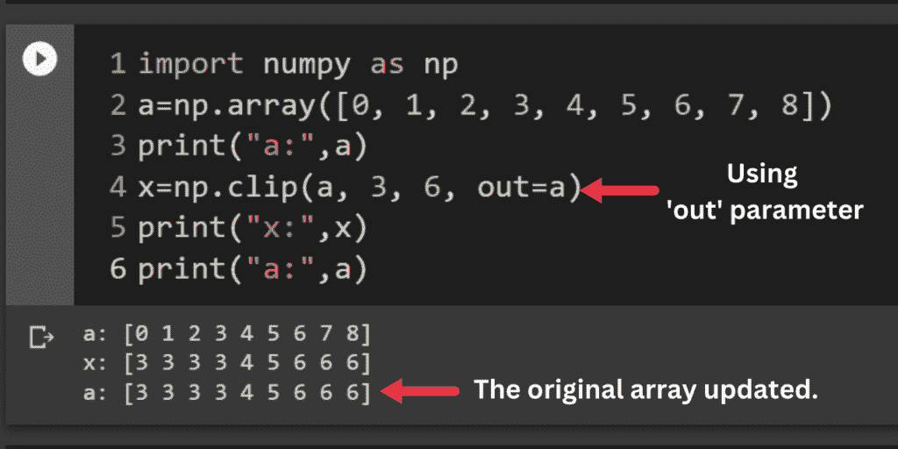
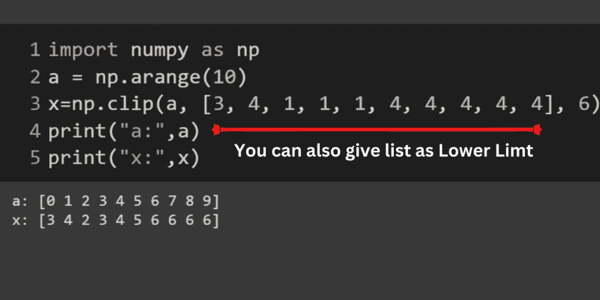

# numpy Clip–裁剪(限制)数组中的值

> 原文：<https://www.askpython.com/python-modules/numpy/numpy-clip>

Python 的 NumPy 模块提供了一种裁剪数组元素的方法。**方法名为 numpy.clip()。**让我们更详细地探索 numpy.clip 方法。

***也读作:[如何在数组上使用 Numpy 最小值？](https://www.askpython.com/python-modules/numpy/numpy-minimum-on-arrays)***

## Numpy.clip()方法是什么？

Numpy.clip()方法是一个函数，它采用一个由数字、最小值和最大值组成的数组，并返回一个数组，其中指定范围之外的所有值都替换为指定的最小/最大值。

这对于确保数组中的所有值都在某个范围内很有用，例如用于缩放或标准化数据。它还可以用于将数组中的值的范围限制在某个范围内。

### 定义 numpy.clip()

Numpy 是 Python 中执行数学和科学运算的强大模块。要使用它，首先确保通过在命令提示符 shell 中键入'`pip3 install numpy`'来安装它。

安装后，您可以使用“numpy.clip()”函数来限制数组中值的范围。这在某些数据处理场景中很有用。

### numpy.clip()的语法

```py
numpy.clip(array, array_min_element, array_max_element, out=None) 

```

**numpy . clip()方法有三个参数:**

*   **数组**:要裁剪的值的数组。
*   **array_min_element** :数组元素允许达到的最小值。
*   **array_max_element** :数组元素允许达到的最大值。
*   **out(可选)**:可选输出数组。

## clip()函数的工作原理

clip()函数的作用是:在指定的范围内裁剪数组中的元素。它是这样工作的:

*   指定数组以及第二个和第三个参数之间的范围(array_Minimum_limit，array_maximum_limit)。
*   如果原始数组中的所有元素都小于或等于最小限制，它们将被替换并显示为最小限制。
*   其余元素将与最大限制进行比较。
*   如果元素小于最大限制，将打印原始数组中的值。
*   如果元素等于最大限制，将打印“10”。如果超过最大限制，它将被替换为最大限制。

注意:原始数组和剪切后的数组的长度是相同的。

## Numpy.clip()的实例

让我们从最基本的例子开始，这样你就能理解它是如何工作的。这里我们将使用 [numpy.arange()方法](https://www.askpython.com/python-modules/numpy/numpy-arange-method-in-python)。

```py
import numpy as np
x= np.arange(12)  
print("x:",x)
y = np.clip(x,2,12)
print("y:",y)

```


Values Replaced By the Minimum and Maximum Limit.

**上面使用的参数**

1.  `x: original_array`
    包含要裁剪元素的数组。
2.  `array_min_element, array_max_element` : *超过极限范围。*
    给定区间边的最小值和最大值。**没有**可以给任何边，裁剪不会对相应的边起作用，只有**参数中的一个**可以是无。
3.  `out: ndarray,` *可选*
    clip()函数返回 ndarray，结果将存储在该数组中。它可以是代替剪辑数组的原始/输入数组。如果是输入数组，它会更新原始数组的值，并存储剪辑后的值。
4.  返回:
    一个包含 x 个元素的数组(原始数组)，其中值< =最小值被替换为 array_min_element，值> =最大值被替换为 array_max_element。

为了更好地理解，以下是几个不同输入的例子。

### 示例 1:基本数组剪辑

此代码创建一个从 0 到 9 的数字数组(a ),然后使用 Numpy.clip()方法创建一个新数组(x ),其中 4 和 8 以外的所有值都替换为 4 或 8。在这种情况下，数组 x 中的所有值将介于 4 和 8 之间，包括 4 和 8。

```py
import numpy as np
a = np.array([0, 1, 2, 3, 4, 5, 6, 7, 8, 9])
x=np.clip(a, 4, 8)
print("a:",a)
print("x:",x)

```



Example 1: Values Replaced By Min Limit And Max Limit

### 示例 2:当最小值限制>最大值限制时

这段代码创建了一个从 0 到 8 的数字数组“a”。然后，它使用 Numpy.clip()方法创建一个新数组“x ”,用指定的最小/最大值替换范围 1 到 8 之外的所有值。在这种情况下，所有小于 1 的值将被替换为 1，所有大于 8 的值将被替换为 8。因此得到的数组“x”将包含值 1、2、3、4、5、6、7 和 8。

```py
import numpy as np
a = np.array([0, 1, 2, 3, 4, 5, 6, 7, 8])
x=np.clip(a, 8, 1)
print("a:",a)
print("x:",x)

```



Example 2: When Minimumim Limit Is More Than Maximum Limit

当`array_min`大于`array_max,`时，`clip`返回一个数组，其中所有值都等于 *array_max* ，如第二个例子所示。

### 示例 3:使用“out”参数

这段代码导入 Numpy 库，并创建一个名为“a”的数组，其值从 0 到 8。然后，使用 Numpy.clip()方法将数组“a”中的值裁剪到 3 到 6 之间的范围。

out 参数意味着新数组将覆盖原始数组“a”。结果是数组“a”现在只包含值 3、4、5 和 6。

```py
import numpy as np
a = np.array([0, 1, 2, 3, 4, 5, 6, 7, 8])
print("a:",a)
x=np.clip(a, 3, 6, out=a)
print("x:",x)
print("a:",a)

```



Example 3: Using Out Parameter

在这里，输入数组得到更新。

### 示例 4:使用列表作为最小限制。

这段代码演示了 Numpy.clip()方法的用法。它创建一个包含数字 0 到 9 的数组“a ”,然后使用 Numpy.clip()函数创建一个包含“a”中所有值的新数组“x ”,并将范围[3，4，1，1，1，4，4，4，4，4]之外的任何值替换为最小/最大值 6。

```py
import numpy as np
a = np.arange(10)
x=np.clip(a, [3, 4, 1, 1, 1, 4, 4, 4, 4, 4], 6)
print("a:",a)
print("x:",x)

```



Example 4 Using List As Minimum Limit

## 摘要

Numpy.clip()方法是一个有用的函数，用于将数组元素裁剪到某个范围。它接受一个数字数组、一个最小值和一个最大值，并返回一个数组，其中指定范围之外的所有值都替换为指定的最小/最大值。这可用于限制数组中值的范围，也可用于缩放或标准化数据。out 参数可用于将结果存储在输入数组中，这对于用截取的值覆盖原始数组非常有用。