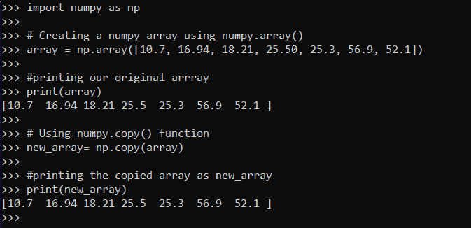
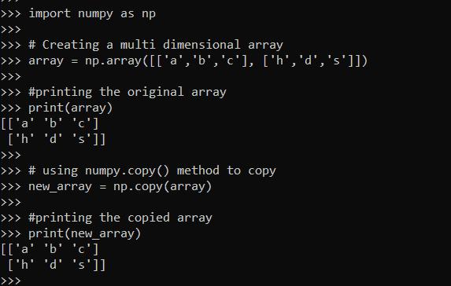
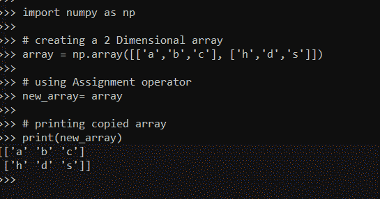
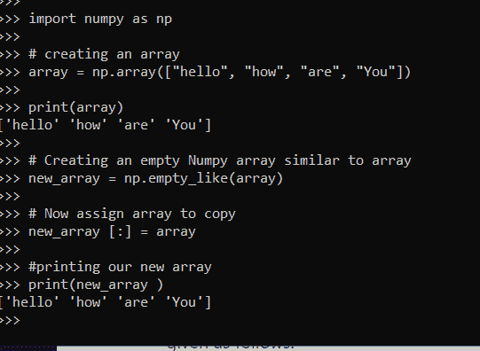

# NumPy.copy():如何复制 NumPy 数组

> 原文：<https://www.askpython.com/python-modules/numpy/numpy-copy>

今天我们要学习如何复制一个 NumPy 数组。我们也将在代码片段中尝试不同的方法。希望你们能和我们一起练习，取得预期的成绩。让我们开始吧。

## 什么是 NumPy 数组？

数组是存储在连续内存位置的相似数据类型的数据集合。这是最简单的数据结构，其中每个数据元素都可以通过使用其索引号直接访问。在 Python 中，数组是 NumPy 库的一种数据结构。一个 [**NumPy 阵列**](https://www.askpython.com/python-modules/numpy/python-numpy-arrays) 的一些关键特征给出如下。

*   它在本质上是同质的。我们可以对数组元素执行所有的操作。
*   NumPy 中的数组可以是一维的，也可以是多维的。
*   它包含用于代码集成的工具。
*   我们可以创建不同数据类型的数组。
*   **NumPy 数组的所有元素**在内存块中的**大小相等。**

让我们了解如何创建 NumPy 数组。我们可以按照下面的代码片段使用 Python IDLE shell 创建我们的第一个 NumPy 数组。让我们和你一起编码。

```py
#importing the numpy module
import numpy as np

#creating array
my_array = np.array(["Hi", "Hello", "Welcome", "to", "JournalDev"])

#printing our array
print(my_array)

print(type(my_array))

```

上面的代码片段将给出如下输出，我们可以看到创建了一个数组，我们还打印了数组的类型，它是`numpy.ndarray.`

```py
["Hi", "Hello", "Welcome", "to", "JournalDev"]
<class 'numpy.ndarray'>

```

在遵循我们的代码片段之前，请确保您已经在您的计算机上安装了 NumPy 模块，如果没有，您可以通过使用命令提示符中的 [`pip`包安装程序](https://www.askpython.com/python-modules/python-pip)来下载该模块，如下所示。

```py
pip install numpy

```

现在，我们将理解使用不同方法复制 NumPy 数组的不同方式，如下所示。

## 1.使用 NumPy.copy()方法

方法创建了数组的一个副本。在下面的例子中，我们将使用这个方法把数组`‘array‘`复制到另一个数组`‘copy_array‘`。

```py
#importing the numpy module
import numpy as np

# Creating a numpy Arrayusing numpy.array()
array = np.array([10.7, 16.94, 18.21, 25.50, 25.3, 56.9, 52.1])

#printing our original Array
print(array)

# Using numpy.copy() function
new_array= np.copy(array)

#printing the copied Arrayas new_array
print(new_array)

```

上面的代码片段将使用`.copy()` 方法将数组的内容复制到 new_array，并给出如下输出。



Copied Array

**上述方法的语法为:**

```py
numpy.copy(array, order='K')

```

上述代码片段中的参数是:

*   `array `–要复制的阵列的名称
*   `order`–控制复印的内存布局。默认情况下 order='K '。这是可选的。

## 2.复制多维数组

让我们看另一个复制多维 NumPy 数组的`.copy()`方法的例子。遵循下面的代码片段。

```py
import numpy as np

# Creating a multi dimensional Array
array = np.array([['a','b','c'], ['h','d','s']])

#printing the original Array
print(array)

# using numpy.copy() method to copy
new_array = np.copy(array)

#printing the copied Array
print(new_array)

```

上面的代码片段将多维数组复制到新数组，并给出如下输出。



Copy Multidimensional Array 1

## 3.使用赋值运算符复制 Numpy 数组

```py
import numpy as np

# creating a 2 Dimensional array
array = np.array([['a','b','c'], ['h','d','s']])

# using Assignment operator
new_array= array

# printing copied array
print(new_array)

```

在上面的代码片段中，数组的内容由[赋值操作符](https://www.askpython.com/python/python-operators)“`=`”赋值给 new_array。让我们看看同样的输出。



Assignment Operator Example Output

## 4.使用 NumPy.empty_like()方法

```py
import numpy as np

# creating an Array
array = np.array(["hello", "how", "are", "You"])

print(array)

# Creating an empty Numpy array similar to Array
new_array = np.empty_like(array)

# Now assign Array to copy
new_array [:] = array

#printing our new Array
print(new_array )

```

此方法返回具有相同数据的任意数据。它不会初始化值。因为它没有初始化，我们需要给它赋值。这样，我们就把数组复制到了 new_array。上面代码片段的输出如下所示。



Empty Like Method Example Output

## 摘要

在本文中，我已经通过示例学习了如何使用不同的方法创建 NumPy 数组的副本。希望你一定练习过并喜欢我们的代码片段。我们必须带着一些更令人兴奋的话题再次访问。