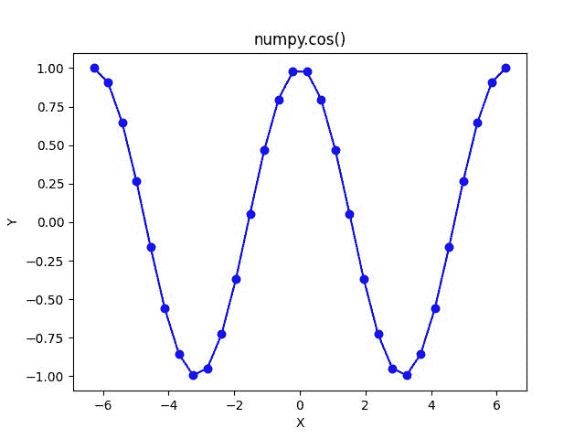

# NumPy Cos–完整指南

> 原文:# t0]https://www . aspython . com/python-modules/num py/numpy-cos

欢迎来到 [**NumPy 三角函数**](https://www.askpython.com/python/numpy-trigonometric-functions) 系列第二教程。在本教程中，我们将了解 NumPy Cos 函数。

NumPy 提供了许多三角函数， **NumPy Cos** 就是其中之一。就像 **Numpy Sine** 在 **[-1，1]** 范围内产生输出一样，**余弦**函数的输出也是一样的。

我们会练习很多例子，让我们的理解变得清晰，让我们开始吧。

## 什么是 NumPy Cos？

NumPy Cos 是 NumPy 库提供的三角函数之一，它计算单个数字的三角函数**余弦函数**以及角度的 NumPy 数组。

**注意:** NumPy Cos 函数可以作为`numpy.cos`访问

## NumPy Cos 的语法

NumPy Cos 以**弧度**的角度作为参数。然而，角度在**度**中也可以作为自变量给出。

**语法:** `numpy.cos(input)`其中输入可以是单个数字，也可以是 NumPy 数组

## 单一角度的 Cos

让我们尝试一些 Numpy Cos 函数的例子来帮助我们更好地理解它。

### 圆周率值的余弦值

```py
import numpy as np

print("Printing the Cosine Values\n")

print("Cosine of 0 is :",np.cos(0))

print("Cosine of pi/6 is :",np.cos(np.pi/6))

print("Cosine of pi/3 is :",np.cos(np.pi/3))

print("Cosine of pi/2 is :",np.cos(np.pi/2))

print("Cosine of pi is :",np.cos(np.pi))

```

**输出**

```py
Printing the Cosine Values

Cosine of 0 is : 1.0
Cosine of pi/6 is : 0.8660254037844387
Cosine of pi/3 is : 0.5000000000000001
Cosine of pi/2 is : 6.123233995736766e-17
Cosine of pi is : -1.0

```

*   除了π/2 的余弦输出，每个输出都非常清楚。
*   **π/2**的 Numpy 余弦提供了不同的输出——该输出采用科学记数法，指数为 10^(-17) ，等于 0。

现在，让我们看看如何将角度作为参数传递给 numpy.cos 函数。

### 带 Deg2Rad 函数的 Numpy Cos 函数

为了计算角度的余弦值，其中 cos 函数的自变量为**度**函数`deg2rad`被使用。

```py
import numpy as np

print("Cosine of 30 degrees is :",np.sin(np.deg2rad(30)))

print("Cosine of 60 degrees is :",np.sin(np.deg2rad(60)))

print("Cosine of 90 degrees is :",np.sin(np.deg2rad(90)))

print("Cosine of 180 degrees is :",np.sin(np.deg2rad(180)))

```

输出

```py
Cosine of 30 degrees is : 0.49999999999999994
Cosine of 60 degrees is : 0.8660254037844386
Cosine of 90 degrees is : 1.0
Cosine of 180 degrees is : 1.2246467991473532e-16

```

这是关于将角度作为参数传递给 numpy.cos()函数。

现在，让我们看看如何计算一组角度的余弦值。

## 多角度的数字余弦

cos 函数也将角度的 Numpy 数组作为参数，但是我们必须确保角度被转换为弧度。

### 角度数组上的数值余弦

```py
import numpy as np

# A NumPy array with all the angles in degrees
a = np.array((0 , 30 , 45 , 60 , 90))

print("Cosine Values :\n",np.cos(a*np.pi/180))

# A NumPy array with all the angles is radians
b = np.array((0 , np.pi/2 , np.pi/3 , np.pi))

print("Cosine Values :\n",np.cos(b))

```

输出

```py
Cosine Values :
 [1.00000000e+00 8.66025404e-01 7.07106781e-01 5.00000000e-01
 6.12323400e-17]
Cosine Values :
 [ 1.000000e+00  6.123234e-17  5.000000e-01 -1.000000e+00]

```

在上面的代码片段中，输出是一个 NumPy 数组，其中的值非常奇怪。但是如果你仔细观察，你就会明白输出是用科学符号表示的。

### 等距 Numpy 数组上的 Numpy 余弦值

在这个例子中，我们将使用`numpy.linspace`创建一个由 30 个均匀分布的值组成的 [NumPy 数组](https://www.askpython.com/python-modules/numpy/python-numpy-arrays)。

```py
import numpy as np

a = np.linspace(-(2*np.pi) , 2*np.pi , 30)

print("Cosine Values: ",np.cos(a))

```

**输出**

```py
Cosine Values:  [ 1\.          0.90757542  0.64738628  0.26752834 -0.161782   -0.56118707
 -0.85685718 -0.99413796 -0.94765317 -0.72599549 -0.37013816  0.05413891
  0.46840844  0.79609307  0.97662056  0.97662056  0.79609307  0.46840844
  0.05413891 -0.37013816 -0.72599549 -0.94765317 -0.99413796 -0.85685718
 -0.56118707 -0.161782    0.26752834  0.64738628  0.90757542  1\.        ]

```

这里，我们使用`numpy.linspace`创建了一个 NumPy 数组，它有 30 个均匀间隔的弧度角，范围从 **-2pi** 到 **2pi** 。

输出也是一个 **NumPy 数组**，它是数组元素的余弦值。

## 可视化 Cos 函数

```py
import numpy as np

# Importing the Matplotlib Library
import matplotlib.pyplot as plt

# Creating a NumPy Array of 30 evenly-spaced elements
a = np.linspace((-2*np.pi),(2*np.pi),30)

# Storing the cosine values in a NumPy Array
b = np.cos(a)

plt.plot(a, b, color = "blue", marker = "o")
plt.title("numpy.cos()")
plt.xlabel("X")
plt.ylabel("Y")
plt.show()

```

**输出**



**Cosine Plot**

`**plt.plot()**`函数用于绘制带四个参数的余弦函数。

*   第**个**参数是角度的 **NumPy 数组**(在第 7 行创建)，绘制在 X 轴(水平轴)上。
*   **第二个**参数是 cos 函数的输出，以 NumPy 数组的形式存储在中，绘制在 Y 轴(垂直轴)上。
*   第三个参数是绘图的颜色。
*   **第四个**参数是标记值，用指定的标记强调每个点。有不同类型的标记可用于表示曲线上的点。

你现在知道余弦函数的曲线是什么样子了。

## 摘要

在本教程中，我们通过示例了解了如何使用 NumPy Cos 函数。如果你使用的是 Jupyter Notebook，那么在每个单元格中写完每一行代码后，按`shift+enter`来获得输出。

**你的任务**是使用 NumPy Cos 函数来计算你选择的更多值的余弦值。

在下一篇教程中，我们将详细讲解 NumPy Tan 函数。在那之前，请继续关注。

## 参考

[num py documentation–num py cos](https://numpy.org/doc/stable/reference/generated/numpy.cos.html)

[Matplotlib–开始使用](https://matplotlib.org/stable/users/getting_started/)