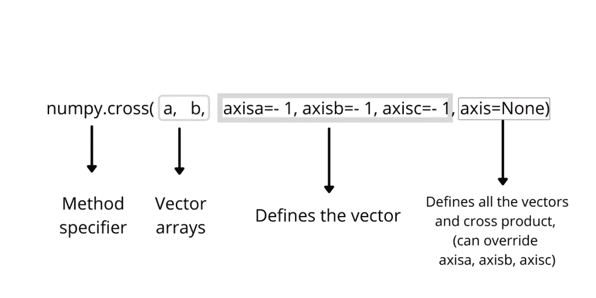
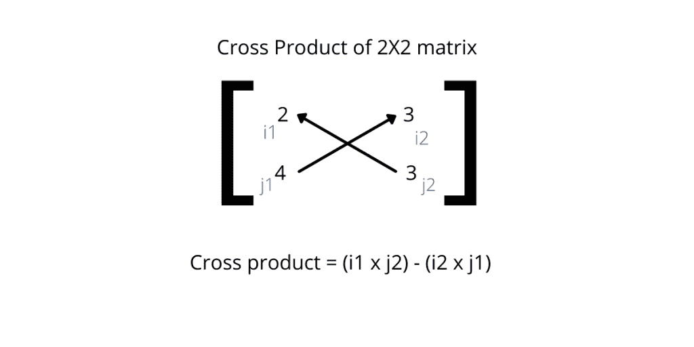
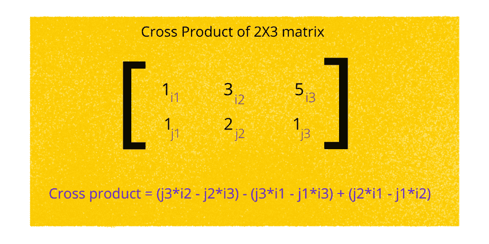

# Numpy 交叉产品–完整指南

> 原文：<https://www.askpython.com/python-modules/numpy/numpy-cross-product>

叉积是一种数学工具，用于计算两个矢量坐标的垂直矢量分量。

**假设在一个 3D 空间中，有两个点:**

*   坐标为(1，2，3)的 a '
*   b '坐标为(4，5，6)。

所以两个坐标的向量分量，将是这个向量矩阵的行列式的叉积。

叉积将是两个矩阵点的非交换垂直矢量积。

## Numpy 叉积

numpy.cross()是 Python 库中的一个数学函数，它找出两个数组(维数为 2&3)之间的叉积，结果可以用[打印函数](https://www.askpython.com/python/built-in-methods/python-print-function)显示。

### Numpy 叉积的语法

实现叉积的基本语法是:

```py
np.cross[M,N]

```

其中 M 和 N 是存储向量坐标的数组变量，但是我们可以根据我们的适用性和需要指定某些参数。



Numpy Cross Syntax

## 如何用 Numpy Python 计算叉积？

让我们看一个关于如何在 python 中找到叉积的函数代码。

### 1.2X2 矩阵的叉积

假设有两个数组，X= [2，3]，Y= [4，3]。为了求向量积，我们需要求 i1-j2 和 i2-j1 的乘积之差。两个二维数组的矢量积总是一维整数。



2X2 cross product

最终结果是(3 * 2)–(4 * 3)=-6。

注意:在这种情况下，X 和 Y 维度是在 z 分量不存在的情况下定义的，因此最终输出是标量。

**示例代码:**

```py
import numpy as pr 

#initialize arrays 

X = pr.array([2, 3]) 
Y = pr.array([4, 3]) 

#calculating cross product 

vector_result= pr.cross(X,Y) 
print(vector_result)

```

### 2.2×3 阵列的叉积

让我们取两个三维数组，求它的叉积。

让我们取 X= [1，3，5]和 Y= [1，2，1]



2X3 matrix cross product

这里，最终的输出将是= (-7，4，-1)

**示例代码:**

```py
import numpy as pr

#initialize arrays

X = pr.array([1, 3, 5])
Y = pr.array([1, 2, 1])

#calculating cross product
cross_product= pr.cross(X,Y)

print(cross_product)

```

注意:numpy 叉积支持 2 维和 3 维矩阵，任何高维矩阵都将抛出错误输出。

让我们再举一个例子，假设 M=[5，6，4]和 N=[2，1]

**示例代码:**

```py
import numpy as pr

#initialize arrays

X = pr.array([5, 6, 4])
Y = pr.array([2, 1])

#calculating cross product
cross_product= pr.cross(X,Y)

print(cross_product)

```

这里，编译器自动将数组 N 的 z 分量赋值为零，并基于该参数计算最终输出。最终结果= [-4，8，-7]

## 结论

在本文中，我们学习了如何使用 python 数学函数“numpy.cross”来计算两个向量数组的叉积。我们还了解了不同的案例场景和参数，通过它们可以在不同的数组值集合上实现 numpy.cross。