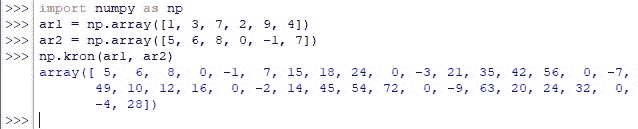
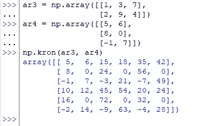

# Numpy.kron():如何使用 Numpy 计算 Kronecker 积？

> 原文:# t0]https://www . aspython . com/python-modules/num py/numpy-crown

假设给我们一对矩阵，我们想以牺牲另一个矩阵为代价来转换一个矩阵。这意味着使用一个矩阵的元素来缩放另一个矩阵。实现这一点的数学过程被称为“Kronecker 积”, Python 中的 NumPy 库提供了一个独特的函数—*kron()。*

这篇文章将帮助你理解如何使用 *numpy* 库中的 *kron( )* 函数来计算克罗内克乘积。让我们开始理解这个函数，首先使用下面的代码导入 *numpy* 库。

```py
import numpy as np

```

此后，我们将通过以下各节进一步探索 *kron( )* 函数。

*   **语法*克朗()*函数**
*   **计算相同维数数组的克罗内克积**
*   **计算不同维度数组的克罗内克积**

* * *

## **语法*克朗()*函数**

需要注意的是，在部署 *kron( )* 函数时，应该将待缩放的数组指定为第二个输入实体，同时将用于缩放的数组指定为第一个输入实体。

以下是 *kron( )* 功能运行所需的输入。

```py
numpy.kron(a, b)

```

在哪里，

*   ***a—***N 维数组，包含用于缩放的元素
*   ***b—***要缩放的 N 维数组

* * *

## **计算相同维数数组的克罗内克积**

在这一节中，我们来寻找一对一维数组的 Kronecker 积，如下所示。

```py
ar1 = np.array([1, 3, 7, 2, 9, 4])
ar2 = np.array([5, 6, 8, 0, -1, 7])

```

现在让我们为上述两个数组部署 *kron( )* 函数。

```py
np.kron(ar1, ar2)

```

一旦上面的代码运行，下面的计算将在后端发生，用于计算将以一维数组的形式返回的结果。

*   “ar2”的第一个元素乘以“ar1”的第一个元素，得出输出数组的第一个元素(即 5×1 = 5)。
*   “ar2”的第二个元素乘以“ar1”的第一个元素，得出输出数组的第二个元素(即 6×1 = 6)。
*   “ar2”中的后续元素也是如此，它与“ar1”中的第一个元素相乘，这样 8×1 = 8，0x1 = 0，-1×1 = -1，7×1 = 7。
*   现在，循环从“ar1”的第二个元素开始重复，这样“ar2”的每个元素都乘以“ar1”的第二个元素，以进一步获得输出数组的元素，这样，5×3 = 15，6×3 = 18，…, 7×3 = 21.
*   该过程再次迭代，直到‘ar2’中的所有元素都乘以‘ar1’中的元素。
*   这些元素的乘积按顺序排列，从“ar2”元素之间的乘积开始，第一个元素来自“ar1”，接着是第二个元素来自“ar2”，依此类推。

把以上放在数学语言中，

ar1 = [a [11] a [12] …..a[1n] a [21] a [22] …..a[2n]a[m1]a[m2]…..a [mn]

ar2 = b [11] b [12] …..b[1p]b[21]b[22]…..b[2p]b[O1]b[O2]…..b [op]

ar1 和 ar2 的克罗内克乘积=a[11]XB[11]a[12]XB[12]…..a[1n]XB[1n]
[a<sub>m1]XB[O1]a[m2]XB[O2]…..a [mn] xb [op]



Kronecker Product Calculated For One-Dimensional Arrays

* * *

## **计算不同维度数组的 Kronecker 积:**

当输入不同维度的数组时， *kron( )* 函数也适用。但是，如果需要的话，有时它会优先考虑最小的输入。

```py
ar3 = np.array([[1, 3, 7],
                [2, 9, 4]])
ar4 = np.array([[5, 6],
                [8, 0],
                [-1, 7]])
np.kron(ar3, ar4)

```



Kronecker Product Calculated For Arrays Of Different Dimensions

* * *

## **结论:**

既然我们已经到了本文的结尾，希望它已经详细说明了如何使用来自 *numpy* 库中的 *kron( )* 函数来计算给定张量对的 Kronecker 积。这里是另一篇[解释 Python](https://www.askpython.com/python-modules/numpy/numpy-tensordot) 中 *numpy* 的 *tensordot* ()函数的文章。AskPython 中还有许多其他有趣且信息量大的文章，可能会对那些希望提高 Python 水平的人有很大帮助。当你享受这些的时候，再见！