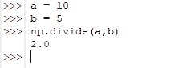
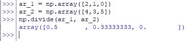
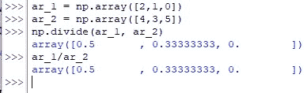
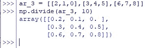
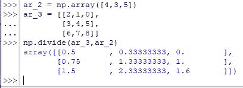
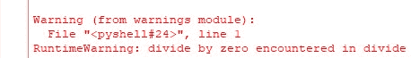

# Numpy。Divide()–如何在 Python 中使用 Numpy Divide？

> 原文：<https://www.askpython.com/python-modules/numpy/numpy-divide>

除法是基本的算术运算之一，用来找出一个给定数的倍数是另一个数的倍数。这不是我们用手指就能完成的事情，因为我们被教导要做加减法。因此，在分析大量数据时，这变得更加乏味。

本文开始探索使用来自 *numpy* 库的 *divide( )* 函数执行除法的不同方差，如下所示。

*   划分两个标量
*   划分两个数组
*   划分一个数组&一个标量
*   划分不同大小的数组

***亦读:[【NumPy Sum——完全指南](https://www.askpython.com/python/examples/numpy-sum)***

* * *

## **numpy . divide()**的语法

在开始解决例子之前，让我们首先理解这个函数的语法。

```py
numpy.divide(x1, x2, where=True, dtype=None)

```

在哪里，

*   *x1*–是被除数的标量或一维数组或二维数组
*   *x2*–是作为除数的标量或一维数组或二维数组
*   *其中*–用于指定数组中的位置，通过键入 TRUE，该位置仅进行除法运算，其他实体不进行除法运算
*   *dtype*–用于指定作为结果返回的数据类型

在开始划分实体之前，使用下面的代码导入 *numpy* 库。

```py
import numpy as np

```

* * *

## **使用 numpy.divide()划分两个标量**

标量是那些只有一个数字的量，不像数组拥有一个数字的集合。让我们给几个变量分配一些标量&使用 *divide( )* 函数。

```py
a = 10
b = 5
np.divide(a,b)

```



Dividing Scalars

* * *

## ****使用 numpy.divide()进行**划分两个数组**

在这一节中，我们将继续划分一对相同大小的一维数组。你没看错吧！使用 *divide( )* 函数要求接受除法运算的数组具有相同的大小。可以使用如下所示的 *array( )* 函数来输入数组。

```py
ar_1 = np.array([2,1,0])
ar_2 = np.array([4,3,5])

```

现在，使用下面的代码将 ar_1 除以 ar_2。

```py
np.divide(ar_1, ar_2)

```



Dividing One-Dimensional Arrays

也可以使用斜杠运算符(/)执行除法，代码如下。

```py
ar_1/ar_2

```



Dividing Using Slash Operator

* * *

## ****使用 numpy.divide()对**划分一个数组&一个标量**

Python 为我们提供了使用标量划分数组的灵活性。这样做的目的是将标量发送给分母，从而除以数组的每个元素，结果将被提供。让我们从创建一个数组开始，这次是二维的。

```py
ar_3 = np.array([[2,1,0],[3,4,5],[6,7,8]])

```

之后，使用 *divide( )* 函数将上述数组中的每个元素除以“10”。

```py
np.divide(ar_3, 10)

```



Dividing A 2D Array By A Scalar

* * *

## ****使用 numpy.divide()进行**划分不同大小的数组**

在本文的前面，我们已经说过，使用 *divide( )* 函数时，两个数组的大小应该相同。这是真的，但在某种程度上，它只适用于列的大小。Python 允许划分两个不同大小的数组，前提是两个数组中的列数相等。因此，让我们创建两个符合这一要求的数组。

```py
ar_2 = np.array([4,3,5])
ar_3 = np.array([[2,1,0],[3,4,5],[6,7,8]])

```

现在可以使用 *divide( )* 函数来完成它的任务。

```py
np.divide(ar_3, ar_2)

```



Dividing Arrays Of Different Sizes

**注意:**应该确保除数不包含零作为它的任何数组元素，否则将出现以下错误。



Divide By Zero Error

* * *

## **总结**

既然我们已经到了本文的结尾，希望它已经详细阐述了如何使用 Python 编程来划分实体。这里有另一篇文章详细介绍了如何在 Python 中使用 *numpy* 减去实体。在 [AskPython](https://www.askpython.com/) 中还有许多其他有趣的&内容丰富的文章，可能会对那些希望提高 Python 水平的人有很大帮助。当你享受这些的时候，再见！