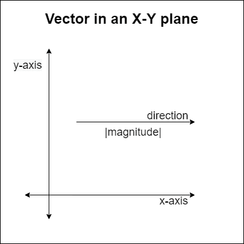
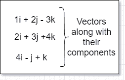
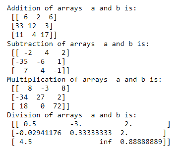
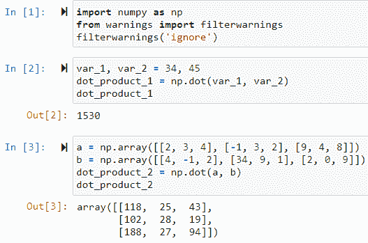
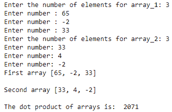

# Numpy Dot()-矢量、Numpy 和计算点积的完整指南

> 原文：<https://www.askpython.com/python-modules/numpy/numpy-dot>

在本文中，我们将学习 numpy dot()方法来寻找点积。它涵盖了标量。向量、数组和矩阵。它还涉及实分析和复数应用，图形可视化，等等。这门学科真正的贡献是在数据科学和人工智能领域。

## 什么是矢量？

矢量是一个既有方向又有大小的箭头形式的量。这样研究起来似乎更精确。现在让我们更深入地研究一下这里所说的箭头的概念。

### 一般定义和表示

1.  **量级:**一个矢量所包含的一个值或一个特定的数。
2.  **方向**:从一点流向另一点。

这些是那些基本术语的细节，它们组合在一起产生了**向量**。我们将看到下图中的图形表示的向量以及一个地方。



A vector in a 1-dimensional plane

## 如何从向量创建矩阵

向量最重要的操作是用矩阵或 T2 数组的形式来表示它。重要的是， **i、j 和 k** 分别是在 **x、y 和 z** 轴上的向量的方向分量。



Vectors With Components

这三个向量可以转换成一个 3×3 的矩阵。矩阵表示法是:

```py
[ [1, 2, -3], 
  [2, 3, 4], 
  [4, -1, 1] ]

```

同样，从给定的一组任意向量中实现矩阵也是可能的。让我们转向主题，即**取点积。两个数组的**。

## Numpy 数组上的操作

该列表向我们展示了对向量或数组最重要的操作:

1.  **点积:**两个向量的元素**的所有乘积相加。**表示为 **A.B** 。
2.  **叉积:**两个矢量合成的第三个矢量。代表为 **AxB。**

在 Python 中，有一个专用于线性代数及其运算的完整库——**[Numpy](https://www.askpython.com/python-modules/numpy/python-numpy-arrays)**。它代表**Num**Eric**Py**thon，用于复杂的计算，尤其是在涉及 n 维数组的情况下。它是一个开源库，所以我们可以通过贡献它的代码来使它变得更好。对于 Python 编程语言来说，这是一个容易获得的 API。

## 实现 Numpy 数组

该库主要用于复杂的数学分析和计算。所以，为了使它更有可能，我们要确保研究它的一些基础知识。这个模块的核心数据类型是 **NumPy ndarray** 。这预示着主要的操作是相对于数组合成和计算的。让我们为它做一个快速教程。

**例#1:**

```py
import numpy as np

list_1 = [23, 12, 3, 11]
print('Original list: ', list_1)

arr = nparray(list_1)
print('Numpy array: ', arr)

print('Data type of list_1', type(list_1))
print('Data type of arr', type(arr))

# Output
# Original list: [23, 12, 3, 11] 
# Numpy array: array([23, 12, 3, 11])
# <class: list>
# numpy.ndarray

```

**例 2:**

```py
import numpy as np

matrix = np.array([[2, 4, 5], [-1, -4, 8], [3, -1, 9]])
print('Our matrix is: ', matrix)

# output:
# Our matrix is: 
# array([[2, 4, 5], 
#        [-1, -4, 8],            
#        [3, -1, 9]])
#

```

### Numpy 数组上的数学运算

这一节讲的是数学运算的实现。对于单个整数来说，这些操作似乎非常简单，但是对于数组来说，这是一项非常复杂的任务。

1.  **加法**
2.  **减法**
3.  **乘法运算**
4.  **两个数组的划分**

**代码:**

```py
import numpy as np
a = np.array([[2, 3, 4], [-1, 3, 2], [9, 4, 8]])
b = np.array([[4, -1, 2], [34, 9, 1], [2, 0, 9]])

addition = a + b
subtraction = a - b
multiplication = a * b
division = a / b

print('Addition of arrays  a and b is: ', addition)
print('Subtraction of arrays  a and b is: ', subtraction)
print('Multiplication of arrays  a and b is: ', multiplication)
print('Division of arrays  a and b is: ', division)

```

**输出:**



## Numpy 点()积

这个乘积是给定数组中每个元素的标量乘法。在一般的数学术语中，两个向量之间的点积是它们各自的标量分量与它们之间角度的余弦的乘积。**所以，如果我们说 a 和 b 是特定角度θ**的两个向量，那么

```py
a.b = |a|.|b|.cosΘ # general equation of the dot product for two vectors

```

**但是，在 Numpy 数组的 dot()函数中，没有角度θ的位置。所以，我们只需要给两个矩阵或数组作为参数。因此，我们将在代码中实现它:**

```py
import numpy as np

var_1, var_2 = 34, 45 # for scalar values
dot_product_1 = np.dot(var_1, var_2)
dot_product_1

# for matrices
a = np.array([[2, 3, 4], [-1, 3, 2], [9, 4, 8]])
b = np.array([[4, -1, 2], [34, 9, 1], [2, 0, 9]])

dot_product_2 = np.dot(a, b)
dot_product_2

```

**输出:**



Output for the mathematical calculations

**代码解释:**

1.  导入模块 Numpy。
2.  之后声明两个变量 var_1 和 var_2。
3.  调用 np.dot()函数并在其中输入所有变量。将所有内容存储在 dot_product_1 变量中。
4.  然后把它打印在屏幕上。
5.  对于多维数组，使用 numpy 的 array()方法创建数组。然后按照上述相同的过程调用点()产品。然后在屏幕上打印出来。

## Numpy 点()积的函数方法

当我们在任何编程语言中定义函数时，代码都非常有用，因为我们可以随时随机调用它们。因此，我们将声明一个函数来计算点积。

**代码:**

```py
import numpy as np

def dot_product(array_1, array_2):
    prod = np.dot(array_1, array_2)
    return prod

def main():
    # declaring two empty arrays
    arr_1 = []
    arr_2 = [] 

    # taking user input for array 1
    n = int(input('Enter the number of elements for array_1: '))
    for i in range(n):
        arr_1.append(int(input('Enter number : ').strip()))

    # taking user input for array 2
    m = int(input('Enter the number of elements for array_2: '))
    for i in range(m):
        arr_2.append(int(input('Enter number: ').strip()))

    print('First array', arr_1, '\n'); print('Second array', arr_2, '\n')

    print('The dot product of arrays is: ', dot_product(arr_1, arr_2))

main()        

```

**说明:**

1.  首先，我们将 numpy 模块作为 np 导入。
2.  然后我们声明一个简单的函数—**dot _ product()**,它接受两个数组作为参数。函数体内部调用了通用的 np.dot()方法，该方法计算点积并将其存储在变量 **prod** 中。然后函数在最后返回相同的结果。
3.  之后，在 main 函数中，我们声明了两个空列表，它们是我们的数组。
4.  变量“n”接受 array_1 中元素数量的输入。
5.  变量“m”也是如此。
6.  然后我们运行两个 for 循环来获取数组的元素。
7.  for 循环在两个变量 **n** 和 **m** 的范围内迭代。因此，我们使用 append 函数输入值。
8.  第二个 for 循环也是如此。
9.  之后，我们在屏幕上显示这两个数组。
10.  然后调用我们的 dot_product()函数来获取点积，并将这两个数组作为其中的参数。
11.  在屏幕上显示数值后。

**输出:**



Output from the function

## 结论

所以，就这样话题结束了。我们看到了向量的数学实现，以及它们与数组的密切关系。然后我们通过代码和图像基础看到了一些变换和复杂的数学计算。之后是 Numpy 模块的基础知识以及点积的 dot()方法。