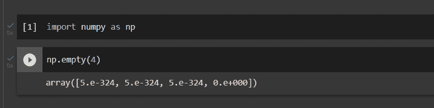
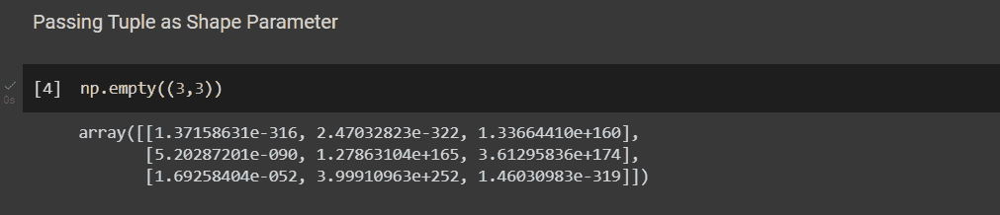
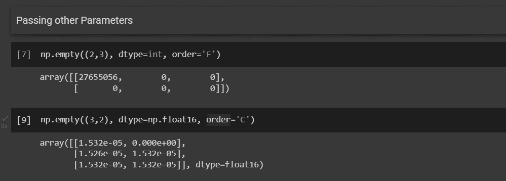
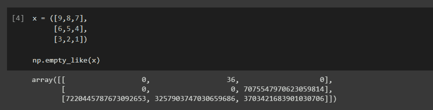
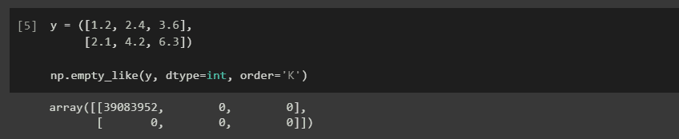
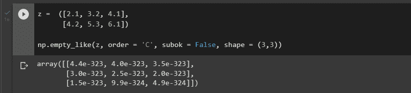

# NumPy empty 和 empty_like

> 原文：<https://www.askpython.com/python-modules/numpy/numpy-empty-and-empty_like>

在本文中，我们将尝试理解 Python 中 NumPy 的 empty()函数和 empty_like()函数。

Python 包 NumPy 用于操作数组。使用 NumPy 可以在一个数组上执行许多数学运算。它提供了一个庞大的高级数学函数库来处理这些数组和矩阵，并提供了强大的数据结构来确保使用数组和矩阵进行高效计算。

2005 年，特拉维斯·奥列芬特开发了 NumPy。您可以免费使用它，因为它是一个开源项目。

***亦读:[【NumPy ones _ like——完全指南](https://www.askpython.com/python-modules/numpy/numpy-ones_like)***

## NumPy 空是什么？

由`numpy.empty()`函数返回的指定形状和类型的新数组没有初始化任何条目。具有指定形状、数据类型和顺序的未初始化(任意)数据数组是该函数的结果。对象数组将以 None 值开始。

还要记住，由于`empty`不会将数组值变为零，所以它会比`[zeros](https://www.askpython.com/python-modules/numpy/numpy-zeros)`快一点。但是，它要求用户手动设置数组中的每个值，因此必须小心使用。

## 句法

```py
numpy.empty(shape, dtype=float, order='C', like=None)

```

### 因素

*   **形状:整数或整数元组**
    *   需要
    *   空数组的形状，例如:`(4, 2)`或 4。
*   **dtype:数据类型，**
    *   可选择的
    *   数组所需的输出数据类型
    *   默认设置为 numpy.float64
*   **顺序:{'C '，' F'}**
    *   可选择的
    *   在内存中存储多维数据时，使用列优先(Fortran 风格)还是行优先(C 风格)的顺序
    *   默认设置为“C”
*   **like: array_like**
    *   可选择的
    *   为了能够创建非 NumPy 数组，提供了引用对象。如果符合数组函数协议，则结果将由传入的类似数组的函数决定。在这种情况下，它确保创建的数组对象与作为参数提供的对象兼容。

返回:具有指定顺序、形状和数据类型的任意(未初始化)数据的集合/数组。对象数组将以 None 值开始。

## Numpy empty()的实现

在实现该函数之前，请确保在 IDE 中导入 NumPy 包。要导入包，请运行以下代码行

```py
import numpy as np

```

### 1.将整数作为形状参数传递

```py
np.empty(4)

```

默认情况下，会考虑所有其他参数。



Implementation 1

### 2.将元组作为形状参数传递

```py
np.empty((3,3))

```

默认情况下，会考虑所有其他参数。



Implementation 2

### 3.分配其他参数

```py
np.empty((2,3), dtype=int, order='F')

np.empty((3,2), dtype=np.float16, order='C')

```



Implementation 3

## NumPy empty_like 是什么？

与 empty()类似，该函数也创建一个数组，但不初始化值。创建的新数组的形状和数据类型与给定(原型)数组的形状和数据类型相同。

返回的数组不由该函数初始化；使用`[zeros_like](https://www.askpython.com/python-modules/numpy/numpy-zeros_like)`或 `ones_like`来代替它。与实际设置数组值的例程相比，它可能要快一点。

## Numpy empty_like()的语法

```py
numpy.empty_like(prototype, dtype=None, order='K', subok=True, shape=None)

```

### 因素

*   **原型** : **阵列状**
    *   需要
    *   返回数组的属性由原型的形状和数据类型定义。
*   **数据类型** : **数据类型**
    *   可选择的
    *   覆盖结果的数据类型。
*   **顺序:{'C '，' F '，' A '或' K'}**
    *   可选择的
    *   哪个顺序–C 表示 C 风格，F 表示 Fortran 风格，如果原型是 Fortran 连续的，A 表示 F，否则为 C。k 代表非常类似于原型的布局。
*   **subok: bool**
    *   可选择的
    *   如果为真，新形成的数组将利用原型的子类类型；否则，将使用基类数组。通常设置为 True。
*   **形状:整数或整数序列**
    *   可选择的
    *   覆盖结果的形状。如果 order='K '并且维数保持不变，将尝试保持顺序；否则，将推断出 order='C '。

## 实现 Numpy empty_like()

### 1.仅提供原型

```py
x = ([9,8,7],
     [6,5,4],
     [3,2,1])

np.empty_like(x)

```



Implementation 4

### 2.分配其他参数

```py
y = ([1.2, 2.4, 3.6],
     [2.1, 4.2, 6.3])
np.empty_like(y, dtype=int, order='K')

z =  ([2.1, 3.2, 4.1],
      [4.2, 5.3, 6.1])
np.empty_like(z, order = 'C', subok = False, shape = (3,3))

```



Implementation 5



Implementation 6

## 摘要

我们知道 NumPy 中的 empty()函数有助于构建任何空数组，而无需初始化值。用户可以使用这个函数指定数组的形状、顺序和数据类型。

类似地，empty_like 也创建一个没有初始化的数组，类似于所提供的原型。

## 参考

[https://numpy . org/doc/stable/reference/generated/numpy . empty . html](https://numpy.org/doc/stable/reference/generated/numpy.empty.html)

[https://numpy . org/doc/stable/reference/generated/numpy . empty _ like . html](https://numpy.org/doc/stable/reference/generated/numpy.empty_like.html)