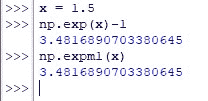
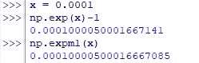
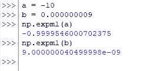
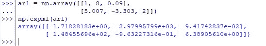

# Numpy Exmp1:完整指南

> 原文：<https://www.askpython.com/python-modules/numpy/numpy-exmp1>

欧拉数，也称为“e”，是一个重要的数学常数，以 18 世纪数学家莱昂哈德·欧拉的名字命名。据估计，这个数字的精确度超过一万亿位，是数学计算中的一个重要工具。

> 2.718281828459045……
> 
> Euler’s number

末尾的点表示数字的个数继续&这提供了一个推论，即*‘e’*属于无理数的范畴。我们将首先使用下面的代码导入 *numpy* 库。

在本文中，我们将探索欧拉数的历史以及如何在 Numpy Exmp1()函数中使用它。

```py
import numpy as np

```

此后，我们将通过下面的每一节进一步探索 *expm1( )* 函数。

*   ***exp m1()*函数**的语法
*   **为什么用 *expm1(x)* 而不用 *exp(x)-1* ？**
*   **在标量上使用*exp m1()***
*   **在 N 维数组上使用*exp m1()***

* * *

## expm1()函数的语法

*expm1( )* 的功能类似于 *exp( )* 函数，其中“*e”*被提升到给定数字的幂，然后从中减去一(1)。下面是 *expm1( )* 函数的语法，该函数包含其运行所需的强制和可选输入。

```py
numpy.expm1(x, out=None, *, where=True, dtype=None)

```

在哪里，

*   ***x—***N 维数组或标量，其幂为 *e*
*   ***out—***一个可选的构造，默认情况下设置为 *none* ，但可用于将结果存储在所需的数组中，该数组的长度与输出的长度相同
*   *****–**kwargs 或 keyword argument，这是一个可选结构，用于将关键字可变长度的参数传递给函数
*   ***其中—***一个可选构造，当设置为*真*(默认设置)时，用于计算给定位置的通用函数(ufunc ),当设置为*假*时，不计算
*   ***dtype—***可选结构，用于指定正在使用的数据类型

* * *

## 为什么用 expm1(x)而不用 exp(x)-1？

您可能想知道为什么需要构建一个特定的函数来从指数中删除一个，而不是使用已经可用的[函数 *exp( )*](https://www.askpython.com/python-modules/numpy/numpy-exp) &从中删除一个！(即) *exp(x)-1。*

让我们这样做，并找出是否有任何可观察到的差异。

```py
x = 1.5 
np.exp(x)-1 
np.expm1(x)

```

以下是上述代码的结果。



Results when x=1.5

嗯，看起来一切都很好，两个结果是同义的。但是，如果我们稍微减少*‘x’*并部署相同的功能会怎么样呢？那些能够返回相同的结果吗？让我们来了解一下！

```py
x = 0.0001
np.exp(x)-1
np.expm1(x)

```



Results when x=0.0001

现在结果不一样了吧？布哈阿哈阿哈阿哈！*(阴险的笑声)*

这背后的主要原因是，任何接近“0”的数字的指数都将非常接近“1”。因此， *exp(x)-1* 在返回结果时似乎不太准确，Python 的 *numpy* 库中提供了一个专用函数 *expm1( )* 。

* * *

## 在标量上使用 expm1()

您还可以通过给 *expm1( )* 函数分配一个负数来查找结果。这将依次返回等价的 *exp(x)，*回报它&，然后从中删除‘1’。对于那些想直接看到结果的人来说，它们就在这里！

```py
a = -10
b = 0.000000009
np.expm1(a)
np.expm1(b)

```



Using *expm1*( ) on Scalars

* * *

## 在 N 维数组上使用 expm1()

*expm1( )* 函数在应用于如下所示的 N 维数组时也适用。

```py
ar1 = np.array([[1, 8, 0.09],
                [5.007, -3.303, 2]])
np.expm1(ar1)

```



Using *expm1*( ) on N-Dimensional Arrays

* * *

## 结论

既然我们已经到了本文的结尾，希望它已经详细阐述了如何使用来自 *numpy* 库中的 *expm1( )* 函数。这里有另一篇文章详细介绍了 Python 中 *numpy* 库中 *nextafter( )* 函数的[用法。AskPython](https://www.askpython.com/python/how-to-use-numpy-nextafter-in-python) 中还有许多其他有趣且信息量大的文章，可能会对那些希望提高 Python 水平的人有很大帮助。*恭喜*