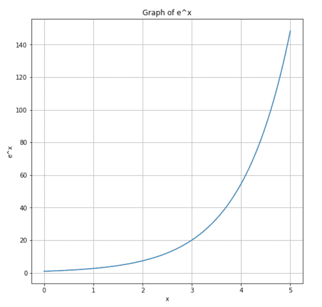

# NumPy exp–完整指南

> 原文:# t0]https://www . aspython . com/python-modules/num py/numpy-exp

你好，欢迎来到 Numpy exp 教程。在本教程中，我们将学习 NumPy exp()方法，也将看到许多关于该方法的例子。让我们开始吧！

* * *

## 什么是 NumPy exp？

NumPy 中的`exp`方法是一个返回输入数组所有元素的指数的函数。这意味着它为输入数组中的每个 *x* 计算 *e^x* 。这里， ***e*** 是欧拉常数，其值约为 2.718281。

可以说 **np.exp(i)** 约等于 **e**i** ，其中' ** '为幂算子。我们将在本教程的下一节看到这个函数的例子。

* * *

## NumPy exp 方法的语法

```py
numpy.exp(x, /, out=None, *, where=True, casting='same_kind', order='K', dtype=None, subok=True[, signature, extobj])

```

| **参数** | **描述** | 必需/可选 |
| x | 输入数组/值。 | 需要 |
| 在外 | 放置结果的替代输出数组。默认情况下，会创建一个新数组。 | 可选择的 |
| 在哪里 | 接受一个类似数组的对象。在为真的位置，`out`数组将被设置为`ufunc`结果。在其他地方，`out`数组将保持其原始值。 | 可选择的 |
| **kwargs | 对于其他只有关键字的参数 | 可选择的 |

**返回:**一个数组，包含 *x* 的逐元素指数。如果 *x* 是标量，那么结果也是标量。

* * *

## 使用 Numpy exp()方法

让我们通过不同的例子来看看如何使用 numpy exp 方法。

### 1.使用 numpy exp()计算标量值的指数

```py
import numpy as np

# positive scalar
a = 6
ans = np.exp(a)
print("a =", a)
print("Exponential =", ans)

```

**输出:**

```py
a = 6
Exponential = 403.4287934927351

```

答案被计算为 e^6，即(2.718281)^6 = 403 . 49326363831

```py
import numpy as np

# negative scalar
a = -6
ans = np.exp(a)
print("a =", a)
print("Exponential of the array =", ans)

```

**输出:**

```py
a = -6
Exponential of the array = 0.0024787521766663585

```

在这种情况下，由于 a 是负数，a 的指数是(e)^(-6)，即 1/(e)^6 = 1/(2.718281)^6 = 0.0024787521766663585。

* * *

### 2.使用 numpy exp()计算一维数组的指数

```py
import numpy as np

a = [0, 3, -2, 1]
ans = np.exp(a)
print("a =", a)
print("Exponential of the array =", ans)

```

**输出:**

```py
a = [0, 3, -2, 1]
Exponential of the array = [ 1\.         20.08553692  0.13533528  2.71828183]

```

这里，结果数组包含输入数组中每个值的 e 的指数。也就是说，和按输入值的顺序包含值 e^0、e^3、e^-2 和 e^1。

* * *

### 3.使用 numpy exp()计算二维数组的指数

```py
import numpy as np

a = [[2, -4, 1], 
     [0, 1, 5]]
ans = np.exp(a)
print("a =\n", a)
print("Exponential of the array =\n", ans)

```

**输出:**

```py
a =
 [[2, -4, 1], [0, 1, 5]]
Exponential of the array =
 [[7.38905610e+00 1.83156389e-02 2.71828183e+00]
 [1.00000000e+00 2.71828183e+00 1.48413159e+02]]

```

与上面的例子类似，结果数组按顺序包含输入数组中每个值的 e 的指数。

* * *

### 4.使用 numpy exp()绘制 np.exp()的图形

现在让我们使用 Python 中的 [Matplotlib](https://www.askpython.com/python-modules/matplotlib) 库来绘制`np.exp()`函数相对于一些输入值的图形。

```py
import numpy as np
import matplotlib.pyplot as plt

# input
x = np.linspace(0, 5, 100)
# output
y = np.exp(x)

# changing the size of figure to 8x8
plt.figure(figsize=(8, 8))
display(plt.plot(x, y))
plt.grid()
# title of the graph
plt.title("Graph of e^x")
plt.xlabel("x")
plt.ylabel("e^x")

```

**输出:**



Graph Of Exponential

在这个例子中，我们创建了一个从 0 到 5 的均匀分布的数组( *x* )，总共有 100 个值。然后将这个数组传递给`np.exp()`函数，存储在 y 的结果中，最后我们绘制 **y v/s x** 的图形，得到上面的图作为结果。

* * *

## 摘要

仅此而已！在本教程中，我们学习了 **Numpy exp** 方法，并使用该方法练习了不同类型的示例。如果你想了解更多关于 NumPy 的信息，请随意浏览我们的 [NumPy 教程](https://www.askpython.com/python-modules/numpy)。

* * *

## 参考

*   [NumPy exp 官方文档](https://numpy.org/doc/stable/reference/generated/numpy.exp.html)