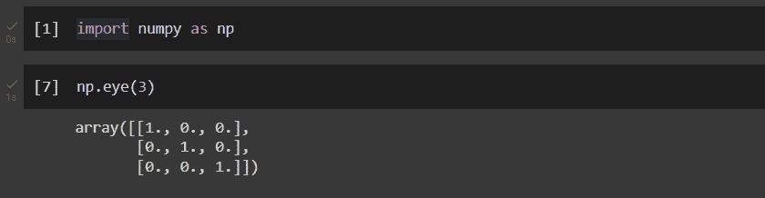
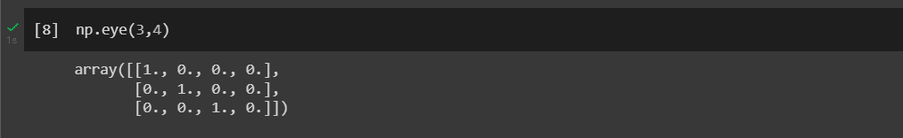
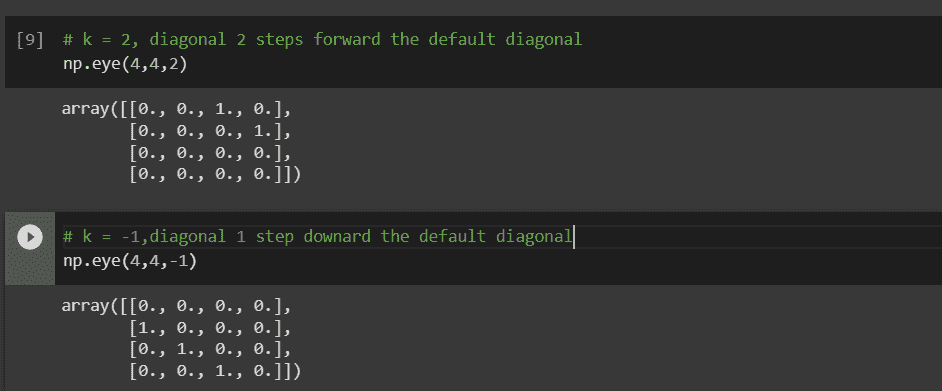

# NumPy 眼功能:完全指南

> 原文：<https://www.askpython.com/python-modules/numpy/numpy-eye>

NumPy 是一个流行的科学计算 Python 库，它提供了对数组和矩阵的高效操作。NumPy 中有用的函数之一是`eye`函数，它允许用户创建特定大小的单位矩阵。单位矩阵是一个主对角线上为 1，其他地方为 0 的方阵。

在本文中，我们将详细探讨`eye`函数，包括它的语法、参数以及如何在各种场景中使用它的例子。

无论您是 NumPy 的新手还是有经验的用户，本文都将提供使用`eye`函数的全面指南。

## numpy.eye()是什么？

Numpy.eye()用于返回一个二维数组，对角线上的值为 1，其他位置的值为 0。可选参数 *k* 决定对角线是主对角线、上对角线还是下对角线。主对角线用 0 *k* (默认)表示，上对角线用正 *k、*表示，下对角线用负 *k、*表示

## 句法

```py
numpy.eye(N, M=None, k=0, dtype=<class 'float'>, order='C', like=None)

```

### 因素

*   **N** : int
    *   需要
    *   输出数组中的行数。
*   **M: int**
    *   可选择的
    *   输出数组中的列数，如果没有，则默认设置为 N，因此形成一个对称矩阵。
*   **k: int**
    *   可选择的
    *   主对角线由索引值 0 表示，上对角线由正值表示，下对角线由负值表示。
*   **数据类型** : **数据类型**
    *   可选择的
    *   返回数组的数据类型。
*   **顺序:{'C '，' F'}**
    *   可选择的
    *   应该使用哪种顺序——行优先(C 风格)还是列优先(Fortran 风格)——将输出存储在内存中？
*   **like: array_like**
    *   可选择的
    *   可以使用引用对象创建非 NumPy 数组。如果符合**数组函数**协议，则结果将由 as like 中提供的数组 like 确定。在这种情况下，它确保创建的数组对象与作为参数提供的对象兼容。

## Numpy.eye()的实现

在使用这个函数之前，请确保在 IDE 中导入 NumPy 包。要导入 NumPy 包，请运行以下代码行。

```py
import numpy as np

```

### 示例 1:只传递“n”参数，因此形成一个单位数组

```py
np.eye(3)

```



Example 1

### 示例 2:传递“n”和“m”参数

```py
np.eye(3,4)

```



Example 2

### 示例 3:传递“k”参数

```py
# k = 2, diagonal 2 steps forward the default diagonal 
np.eye(4,4,2)

# k = -1,diagonal 1 step downard the default diagonal
np.eye(4,4,-1)

```



Example 3

## 结论

NumPy `eye`是在科学计算中创建[单位矩阵](https://www.askpython.com/python-modules/numpy/numpy-identity)的一种有用方法。它使用简单，有多种参数，允许用户自定义矩阵的大小和类型。

通过理解`eye`函数的语法和参数，以及使用它的一些常见陷阱和技巧，您可以在自己的项目中自信而有效地使用`eye`函数。

无论您是在机器学习、线性代数还是任何其他领域使用矩阵，`eye`函数都可以成为您的 NumPy 工具包中一个有价值的补充。因此，它是数字图书馆中一个非常重要的功能。

## 参考

[https://numpy . org/doc/stable/reference/generated/numpy . eye . html](https://numpy.org/doc/stable/reference/generated/numpy.eye.html)