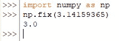
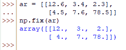
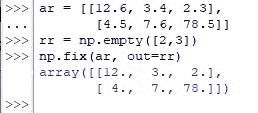
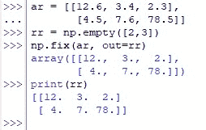

# Numpy 修复:如何四舍五入到最近的整数？

> 原文：<https://www.askpython.com/python/numpy-fix>

近似值——在一个精确到第 n 个十进制数字的世界里，确实有理由认为近似值仍然有效。事实上，大自然在执行事情时并不十分精确，而是在一个“范围”内做事情。当开始进行数据分析时，情况也是如此。

数据科学家自己可能会对他们的模型在交付结果方面有多精确感到骄傲，但他们也永远无法否认这样一个事实，即他们的整个模型是建立在近似假设的基础上的！

***亦读: [Numpy。Divide()–如何在 Python 中使用 Numpy Divide？](https://www.askpython.com/python-modules/numpy/numpy-divide)***

在本文中，我们将探索 Python 的 NumPy 库中可用的一个这样的函数，它将帮助人们将任何给定的数字舍入到最接近零的整数。这意味着任何给定的数，无论它有多少位小数，都将被四舍五入成整数，不会留下任何小数值。

正在研究的函数是 *numpy.fix( )* ，在使用示例数据进行演示之前，让我们先了解一下它的语法。

## numpy.fix()的语法

下面是 *numpy.fix( )* 函数的语法。

```py
numpy.fix(x, out=None)

```

在哪里，

*   *x–*可以是单个数字，也可以是要舍入的数字数组
*   *out–*可选特性，可用于将结果值存储在与输入维数相同的指定数组中，如果指定的话。

需要注意的是， *numpy.fix( )* 函数的输出是以浮点数的形式返回的。

* * *

我们应该使用下面的代码导入 *numpy* 库。

```py
import numpy as np

```

## 用 numpy.fix()舍入一个数字

在导入了 *numpy* 库之后，应该使用下面的代码将所需的数字舍入到最接近零的整数。

```py
import numpy as np
np.fix(3.14159365)

```



Rounding Off A Single Number

那些观察力敏锐的人现在可能已经发现，上图中被四舍五入的数字属于无理数的范畴。如果你到现在还没猜到，那就是*π*(π)的前八位小数！

显示的结果只有“3.0”，这意味着无论小数的计数是多少，都只能得到小数为零的结果，并保持其整数部分不变。

***也读作:[Numpy . Subtract():Python 中如何用 NumPy 减去数字？](https://www.askpython.com/python-modules/numpy/numpy-subtract)***

* * *

## 用 numpy.fix()舍入数字数组

现在让我们开始对数组中的一组数字进行舍入。我们将从构建一个类似下面给出的数组开始。

```py
ar = [[12.6, 3.4, 2.3],
       [4.5, 7.6, 78.5]]

```

一旦完成，我们将使用下面的代码部署要使用的 *fix( )* 函数。

```py
np.fix(ar)

```

运行上面的代码会导致下面的结果。



Rounding Off An Array

* * *

## 在 numpy.fix()方法上使用 Out 选项

本节将演示如何使用本文前面描述的 *out* 选项对数字进行四舍五入。由于存储输出的规定应该与输入具有相同的维数，因此在涉及多个数字的情况下，应该为变量分配一个具有相同输入维数的数组。

如果数组与上一节中使用的相同，那么它有 2 行 3 列，这使我们将输出数组设置为空，如下所示，这样它可以被结果的值替换。

```py
rr = np.empty([2,3])

```

然后在使用 *fix( )* 函数时，将“rr”分配给 *out* 选项，如下所示。

```py
np.fix(ar, out=rr)

```

运行上面的代码会得到下面的结果。



Output Array Assigned

要验证输出数组是否被更新，可以使用 *print( )* 函数。



Viewing The Output Array

* * *

## **结论**

既然我们已经到了本文的结尾，希望它已经详细说明了如何使用 Python 中的 *numpy.fix( )* 函数将任意给定的数字四舍五入到最接近的整数。这里有另一篇文章详细介绍了[如何在 Python](https://www.askpython.com/python-modules/numpy/converting-degrees-to-radians-numpy) 中使用 *numpy* 将角度转换成弧度。AskPython 中还有许多其他有趣的&同样丰富的文章，可能对那些希望提高 Python 水平的人有很大帮助。当你享受这些的时候，再见！