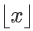
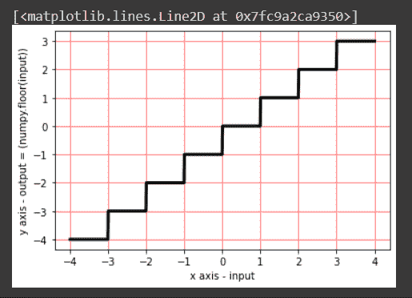

# numpy floor–返回输入的楼层，按元素排序

> 原文：<https://www.askpython.com/python-modules/numpy/numpy-floor>

今天我们将学习如何获取输入元素的底值！这意味着我们将逐个元素地处理数据。我们将理解函数如何处理数组或矩阵形式的输入。我们还将了解它在所有输入情况下的实现。我们将让函数传递其域内外的所有类型的输入。最后，我们将看到它在图中的表示。

## 什么是 NumPy？

当我们将要学习`numpy`楼层功能时，让我们了解什么是`NumPy`。 [NumPy 是一个 Python 库](https://www.askpython.com/python-modules/numpy/python-numpy-module)，它提供了处理数组的方法。它提供了一些类似数学函数的功能。唯一的区别是语法。让我们稍微理论一下。

标量 x 的底是最大的整数 y，这样 y <= x. it is dented as 。让我们看看下面的例子。

*   -2.365 的地板是-3。
*   2.365 的底是 2。
*   任何整数的底数都与该数相同。

现在我们将看看如何在我们的代码片段中实现同样的功能。为了实现这个函数，我们使用了 NumPy.floor()函数。

## 实现 Numpy.floor()方法

Numpy 库支持这个函数。要使用它，我们需要导入它的依赖项，即 NumPy 库。让我们看看下面的语法。

```py
import numpy
numpy.floor(x, out=None, where=True, casting='same_kind', order='K', subok : [bool, datatype])

```

上述代码片段中使用的参数如下:

*   x: 它可以是包含弧度值的变量，也可以是包含某个值的数组
*   **out:** 存储结果的位置。如果提供了，它必须具有与输入 x 相似的形状。如果没有提供或没有提供，则返回新的值或结果。这是可选的。
*   当条件为真时，我们必须得到我们的结果或输出；当条件为假时，我们将得不到任何结果。这是可选的。y 默认其值为真。
*   **casting='same_kind':** 表示只允许 float64 到 float32 的值或结果。该函数在此范围或数据类型中呼喊 cast 值。
*   **order = 'K':** 它总是以 K 排序的形式产生一个输出数组。(注意:有四种类型的订单:**{‘K’，‘C’，‘F’，‘A’}**)。这是可选的。
*   **subok**:【bool，datatype】**是否生成结果的子类**。如果为真，则提供子类的名称。它返回一个与给定数组具有相同形状和类型的数组。也是可选的。

这个函数的定义域是一组实数。该范围是整数的集合。我们将通过传递单值、数组和复数来尝试我们的函数。

### 步骤 1:导入数字

首先，我们需要导入所需的模块，即 Numpy 模块。

```py
import numpy

```

### 步骤 2:向 numpy.floor()方法传递值

在这一步中，我们将如下实现我们的功能。

```py
import numpy 
#Passing single value in our function
a = numpy.floor(0.366)
print(a)

#output
    0.0

#passing multiple values in the form of array
import math
input = numpy.array([-2.35, 0, 0.36, 1, 5.69, math.pi, 5/2, 5%3])
b = numpy.floor(input)
print(b)

#output
    [-3\.  0\.  0\.  1\.  5\.  3\.  2\.  2.]

#passing complex number
import cmath
x=5
y=6
z=complex(x,y)
c = numpy.floor(z)
print(c)

#output
    TypeError: ufunc 'floor' not supported for the input types, and the inputs could not be safely coerced to any supported types according to the casting rule ''safe''

```

你可以在上面的步骤中看到，我们实现了我们的方法三次。可以看到 floor 函数给出了传递单值、数组和无理数函数(`math.pi`)的结果。但是在传递复数的情况下，它抛出一个错误“`ufunc 'floor'` 不支持输入类型”，这表明函数`NumPy.floor()`不支持输入数据类型。

## 在图形上绘制 numpy.floor()

在下面的代码片段中，我们创建了空数组 x[]和 y[]。使用 while 循环，我们已经将输入值从-3.99 开始加载到 x[]数组中，从 4.00 开始按顺序增加 0.01。在 floor 函数实现之后，我们将各自的结果加载到 y[]数组中。使用 x[]和 y[]数组，我们使用`matplotlib.pyplot` 库及其支持方法绘制了我们的图表。

```py
import matplotlib.pyplot as plt
import numpy
x=[]
y=[]
i=-3.99
while (i<4.00):
    x.append(i)
    y.append(numpy.floor(i))
    i=i+0.01

plt.xlabel("x axis - input")
plt.ylabel("y axis - output = (numpy.floor(input))")
plt.grid(linestyle='-', linewidth=0.5,color='red')
plt.plot(x,y, linewidth=3, color = 'black')

plt.show()

```



## 结论

Numpy floor 是一个按元素返回输入的下限的函数。该函数对于向下舍入到最接近的整数很有用。在本文中，我们介绍了如何使用 NumPy floor 函数，以及如何将它应用于不同的数据类型。