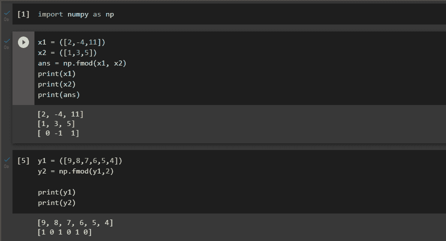
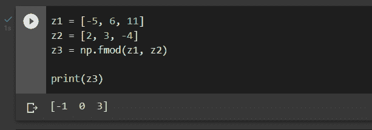
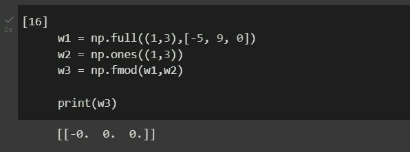

# NumPy fmod()–返回除法运算的元素余数。

> 原文:# t0]https://www . aspython . com/python-modules/num py/numpy-fmod

NumPy 是“数值 Python”的缩写，是一个主要用于数组和多维矩阵的基础包。这个开源包提供了广泛的函数来对数组或矩阵执行全面的数学运算。

一个这样的函数是`fmod(`，它以逐个元素的方式提供除法余数。通过该函数获得的余数与其被除数 *(x1)* 具有相同的符号。

这个函数的工作方式与 C 库中的 fmod()函数完全相同。它也可以与 Matlab(TM) `rem`函数相媲美，并且不能与 Python 模数运算符 *x1 % x2* 相混淆(这是通过 NumPy 中的 [mod()函数实现的)。)在本文中，让我们彻底理解 Python 中`fmod()`函数的语法和用例。](https://www.askpython.com/python-modules/numpy/numpy-mod)

## 为什么要用 fmod()。

fmod()函数用于计算给定数组中元素的余数。所需的参数包括两个整数数组或元组——第一个被视为被除数，第二个被视为除数。约定约束负被除数和除数的模运算的结果。

在 fmod 的情况下，结果的符号是被除数，而在余数的情况下，结果的符号是除数。Matlab(TM) `rem`函数和 fmod 函数是等效的。

## Numpy fmod()的语法

```py
numpy.fmod(x1, x2, /, out=None, *, where=True)

```

### 因素

*   **x1: array_like** ，必选
    *   被视为被除数的数组
*   **x2: array_like，**必需
    *   被视为除数的数组
*   **out: ndarray、None 或 ndarray 和 None 的元组，**可选
    *   一个保存结果的地方。如果提供的话，它必须有一个输入广播到的形状。在没有任何输入或没有输入的情况下，返回一个新分配的数组。元组的长度(仅作为关键字参数可用)必须与输出的数量相匹配。
*   **其中:array_like，**可选
    *   这种情况出现在输入上。在条件为真的点上，ufunc 结果将被设置为 out 数组。外部数组将在所有其他地方保持其初始值。应该注意的是，如果条件为假，由缺省 out=None 形成的未初始化 out 数组中的位置将继续未初始化。
*   ****kwargs** , Optional
    *   对于其他只有关键字的参数

## Numpy fmod()的实现

在实现该函数之前，请确保在 IDE 中导入 NumPy 包。为此，请在您的 IDE 中运行以下代码行。

```py
import numpy as np

```

让我们以最简单的方式，通过提供两个必需的参数——被除数数组和除数数组，尝试按元素返回余数。还要注意，在第二个例子中，除数是单一整数，因此对于被除数数组的所有元素都是相同的。

```py
x1 = ([2,-4,11])
x2 = ([1,3,5])
ans = np.fmod(x1, x2)
print(x1)
print(x2)
print(ans)

y1 = ([9,8,7,6,5,4])
y2 = np.fmod(y1,2)
print(y1)
print(y2)

```

### 输出



Example

让我们用另一组简单的例子来理解 fmod()函数中的符号约定。

```py
z1 = [-5, 6, 11]
z2 = [2, 3, -4]
z3 = np.fmod(z1, z2)

print(z3)

```

第一个元素的结果是负的，因为被除数是负的，但在第三个元素的情况下，结果仍然是正的，因为被除数是正的，因此我们可以得出结论，除数的符号确实影响输出的符号，它完全取决于被除数。

### 输出



Example

在下一个示例中， [ones()](https://www.askpython.com/python-modules/numpy/numpy-ones) 用于创建一个数组，其中所有元素都被赋值为“1”。注意，即使是零也被赋予了一个负号，只是因为被除数被赋予了一个负号。

```py
w1 = np.full((1,3),[-5, 9, 0])
w2 = np.ones((1,3))
w3 = np.fmod(w1,w2)

print(w3)

```

### 输出



Example

## 摘要

NumPy 包是为处理数组和多维矩阵而构建的。fmod()是获得 *x1* (被除数)除以 *x2* (除数)的余数的直接方法。如果 *x1* 和 *x2* 都是标量，这就是一个标量。

## 参考

[https://numpy . org/doc/stable/reference/generated/numpy . fmod . html](https://numpy.org/doc/stable/reference/generated/numpy.fmod.html)