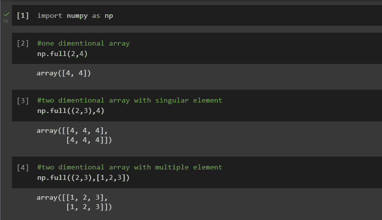
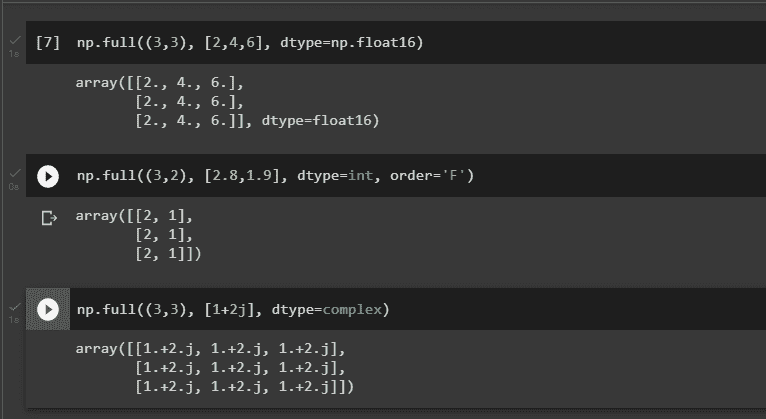

# NumPy full()函数

> 原文：<https://www.askpython.com/python-modules/numpy/numpy-full>

在本文中，我们将尝试理解 Python 中 NumPy 包的 full()函数。

NumPy 是一个流行的科学计算 Python 库，它提供了处理大型多维数组和数字数据矩阵的工具。NumPy 提供的函数之一是`full()`，它返回给定形状和类型的新数组，用填充值填充。

函数允许你创建一个任意大小和形状的数组，并用指定的值填充它。当您需要创建特定大小和类型的数组作为其他数据的占位符时，或者当您希望用默认值初始化数组时，这可能会很有用。

`full()`函数是一种简单有效的方法，通过一次函数调用就可以创建和填充数组。

## NumPy 中的 full()函数是什么？

该函数用于创建给定形状和类型的新数组。数组的值用参数中传递的`fill_value`初始化。还可以提供新数组的数据类型，以及它在参数中的顺序。

## NumPy full()的语法

```py
numpy.full(shape, fill_value, dtype=None, order='C', like=None)

```

### 因素

*   **形状:整数或整数序列**
    *   需要
    *   新数组的维数；可以是单个整数，也可以是整数元组。
*   **fill_value:标量或数组 _like**
    *   需要
    *   要添加到新数组的值
*   **dtype:数据类型**
    *   可选择的
    *   新数组中元素的数据类型；默认=无，表示`np.array(fill_value).dtype`。
*   **顺序:{'C '，' F'}**
    *   可选择的
    *   应该使用哪种顺序存储多维数据——C 语言还是 Fortran 语言——连续(按行或按列)
*   **like: array_like**
    *   可选择的
    *   为了能够生成不是 NumPy 数组的数组，提供了引用对象。如果符合**数组函数**协议，则结果将由 as like 中提供的数组 like 确定。在这种情况下，它确保创建的数组对象与作为参数提供的对象兼容。

## NumPy full()的实现

在实现该函数之前，请确保在 IDE 中导入 NumPy 包。为此，请运行以下代码行。

```py
import numpy as np

```

### 例 1。仅传递必需的参数

让我们创建一个具有特定大小和形状的数组，并填充一个常量值

```py
#one dimentional array
np.full(2,4)

#two dimentional array with singular element
np.full((2,3),4)

#two dimentional array with multiple element
np.full((2,3),[1,2,3])

```



Example 1

### 例 2。传递其他参数

现在让我们创建一个具有特定大小和数据类型的数组，其中填充了一个常数值。

```py
np.full((3,3), [2,4,6], dtype=np.float16)

np.full((3,2), [2.8,1.9], dtype=int, order='F')

np.full((3,3), [1+2j], dtype=complex)

```



Example 2

## 结论

NumPy 包使得使用数组更加容易。full()函数是返回给定形状和类型的新数组的简单方法，用 *fill_value* 填充。

## 参考

[https://numpy . org/doc/stable/reference/generated/numpy . full . html](https://numpy.org/doc/stable/reference/generated/numpy.full.html)