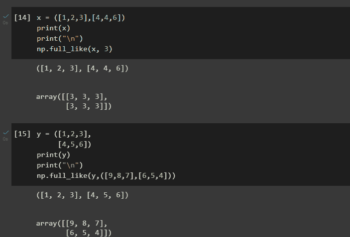
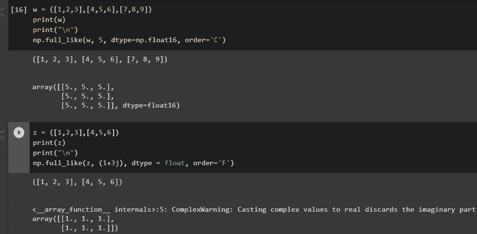

# NumPy full_like()函数——返回一个与给定数组具有相同形状和类型的完整数组

> 原文：<https://www.askpython.com/python-modules/numpy/numpy-full_like>

NumPy 是一个强大的、广泛使用的 Python 科学计算库。它提供了许多处理数字数据和数组的函数和工具，包括`full_like()`函数。这个函数允许你创建一个新的数组，它的形状和数据类型与给定的数组相同，但是填充了一个特定的值。

这在许多情况下都很有用，例如当您需要创建某种形状和类型的数组来保存占位符或默认值时。在本文中，我们将详细探讨`full_like()`函数的用法和语法，并提供如何在实践中使用它的例子。

***也读作: [NumPy full()函数](https://www.askpython.com/python-modules/numpy/numpy-full)***

## NumPy 中的 full_like()是什么？

`full_like()`是 NumPy 库中的一个函数，它创建一个与给定数组具有相同形状和数据类型的新数组，但用指定的值填充。它接受两个必需的参数:

1.  `a`:用作新数组的形状和数据类型模板的数组。
2.  `fill_value`:填充新数组的值。

## Numpy full_like()的语法

```py
numpy.full_like(a, fill_value, dtype=None, order='K', subok=True, shape=None)

```

### 因素

*   **答:数组 _like**
    *   需要
    *   返回数组的这些相同特征是由。
*   **fill_value: array_like**
    *   需要
    *   新数组中用来初始化元素的值。
*   **dtype:数据类型**
    *   可选择的
    *   覆盖结果的数据类型。
*   **顺序:{'C '，' F '，' A '或' K'}**
    *   可选择的
    *   更改结果的内存布局。“C”代表 C 阶，“F”代表 F 阶，“A”代表 C，除非“A”是 Fortran 连续的。“K”表示与 a 非常相似的布局。
*   **subok: bool**
    *   可选择的
    *   如果为 True，新生成的数组将使用的子类类型；否则，将使用基类数组。通常设置为 True。
*   **形状:int 或整数序列**
    *   可选择的
    *   改变结果的形式。如果 order='K '并且维度数量保持不变，将尝试保持顺序；否则，假定 order='C '。

## Numpy full_like()的实现

在实现该函数之前，请确保在 IDE 中导入 NumPy 包。为此，请在您的 IDE 中运行以下代码行。

```py
import numpy as np

```

### 例 1。仅传递必需的参数

```py
x = ([1,2,3],[4,4,6])
print(x)
print("\n")
np.full_like(x, 3)

y = ([1,2,3],
     [4,5,6])
print(y)
print("\n")
np.full_like(y,([9,8,7],[6,5,4]))

```



Example 1

### 例 2。传递其他参数

```py
w = ([1,2,3],[4,5,6],[7,8,9])
print(w)
print("\n")
np.full_like(w, 5, dtype=np.float16, order='C')

z = ([1,2,3],[4,5,6])
print(z)
print("\n")
np.full_like(z, (1+3j), dtype = float, order='F')

```



Example 2

### 示例 3:用 numpy.full_like()将所有内容放在一起

下面是一个更完整的使用 numpy.full_like()方法的例子，包括所有不同的使用方法。

```py
import numpy as np

# Create a random array of integers from 0 to 9
a = np.random.randint(10, size=(2, 3, 4))
print(f"Original array: \n{a}")

# Create a new array of zeros with the same shape and data type as a
b = np.full_like(a, 0)
print(f"Array of zeros with same shape and data type as a: \n{b}")

# Create a new array of ones with the same shape and data type as a
c = np.full_like(a, 1, dtype=np.float64)
print(f"Array of ones with same shape and data type as a, but with data type float64: \n{c}")

# Create a new array with the same shape and data type as a, but filled with the maximum value of a's data type
d = np.full_like(a, np.amax(a))
print(f"Array with same shape and data type as a, filled with the maximum value of a's data type: \n{d}")

# Create a new array with the same shape and data type as a, but filled with the minimum value of a's data type
e = np.full_like(a, np.amin(a))
print(f"Array with same shape and data type as a, filled with the minimum value of a's data type: \n{e}")

```

**输出**

```py
Original array: 
[[[2 9 7 3]
  [9 8 6 4]
  [1 0 8 9]]

 [[3 9 9 7]
  [0 8 0 3]
  [5 5 4 3]]]
Array of zeros with same shape and data type as a: 
[[[0 0 0 0]
  [0 0 0 0]
  [0 0 0 0]]

 [[0 0 0 0]
  [0 0 0 0]
  [0 0 0 0]]]
Array of ones with same shape and data type as a, but with data type float64: 
[[[1\. 1\. 1\. 1.]
  [1\. 1\. 1\. 1.]
  [1\. 1\. 1\. 1.]]

 [[1\. 1\. 1\. 1.]
  [1\. 1\. 1\. 1.]
  [1\. 1\. 1\. 1.]]]
Array with same shape and data type as a, filled with the maximum value of a's data type: 
[[[9 9 9 9]
  [9 9 9 9]
  [9 9 9 9]]

 [[9 9 9 9]
  [9 9 9 9]
  [9 9 9 9]]]
Array with same shape and data type as a, filled with the minimum value of a's data type: 
[[[0 0 0 0]
  [0 0 0 0]
  [0 0 0 0]]

 [[0 0 0 0]
  [0 0 0 0]
  [0 0 0 0]]]

```

## 结论

总之，NumPy 中的`full_like()`函数是创建新数组的有用工具，这些新数组具有与给定数组相同的形状和数据类型，但填充了特定的值。这在许多情况下都很有用，例如当您需要创建某种形状和类型的数组来保存占位符或默认值时。无论您是在科学计算中处理数字数据，还是仅仅需要在 Python 脚本中操作数组，`full_like()`函数都是您工具箱中的宝贵补充。

## 参考

[https://numpy . org/doc/stable/reference/generated/numpy . full _ like . html](https://numpy.org/doc/stable/reference/generated/numpy.full_like.html)