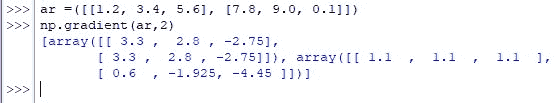

# Numpy 渐变:返回 N 维数组的渐变

> 原文：<https://www.askpython.com/python-modules/numpy/numpy-gradient>

讨厌打破这一点，但数学是令人厌倦的！这比你能想到的要强烈得多，尤其是当你进入分化和整合的领域时。更糟糕的是，这种区分足够灵活，可以部分完成。

老天爷啊！但是，嘿，我们已经让 Python 为我们完成了一些工作。唷！

本文解释了 Python 的 *numpy* 库中的 *gradient( )* 函数的部署，用于 N 维数组。

***也读作:[NumPy nanmax——忽略任何 NaNs 的沿轴数组的最大值](https://www.askpython.com/python-modules/numpy/numpy-nanmax)***

* * *

## ***numpy . gradient()*的语法**

让我们先看看 *gradient( )* 函数的语法，然后再了解如何使用它。

```py
numpy.gradient( array, varags, axis=None, edge_order=1)

```

在哪里，

*   *数组*–N 维标量实体的集合
*   *varags*–包含可变参数的可选条款，可变参数规定了输入数组中每个维度的间距
*   *轴*–一个可选的规定，规定计算梯度&的方向，默认设置为无
*   *edge _ order–*一个可选条款，处理要计算坡度的边界。它可以设置为“1”或“2”，前者是默认设置

Python 通过寻找差异来计算梯度，

*   在边界处相邻数字之间&除以默认间距“1”
*   在内部的相邻数字之间&除以默认间距“2”

* * *

## **计算等间距梯度:**

在导入了 *numpy* 库之后，让我们从构造一个数组&开始，然后找到它的均匀间距的梯度，比如下面给出的‘3’。

```py
import numpy as np
ar = np.array([1.2, 3.4, 5.6])
np.gradient(ar,3)

```


Gradient Calculated With Uniform Spacing

同样的事情也可以用 *gradient( )* 函数的默认设置来完成，而不需要明确提到所需的间距。在这种情况下，间距被设置为本文语法部分前面提到的默认值。另外，要注意的是，如果需要找到一串整数的梯度，也可以在数组内将数据类型指定为'*' float '*。

```py
ar = np.array([1, 3, 5, 9], dtype = float)
np.gradient(ar)

```


Calculating Gradient With Default Values

* * *

## **计算非均匀间距的梯度**

也可以通过在 *gradient( )* 函数中为输入数组的每个元素分配所需的间距来使用排他间距。但是，我们应该记住，这个数组应该与输入数组的维数相同。

```py
ar = np.array([1.2, 3.4, 5.6], dtype = float)
sp = np.array([7.8, 9.0, 0.1], dtype = float)
np.gradient(ar,sp)

```


Calculating Gradient With Non-Uniform Spacing

* * *

## **计算 N 维数组的梯度:**

当一个多维数组进入画面时， *gradient( )* 函数将返回两个不同的结果，而不管其中一个是否提供均匀的间距。这让我们想知道*为什么会这样？!'。*

这个结果可以归因于这样的事实，即一个结果对应于关于行的梯度计算，而另一个结果对应于关于输入阵列的列的梯度计算。

让我们试着计算一个均匀间距为‘2’的二维数组的梯度，如下所示。

```py
ar =([[1.2, 3.4, 5.6], [7.8, 9.0, 0.1]])
np.gradient(ar,2)

```



Gradient Of 2 Dimensional Array With Uniform Spacing

上图中的第一个结果是根据列计算的梯度，接下来的是根据行计算的梯度。

* * *

## **结论:**

既然我们已经到了这篇文章的结尾，希望它已经详细阐述了如何在 Python 中找到 N 维数组的梯度。这里有另一篇文章解释了[如何在 Python](https://www.askpython.com/python-modules/numpy/numpy-reciprocal) 中使用 numpy 返回每个元素的倒数。在 [AskPython](https://www.askpython.com/) 中还有许多其他有趣的&文章，这些文章可能对那些希望提高 Python 水平的人有很大帮助。当你享受这些的时候，*再见*！