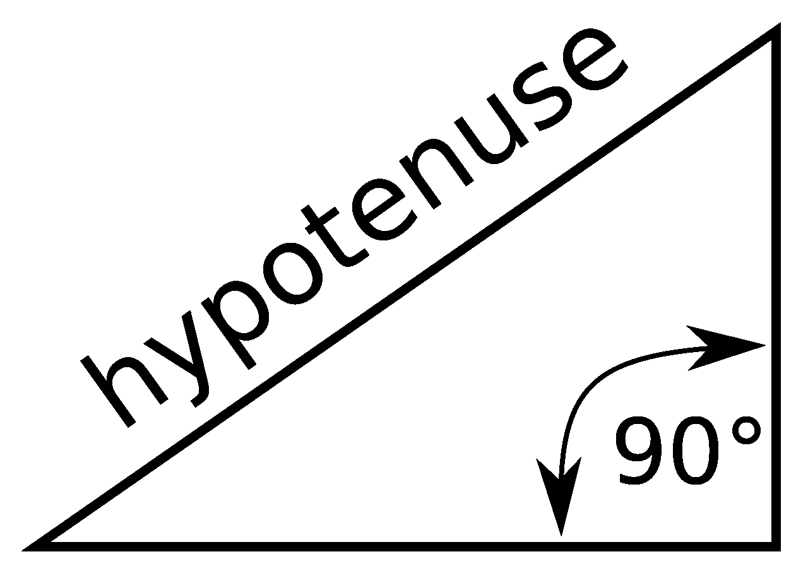

# NumPy hypo t–完整指南

> 原文：<https://www.askpython.com/python-modules/numpy/numpy-hypot>

读者你好！欢迎来到本系列的另一个教程[数字数学函数](https://www.askpython.com/python/examples/plot-mathematical-functions)。在本教程中，我们将了解 NumPy 库的 hypot 函数。

我们一定都计算过数学中直角三角形斜边的值。我们过去常常应用著名的毕达哥拉斯定理来找出斜边或任何其他两条边(即垂线和底边)的值。

本教程将用很多例子来说明如何使用 **NumPy hypot** 函数。那么，我们开始吧。

***也查:[NumPy Arctan-完全指南](https://www.askpython.com/python-modules/numpy/numpy-arctan)***

## 斜边——快速概览

*   直角三角形有一个角等于 90 度，即两条边互相垂直。在直角三角形中，与 90 度角相对的边**称为三角形的**斜边**。**
*   直角三角形斜边的值是所有边中最大的。

为了更好地理解，请参考下图。



**Hypotenuse**

## 什么是 NumPy 海波？

*   NumPy 提供了很多数学函数，numpy.hypot()就是其中之一。这里，hypot 代表直角三角形的斜边。三角形。
*   numpy.hypot()在给定直角三角形其他两条边的值的情况下，计算直角三角形斜边的值。

## NumPy hypot 的语法

`numpy.hypot(x1, x2)`

其中 x1 和 x2 是直角三角形两边的值。

这个函数根据**毕达哥拉斯定理**计算斜边的值。因此，`numpy.hypot(x1, x2)`将被计算为 sqrt(x1² +x2² )，其中 sqrt 是平方根。

**注意:** x1 和 x2 不能为负。

## 使用 NumPy 海波函数

现在让我们看一些使用 numpy hypot 函数的实际例子。

### 计算两个值列表的斜边

```py
# Importing the numpy library
import numpy as np

x1 = [12 , 4 , 5 , 6]

x2 = [5 , 6 , 7 , 14]

a = np.hypot(x1 , x2)

print("Hypotenuse Values:\n",a)

```

**输出**

```py
Hypotenuse Values:
 [13\.          7.21110255  8.60232527 15.23154621]

```

### 使用数值数组计算斜边

```py
import numpy as np

a = np.array((4 , 5))

b = np.array((3 , 12))

c = np.hypot(a , b)

print("Hypotenuse Values :\n",c)

```

**输出**

```py
Hypotenuse Values :
 [ 5\. 13.]

```

## 具有二维数组的 NumPy 海波函数

继续，我们现在将使用一个 [2D 数组来计算斜边。](https://www.askpython.com/python/array/array-indexing-in-python)

### 计算 2D 列表的斜边

```py
import numpy as np

# Creating two 3x3 arrays
x = [[1,2,3] , [4,5,6] , [7,8,9]]

y = [[10,11,12] , [13,14,15] , [16,17,18]]

z = np.hypot(x,y)

print("Hypotenuse Values:\n",z)

```

**输出**

```py
Hypotenuse Values:
 [[10.04987562 11.18033989 12.36931688]
 [13.60147051 14.86606875 16.15549442]
 [17.4642492  18.78829423 20.1246118 ]]

```

### 使用 np.ones()数据计算斜边

```py
import numpy as np

#Initializing a 3x3 NumPy Array with all the elements equal to 3
m = 3*np.ones((3,3))

#Initializing a 3x3 NumPy Array with all the elements equal to 4
n = 4*np.ones((3,3))

p = np.hypot(m , n)

print("Hypotenuse Values:\n",p)

```

**输出**

```py
Hypotenuse Values:
 [[5\. 5\. 5.]
 [5\. 5\. 5.]
 [5\. 5\. 5.]]

```

`np.ones()`函数创建一个所有元素都等于 1 的 NumPy 数组，在上面的代码片段中，我们创建了一个变量 **m** ，它包含一个所有元素都等于 3 的 3×3(二维数组)和另一个变量 **n** 也包含一个所有元素都等于 4 的 3×3(二维数组)。

下一步很简单，将 m 和 n 作为参数传递给 np.hypot()函数，计算两个数组中每对元素的斜边值。

***也读作:[【NumPy Arcsin-完全指南】](https://www.askpython.com/python-modules/numpy/numpy-arcsin)***

## 摘要

这就是 NumPy 海波函数的全部内容，它是一个非常简单明了的函数。敬请关注，继续学习🙂

## 参考

[NumPy 文件–NumPy hypot](https://numpy.org/doc/stable/reference/generated/numpy.hypot.html)