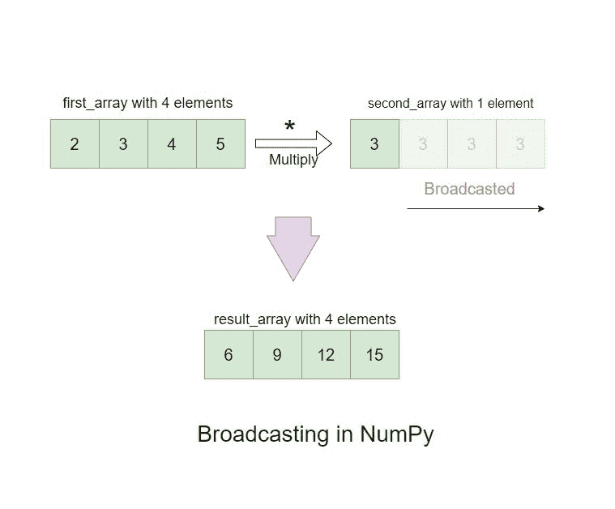

# NumPy 面试问题:为你的 Python 工作面试做准备

> 原文：<https://www.askpython.com/python/numpy-interview-questions>

NumPy 是 Python 中的一个开源科学数值库。它主要用于执行涉及矩阵和数组的数学计算。它包含许多数学函数，本质上是高级的，这些函数对数组进行操作以提供输出。

NumPy 最初被开发为 ***数字*** ，由 Jim Hugunin 和其他几个开发者作为项目的贡献者开发。2005 年，Travis Oliphant 创建了 Numarray，这是一个与 Numeric 竞争的类似的库。他将 Numarray 的特性结合到 Numeric 中，从而创造了 NumPy。

***也读作:[熊猫 Dataframe 和 Numpy 数组的区别](https://www.askpython.com/python/pandas-dataframe-vs-numpy-arrays)***

## 关键特征

以下是 NumPy 最重要的特性，这些特性使它在整个技术社区中真正流行起来。

1.  N 维数组–NumPy 速度非常快，功能强大，用途广泛。它使用向量化技术来执行数学运算。还将广播和索引作为数组计算的标准概念。
2.  **提供基于数字的计算工具**——NumPy 可以处理大量的数学和复杂的函数。其中一些包括线性代数、随机数发生器、傅立叶变换等等，它们在科学计算中被广泛使用。
3.  **使用多种连接设备和硬件的能力**–具体称为互操作性，NumPy 支持多种类型的硬件、计算平台、图形处理单元、分布式计算能力和稀疏阵列库集成，这使其成为周围大型社区使用的最强大的 Python 库之一。
4.  **优化和高性能的代码执行**–NumPy 在其核心整合了高性能的 C 代码编译，提供高效和高速的代码执行。
5.  **用户友好**–NumPy 提供了非常易读和简单的 Python 语法，这使得它非常用户友好。使用它的代码需求很少，并且易于调试。因此，使其可被所有级别的编码人员和跨多个行业使用和编程。
6.  开源(–NumPy 有一个庞大而多样化的社区，有许多开源贡献者。它带有 BSD 许可证，在 GitHub 上公开开发和维护。

## 真实世界数据分析中的 NumPy 示例

NumPy 被科学界大量使用，这使得它在每一个重要的层面上都脱颖而出。下面是几个例子，提供了他们的一瞥。完整的案例研究可在 [NumPy 官方网站上阅读。](https://numpy.org/)

1.  [第一张黑洞图像](https://numpy.org/case-studies/blackhole-image/)–NumPy 与 Matplotlib 和 SciPy 等使用 NumPy 作为依赖项的其他科学库一起，利用视界望远镜制作了第一张黑洞图像。
2.  [探测到引力波](https://numpy.org/case-studies/gw-discov/)–在阿尔伯特·爱因斯坦于 1916 年首次预言引力波之后，100 年后，LIGO 科学家用 NumPy 证实了引力波的存在。
3.  [体育分析](https://numpy.org/case-studies/cricket-analytics/)–体育行业大量使用预测分析和数据建模来提供团队和球员的统计分析，以提高他们的表现。在大多数情况下，NumPy 就是为此目的而使用的。
4.  [使用深度学习进行姿态估计](https://numpy.org/case-studies/deeplabcut-dnn/)–DeepLabCuts 正在使用 NumPy 进行动物行为观察，以更好地了解运动控制、物种和时间尺度，从而进行快节奏的科学研究。

## 理论数量面试问题

### 1.什么是 NumPy，它的基本特征是什么？

NumPy 是 Python 中的一个科学计算包/库。它提供了一个多维数组对象以及多个派生对象，如掩码数组和矩阵。NumPy 包的核心是***n 数组*** 。这负责封装同质数据类型的 n 维数组，提供优化的代码编译，使其非常高效。它主要用于执行数学和逻辑运算、实现基本的线性代数、操纵数组形状、排序和选择、I/O、执行离散傅立叶变换等等。

### 2.NumPy 是用什么语言写的？

NumPy 本质上是一个 Python 库。它主要是用 C/C++编写的，目的是快速优化代码执行。然而，NumPy 的某些部分也是用 Python 编写的。

### 3.使用 NumPy 的主要原因是什么？

NumPy 是各行各业非常流行的 Python 库。数据科学是利用这个库的主要领域之一。大多数科学计算使用数组。在执行高级和复杂的计算时，为了尽快得到结果，高效和快速的代码执行是不可避免的。

虽然 Python 列表也是数组，但是这些列表的处理时间比 NumPy 数组慢 50 倍，这使得它成为执行数字和科学计算最流行的库。在 NumPy 中，数组对象被称为 ***ndarray*** ，它提供了许多额外的功能，使它更快更容易使用。

### 4.标准 Python 序列和 NumPy 数组之间有什么重要的区别？

以下是两者之间一些最显著的区别。

*   Python 列表可以动态增长，而 NumPy 数组的大小在创建时是固定的。因此，当我们改变一个 ***ndarray*** 的大小时，它删除原来的数组并创建一个新的。
*   在计算包含大量数据的高等数学和各种其他类型的运算时，NumPy 的性能要高得多。使用 Python 进行计算需要更多的代码，效率也不如 NumPy。
*   与 Python 数组不同，NumPy 数组的所有元素的数据类型都是相同的，因此它占用固定的内存大小。然而，有一个例外，可以有对象数组(Python 和 Numpy ),允许数组有不同大小的元素。
*   许多使用基于 Python 的包进行高级计算的科学界都采用了 NumPy 数组。基于 Python 的序列通常会在预处理数据时转换为 NumPy 数组，并将结果作为 NumPy 数组输出。因此，编写高效的基于 Python 的科学计算需要 NumPy 数组的知识。

### 5.是什么让 NumPy 数组比 Python 列表快？

列表在创建和保存时，存储在随机的内存位置，如果对其进行操作，则需要更长的时间来访问和处理。这就是 NumPy 数组的亮点。它们作为 ndarrays 存储在一个连续的内存位置，使得操作和计算非常高效和优化。这种类型的代码执行与现代 CPU 架构是一致的，因此，使 NumPy 成为一个非常快速和优化的 Python 库。

### 6.在 NumPy 的上下文中简要解释一个数组。

在 NumPy 库中，数组是核心数据结构。数组包含原始数据信息，并提供解释项目和定位元素的方法。数组中的元素可以用多种方式索引，并由元素网格组成。

数组中的元素类型被称为 **dtype** ，它们也必须是相同的数据类型。维数与数组的秩有关。整数元组是提供沿每个维度的数组大小的数组形状。

### 7.列出 NumPy *ndarray* 对象的一些重要属性。

下面是一个***n 数组*** 对象的一些主要属性

*   **ndarray . shape**–输出数组尺寸。对于包含 **n 行**和 **m 列**的矩阵，形状将是 **(n，m)** 。为了获得给定数组**的轴数，使用了 ndarray.ndim** 。
*   **ndarray . dtype**–描述数组中包含的元素的数据类型。我们也可以使用标准 Python 来指定数据类型。NumPy 还提供了自己的附加数据类型。一些例子是 **numpy.int16、numpy.int32、**和 **numpy.float64** 。
*   **ndarray . itemsize**–输出给定数组中每个元素的大小，单位为**T3 字节。T5 与使用 **ndarray.dtype.itemsize** 相同。比方说，我们有一个包含类型为 **float64** 的元素的数组。它的 itemsize 将是 **8** ，这是 **64/8** 的结果。还有一种是当包含的数据类型为 **complex32** 时。它的 itemsize 将是 **4** 也就是 **32/8** 。**
*   **ndarray . data**–返回保存数组的内存位置或缓冲区。它并不常用，因为我们使用索引作为对该内存位置的引用来获取数组中包含的元素。

### 8.NumPy 中的通用函数有哪些？

像 **exp、sin、cos、add、sqrt、**等数学函数在 Numpy 中被称为**通用函数**或 **ufunc** 。它们对 NumPy 中的数组进行操作，并以数组的形式提供输出。他们使用**向量化**来实现操作，也支持广播以及其他方法，如**累加**和**减少**。

### 9.解释 NumPy 中的术语广播。

每当我们有不同维度的数组时，NumPy 在执行算术、函数、位运算以及逻辑运算时都以统一的方式对待它们。这被称为**广播**。它用于解释操作行为，这是隐式地一个元素一个元素地完成的。



NumPy Broadcasting

### 10.如何将 1D 阵列转换成 2D 阵列？

为了增加给定数组的维数，我们可以使用 NumPy 提供的 **np.newaxis** 和 **np.expand_dims** 函数。因此，我们可以将 1D 转换成 2D，将 2D 转换成 3D 等等。

### 11.解释 NumPy 中**副本**和**视图**的主要区别。

当我们使用 NumPy 中的 [**copy()函数时，它创建了一个全新的数组。我们在原始数组中所做的更改不会反映在它的复制版本中。另一方面，view()函数只是原始数组的反射。无论我们在原始数组中做什么更改，都将在用视图函数调用的数组中实现。**](https://www.askpython.com/python-modules/numpy/numpy-copy)

### 12.NumPy 和熊猫有什么不同？

以下是 NumPy 和熊猫的一些区别。

*   NumPy 比熊猫快得多，内存效率高。
*   NumPy 主要用于数值计算，而 Pandas 用于更广泛的目的，如数据分析和可视化。
*   NumPy 支持使用矩阵和数组数据格式，其中 Pandas 可以用于表格数据、Excel 文件、CSV 文件等。
*   NumPy 使用数组作为其主要对象，默认情况下也不进行索引。Pandas 使用系列和数据框作为其主要对象，并且默认情况下还提供索引。

### 13.陈述 NumPy 和 SciPy 之间的区别。

NumPy 实现了基本的功能，即索引、排序等等，这使它变得轻量和紧凑。另一方面，SciPy 用于涉及算法和代数函数的复杂计算。这使得它承载了更多的功能。

NumPy 中的函数定义得不是很全面，不像 SciPy。NumPy 的一个限制是被操作的数组必须是相同类型或同类的。SciPy 没有同质性的限制，这使得它更加灵活和通用。

Numpy 部分是用 Python 编写的，大部分使用 C 语言进行代码编译和执行。SciPy 是用 Python 编写的，与 NumPy 相比，它速度较慢，但它提供的功能比 NumPy 多得多。

### 14.NumPy 为数组迭代提供了哪些函数？

NumPy 提供的`nditer()`和`ndenumerate()`函数可以用来对不同维数的数组进行迭代运算。

### 15.如何在 NumPy 中加入数组？

我们可以使用`concatenate()`和`stack()`函数来连接 NumPy 数组。这两个函数输出相似的结果，除了堆叠操作是沿着新轴执行的，这与串联不同。

## NumPy 编码问题

### 1.怎么才能安装 NumPy？

*   **与康达**

```py
# Using an environment 
conda create -n my-env
conda activate my-env

# Install using conda-forge
conda config --env --add channels conda-forge

# Installation command
conda install numpy

```

*   **带 PIP**

```py
pip install numpy

```

***也念:[康达 vs Pip:选择你的 Python 包管理器](https://www.askpython.com/python/conda-vs-pip)***

### 2.导入 NumPy 并使用它创建一个简单的数组。

```py
import numpy as np

array1 = np.array([10, 12, 14, 16])
print(array1)

```

### 3.如何检查已安装 NumPy 的版本？

```py
import numpy as np

np.__version__

# Output: '1.21.5'

```

### 4.如何使用 NumPy 创建不同维度的数组？另外，检查尺寸。

```py
import numpy as np

first_array = np.array(10) # 0D Array
second_array = np.array([21, 22, 23, 24, 25]) # 1D Array
third_array = np.array([[21, 22, 23], [24, 25, 26]]) # 2D Array
fourth_array = np.array([[[10, 20, 30], [40, 50, 60]], [[10, 20, 30], [40, 50, 60]]]) # 3D Array

first_array, first_array.ndim

# Output: (array(10), 0)

second_array, second_array.ndim

# Output: (array([21, 22, 23, 24, 25]), 1)

third_array, third_array.ndim

# Output:

"""
(array([[21, 22, 23],
        [24, 25, 26]]),
 2)

"""

fourth_array, fourth_array.ndim

# Output:

"""
(array([[[10, 20, 30],
         [40, 50, 60]],

        [[10, 20, 30],
         [40, 50, 60]]]),
 3)

"""

```

### 5.如何使用 NumPy 创建更高维的数组？

```py
import numpy as np

higher_dimension_array = np.array([10, 20, 30, 40], ndmin=7)

higher_dimension_array

# Output: array([[[[[[[10, 20, 30, 40]]]]]]])

'Dimensions :', higher_dimension_array.ndim

# Output: ('Dimensions :', 7)

```

### 6.举例说明 NumPy***n array***属性的用法。

*   **n 阵列形状**

```py
import numpy as np

my_array = np.arange(10).reshape(2, 5)
my_array

# Output

"""
array([[0, 1, 2, 3, 4],
       [5, 6, 7, 8, 9]])

"""

my_array.shape

# Output

"""
(2, 5)
"""

```

*   **ndarray.dtype**

```py
my_array.dtype

# Output

"""
dtype('int32')
"""

```

*   ndaarray . item size

```py
r_part = [2, 3, 4]
i_part = [6, 7, 8]

my_complex_array = np.array([r_part, i_part], dtype=complex)

my_complex_array

# Output

"""

array([[2.+0.j, 3.+0.j, 4.+0.j],
       [6.+0.j, 7.+0.j, 8.+0.j]])

"""
my_complex_array.dtype

# Output

"""
dtype('complex128')
"""

my_complex_array.itemsize

# Output

"""
16
"""

```

*   **ndarray.data**

```py
my_array.data

# Output

"""
<memory at 0x000001E8ABFEDBA0>
"""

```

### 7.如何使用 NumPy 创建不同数据类型的数组？

我们可以通过几种方式使用 NumPy 创建数组。数组类型的推导是从那些序列中包含的元素类型中完成的。下面是一些例子。

*   **int 数据类型**

```py
first_array = np.array([1, 2, 3])
first_array 

# Output: array([1, 2, 3])

first_array.dtype
# Output: dtype('int32')

```

*   **浮点数据类型**

```py
second_array = np.array([2.3, 4.5, 6.7])
second_array

# Output: array([2.3, 4.5, 6.7])

second_array.dtype
# Output: dtype('float64')

```

*   **多种数据类型**

```py
third_array = np.array([(2.3, 8.7, 3.2), (1, 2, 3)])
third_array

# Output

"""
array([[2.3, 8.7, 3.2],
       [1\. , 2\. , 3\. ]])

"""

```

### 8.如何用 NumPy 创建复杂类型数组？

```py
import numpy as np

complex_type_array = np.array([[1, 2, 4], [9, 10, 5]], dtype=complex)

complex_type_array

# Output

"""
array([[ 1.+0.j,  2.+0.j,  4.+0.j],
       [ 9.+0.j, 10.+0.j,  5.+0.j]])

"""

```

### 9.我们如何使用内置函数创建 NumPy 数组？

*   **使用“数组”功能创建数组**

```py
import numpy as np

np.arange(1, 20, 3)

# Output: array([ 1,  4,  7, 10, 13, 16, 19])

```

*   **创建具有相等线性间距的阵列**

```py
import numpy as np

np.linspace(0, 1, 4 )

# Output : array([0\.        , 0.33333333, 0.66666667, 1\.        ])

```

*   **创建固定形状的零数组**

```py
import numpy as np

np.zeros((4, 5))

# Output:

"""
array([[0., 0., 0., 0., 0.],
       [0., 0., 0., 0., 0.],
       [0., 0., 0., 0., 0.],
       [0., 0., 0., 0., 0.]])

"""

```

*   **创建一个固定形状的数组**

```py
import numpy as np

np.ones((4, 5))

# Output

"""
array([[1., 1., 1., 1., 1.],
       [1., 1., 1., 1., 1.],
       [1., 1., 1., 1., 1.],
       [1., 1., 1., 1., 1.]])

"""

```

### 10.举例使用 NumPy 中的通用函数。

```py
import numpy as np

first_array = np.arange(1, 5)
second_array = np.arange(6, 10)

first_array, second_array

# Output: (array([1, 2, 3, 4]), array([6, 7, 8, 9]))

np.sqrt(first_array)

# Output: array([1\.        , 1.41421356, 1.73205081, 2\.        ])

np.add(first_array, second_array)

# Output: array([ 7,  9, 11, 13])

```

### 11.使用 NumPy 中的`np.newaxis`函数创建一个 2D 数组。

```py
import numpy as np

#  Create 1D array
first_array = np.array([3, 4, 5, 6, 7])

first_array.shape

# Output: (5,)

# Adding a new axis to our 1D array: with np.newaxis

second_array = first_array[np.newaxis, :]

second_array.shape

# Output: (1, 5)

# Adding another axis to our 2D array: with np.newaxis

third_array = second_array[np.newaxis, :]

third_array.shape

# Output: (1, 1, 5)

```

### 12.创建 NumPy 数组，显示`np.expand_dims`函数的用法。

```py
import numpy as np

# Creating a 1D array

first_array = np.arange(6)

first_array

# Output: array([0, 1, 2, 3, 4, 5])

first_array.shape

# Output: (6,)

# Adding a new axis to our 1D array at position 0: with np.expand_dims

second_array = np.expand_dims(first_array, axis=0)
second_array

# Output: array([[0, 1, 2, 3, 4, 5]])

second_array.shape

# Output: (1, 6)

# Adding a new axis to our 1D array at position 1: with np.expand_dims

third_array = np.expand_dims(first_array, axis=1)
third_array.shape

# Output: (6, 1) 

```

### 13.展示一些用 1D、2D 和 3D 数组访问数组值的例子。

*   从 1D 数组中访问元素

```py
import numpy as np

first_array = np.array([25, 30, 35, 40])

first_array[1] # Output: 30

```

*   从 2D 数组中访问元素

```py
import numpy as np

my_array = np.array([[22, 33, 44, 55], [66, 77, 88, 99]])

# Accessing row 2, element 3
my_array[1, 2] # Output: 88

```

*   访问 3D 数组中的元素

```py
import numpy as np

my_array = np.array([[[11, 22, 33], [44, 55, 66]], [[77, 88, 99], [100, 111, 122]]])

# Accessing 3rd element of 2nd array of 1st array
my_array[0, 1, 2] # Output: 66

```

### 14.显示了一个使用 NumPy 2D 数组的负索引的示例。

```py
import numpy as np

my_array = np.array([[77, 88, 99], [100, 111, 122]])

# Accessing the last element from the first dimension
my_array[0, -1] # Output: 99

```

### 15.我们如何知道数组的形状？此外，首先将 1D 阵列重塑为 2D 阵列，然后将 1D 阵列重塑为三维阵列

```py
import numpy as np

my_array = np.arange(16)

my_array

# Output: array([ 0,  1,  2,  3,  4,  5,  6,  7,  8,  9, 10, 11, 12, 13, 14, 15])

# 1D Array
my_array.shape # Output: (16,)

```

*   将 1D 转换为 2D 数组

```py
my_array.reshape(4, 4)

"""
Output:

array([[ 0,  1,  2,  3],
       [ 4,  5,  6,  7],
       [ 8,  9, 10, 11],
       [12, 13, 14, 15]])

"""

```

*   将 1D 转换为 3D 阵列

```py
# Convert 1D to 3D Array
my_array.reshape(4, 2, 2)

"""
Output:

array([[[ 0,  1],
        [ 2,  3]],

       [[ 4,  5],
        [ 6,  7]],

       [[ 8,  9],
        [10, 11]],

       [[12, 13],
        [14, 15]]])

"""

```

### 16.展示 NumPy 中**复制**功能的用法。

```py
import numpy as np

my_array = np.array([14, 15, 16, 17, 18])
my_array_copy = my_array.copy()
my_array[-1] = 100

print(my_array)
print(my_array_copy)

"""
Output:

[ 14  15  16  17 100]
[14 15 16 17 18]

"""

```

### 17.展示 NumPy 中**视图**功能的用法。

view 函数创建一个类似别名的 Numpy 数组，将所有更改复制到新数组中。

```py
import numpy as np

my_array = np.array([14, 15, 16, 17, 18])
my_array_view = my_array.view()
my_array[-1] = 100

print(my_array)
print(my_array_view)

"""
Output:
[ 14  15  16  17 100]
[ 14  15  16  17 100]

"""

```

### 18.NumPy 中的 **arange** 函数是如何使用的？

```py
import numpy as np

my_array = np.arange(5)

my_array

# Output: array([0, 1, 2, 3, 4])

```

*   范围:用“**启动**、“**停止**

```py
my_array = np.arange(1, 10)

my_array

# Output: array([1, 2, 3, 4, 5, 6, 7, 8, 9])

```

*   范围:用“**开始**、“**停止**、“**步长**

```py
my_array = np.arange(1, 14, 3)

my_array

# Output: array([ 1,  4,  7, 10, 13])

```

*   量程:**负** **计数**用**开始**、**停止**、**步长**

```py
my_array = np.arange(25, 0, -4)

my_array

# Output: array([25, 21, 17, 13,  9,  5,  1])

```

### 19.给出在 NumPy 中迭代 1D 和 2D 数组的例子。

*   1D 阵列迭代

```py
import numpy as np

my_array = np.arange(5)

for eachItem in my_array:
  print(eachItem)

"""
Output: 

0
1
2
3
4

"""

```

*   2D 阵列迭代

```py
import numpy as np

my_array = np.array([[14, 15, 16], [17, 18, 19]])

for eachItem in my_array:
  print(eachItem)

"""
Output:

[14 15 16]
[17 18 19]

"""

```

*   迭代 2D 数组中的每个标量项

```py
import numpy as np

my_array = np.array([[14, 15], [17, 19]])

for each in my_array:
  for eachItem in each:
    print(eachItem)
"""
Output:

14
15
17
19

"""  

```

### 20.我们如何用 nditer()函数迭代？

```py
import numpy as np

my_array = np.array([[12, 13], [14, 15]])

for each_scalar_item in np.nditer(my_array):
  print(each_scalar_item)

"""

Output:

12
13
14
15

"""

```

### 21.展示 nditer()函数提供步长的用法。

```py
import numpy as np

my_array = np.array([[0, 1, 2, 3, 4], [5, 6, 7, 8, 9]])

for eachItem in np.nditer(my_array[:, ::3]):
  print(eachItem)

"""
Output:

0
3
5
8

"""

```

### 22.举一个使用 ndenumerate()函数的例子。

```py
import numpy as np

my_array = np.array([[12, 13], [14, 15]])

for index, eachItem in np.ndenumerate(my_array):
  print(index, eachItem)

"""
Output:

(0, 0) 12
(0, 1) 13
(1, 0) 14
(1, 1) 15

"""

```

### 23.如何在 NumPy 中使用 concatenate 函数连接两个数组？

```py
import numpy as np

first_array = np.array([1, 2, 3])

second_array = np.array([4, 5, 6])

concatenated_array = np.concatenate((first_array, second_array))

concatenated_array

# Output: array([1, 2, 3, 4, 5, 6])

```

### 24.用 stack 函数连接两个 NumPy 数组。

```py
import numpy as np

first_array = np.array([1, 2, 3])

second_array = np.array([4, 5, 6])

stacked_array = np.stack((first_array, second_array))

stacked_array

"""
Output:

array([[1, 2, 3],
       [4, 5, 6]])

"""

```

### 25.我们如何在 NumPy 中使用 where()函数？

*   搜索数组中包含值 10 的所有索引

```py
import numpy as np

my_array = np.array([10, 20, 30, 10, 40, 50, 60, 10])

search_indexes_for_ten = np.where(my_array == 10)

search_indexes_for_ten

# Output: (array([0, 3, 7], dtype=int64),)

```

*   搜索所有值为偶数的索引

```py
import numpy as np

my_array = np.array([10, 11, 12, 15, 21, 26])

search_indexes_for_even = np.where(my_array % 2 == 0)

search_indexes_for_even

# Output: (array([0, 2, 5], dtype=int64),)

```

## 摘要

这些是 NumPy 库中一些重要的概念和问题。我希望这篇文章有助于很好地了解 NumPy 提供的功能和方法。

## 参考

[NumPy 官方文档](https://numpy.org/doc/)