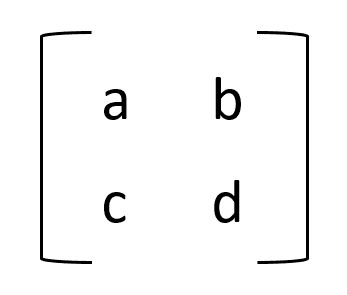
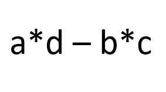
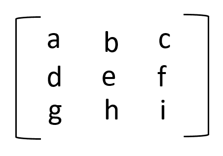
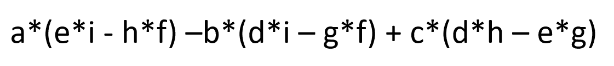

# NumPy linalg . det–计算给定数组的行列式

> 原文:# t0]https://www . aspython . com/python-modules/num py/numpy-linalg-det

你好，欢迎来到这个关于 **Numpy linalg.det** 的教程。在本教程中，我们将学习 **NumPy linalg.det()** 方法，也将看到许多关于相同的例子。让我们开始吧！

***也查:[Numpy linalg . EIG——计算一个方阵的特征值和右特征向量](https://www.askpython.com/python-modules/numpy/numpy-linalg-eig)***

* * *

## 什么是 numpy.linalg.det？

NumPy 中的`numpy.linalg.det()`方法用于计算给定方阵的行列式。

如果我们有一个形式为 2×2 的矩阵:



2×2 Array

它的行列式计算如下:



2×2 Array Determinant

对于像这样的 3×3 矩阵



3×3 Array

行列式的计算如下:



3×3 Array Determinant

同样，我们可以计算高阶数组的行列式。

* * *

## NumPy linalg.det 的语法

```py
numpy.linalg.det(a)

```

*   **参数:** *一个*，一个 MxM 数组。要计算行列式的输入数组。
*   **返回:*的***行列式 a 。

* * *

## NumPy linalg.det 示例

让我们看一些 NumPy linalg.det 函数的例子来了解它是如何工作的。

### 1.在 2×2 阵列上使用 NumPy linalg.det

```py
import numpy as np

arr = [[2, 1], [3, 5]]
# using np.linalg.det() method to compute the determinant
print("array = ", arr)
print("Determinant of array = ", np.linalg.det(arr))
det = 5*2 - 3*1
print("Determinant of array using manual calculation = ", det)

```

**输出:**

```py
array =  [[2, 1], [3, 5]]
Determinant of array =  6.999999999999999
Determinant of array using manual calculation =  7

```

* * *

### 在带有负数的 2×2 数组上使用 NumPy linalg.det

```py
import numpy as np

arr = [[-5, 2], [-4, 8]]
# using np.linalg.det() method to compute the determinant
print("array = ", arr)
print("Determinant of array = ", np.linalg.det(arr))
det = (-5*8) - (-4*2)
print("Determinant of array using manual calculation = ", det)

```

**输出:**

```py
array =  [[-5, 2], [-4, 8]]
Determinant of array =  -32.0
Determinant of array using manual calculation =  -32

```

* * *

### 3×3 阵列的 NumPy 线性代数计算

```py
import numpy as np

arr = [[2, 1, 3], [5, 3, 4], [1, 0, 1]]
# using np.linalg.det() method to compute the determinant
print("array = ", arr)
print("Determinant of array = ", np.linalg.det(arr))
det = 2*(3*1 -0*4) -1*(5*1 - 1*4) + 3*(5*0 - 3*1)
print("Determinant of array using manual calculation = ", det)

```

**输出:**

```py
array =  [[2, 1, 3], [5, 3, 4], [1, 0, 1]]
Determinant of array =  -4.0
Determinant of array using manual calculation =  -4

```

在上述所有示例中，我们使用`numpy.linalg.det`方法计算行列式，并使用手动方法计算行列式，即通过上述公式。通过这一点，我们可以得出结论，两种方法返回相同的答案。

* * *

## 结论

仅此而已！在本教程中，我们学习了 **Numpy linalg.det** 方法，并使用该方法练习了不同类型的示例。

如果你想了解更多关于 NumPy 的知识，请随意浏览我们的 NumPy 教程。

* * *

## 参考

*   [numpy.linalg.det 官方文档](https://numpy.org/doc/stable/reference/generated/numpy.linalg.det.html)