# NumPy linalg.matrix_power:计算方阵的幂

> 原文：<https://www.askpython.com/python-modules/numpy/numpy-linalg-matrix_power>

在本教程中，我们将学习如何在线性代数中使用 NumPy 模块中的 Python 中的 **linalg.matrix_power** 方法来计算矩阵的给定幂。

**numpy . linalg . matrix _ power()方法用于将方阵提升到整数 n 次幂**

让我们先看看函数的语法。

***也查:[Numpy linalg . EIG——计算一个方阵的特征值和右特征向量](https://www.askpython.com/python-modules/numpy/numpy-linalg-eig)***

* * *

## numpy.linalg.matrix_power 的语法

```py
numpy.linalg.matrix_power(a, n)

```

*   **参数:**
    *   *一个*，一个 MxM 数组。输入矩阵的幂。
    *   *n* ，整数，幂或指数。它可以是正数、负数或零。
*   **回报:** *一**n* 。返回的矩阵与 *a* 的形状相同。如果 *n* 是正数或者零，那么返回类型是整数。如果 *n* 为负，那么返回类型为 float。
*   **引发:** *LinAlgError* 对于非方阵或者(对于负幂)其逆无法计算的矩阵。

***注意:如果一个矩阵的行列式为零，那么它的逆就无法计算。***

这个函数非常类似于`numpy.power(n, p)`函数，它采用两个参数，一个数字 *n* 和一个幂 *p* ，并将 *n* 提升到幂 *p* 。

* * *

## numpy.linalg.matrix_power 示例

现在让我们从 numpy linalg 矩阵幂方法的几个例子开始。

### 使用 numpy.linalg.matrix_power 的正幂

```py
import numpy as np

matrix = [[2, 5], [1, 3]]
# calculating the matrix power
mat_power_2 = np.linalg.matrix_power(matrix, 2)
mat_power_3 = np.linalg.matrix_power(matrix, 3)

print("Matrix = \n", matrix,
      "\nMatrix power 2 = \n", mat_power_2,
      "\nMatrix power 3 = \n", mat_power_3)

```

**输出:**

```py
Matrix = 
 [[2, 5], [1, 3]] 
Matrix power 2 = 
 [[ 9 25]
 [ 5 14]] 
Matrix power 3 = 
 [[ 43 120]
 [ 24  67]]

```

矩阵的 2 次幂通过矩阵乘以自身来计算，如下所示:

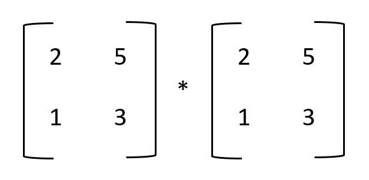

Step 1

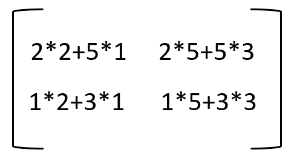

Step 2

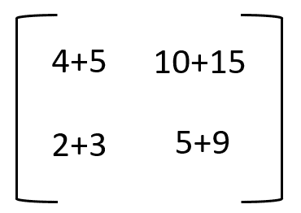

Step 3

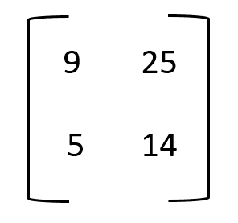

Step 4 – Final result of matrix power 2

以上矩阵是矩阵幂 2 的结果。现在，为了计算矩阵的幂 3，我们可以将矩阵的幂 2 乘以给定的矩阵。也就是说，

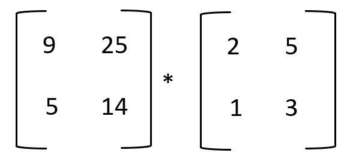

Step 1

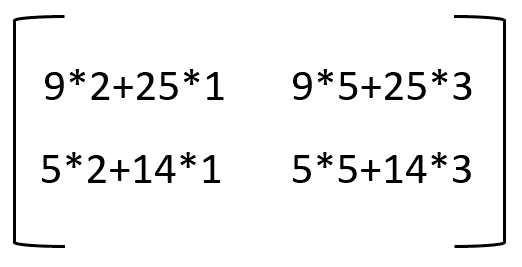

Step 2

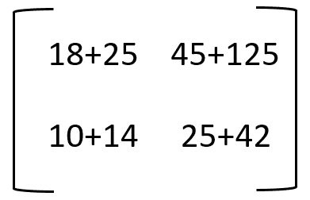

Step 3

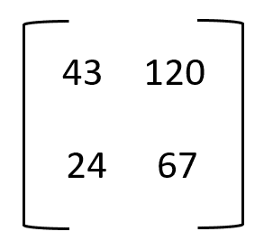

Step 4 – Final result of matrix power 3

* * *

### 使用负幂的 numpy.linalg.power()

当我们将一个负幂 *n* 传递给函数时，它首先计算矩阵的逆矩阵，然后将逆矩阵提升到幂 abs(n)。

对于像这样的 2×2 矩阵:

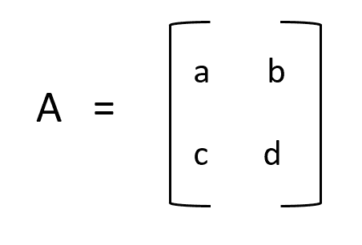

倒数计算如下:

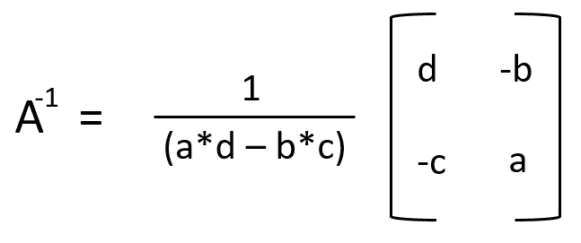

```py
import numpy as np

matrix = [[2, 5], [1, 3]]
# calculating the matrix power
mat_power = np.linalg.matrix_power(matrix, -2)

print("Matrix = \n", matrix, "\nMatrix power -2 = \n", mat_power)

```

**输出:**

```py
Matrix = 
 [[2, 5], [1, 3]] 
Matrix power -2 = 
 [[ 14\. -25.]
 [ -5\.   9.]]

```

在这个例子中，

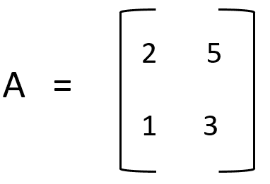

其倒数计算如下:

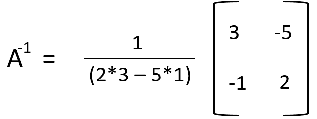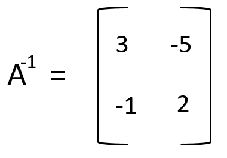

现在，将矩阵的逆矩阵提升到幂 *abs(-2)，即 2* ，如下所示:

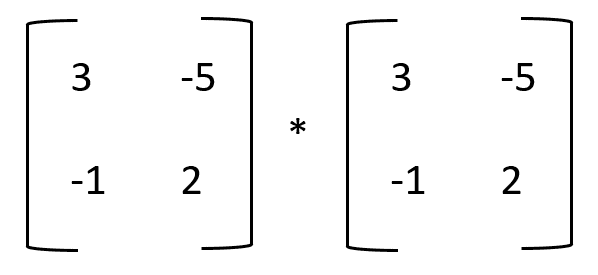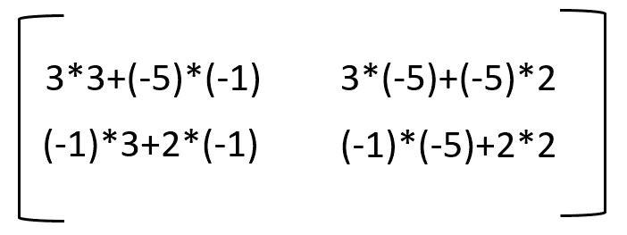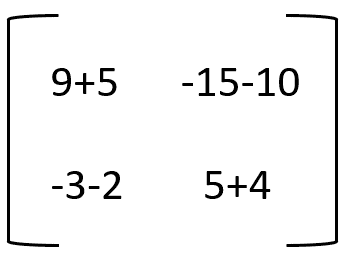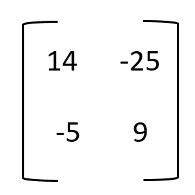

The final result of matrix power -2

* * *

### 将 numpy.linalg.matrix_power 与 0 一起使用

当零作为幂传递给`numpy.linalg.matrix_power`函数时，返回一个与输入矩阵形状相同的单位矩阵。

```py
import numpy as np

matrix_1 = [[2, 5], [1, 3]]
matrix_2 = [[4, 2, 5], [1, 8, 3], [6, 0, 2]]
# calculating the matrix power
mat_1_power_0 = np.linalg.matrix_power(matrix_1, 0)
mat_2_power_0 = np.linalg.matrix_power(matrix_2, 0)

print("Matrix 1 = \n", matrix_1, 
      "\nMatrix 1 power 0 = \n", mat_1_power_0, 
      "\nMatrix 2 = \n", matrix_2,
      "\nMatrix 2 power 0 = \n", mat_2_power_0)

```

**输出:**

```py
Matrix 1 = 
 [[2, 5], [1, 3]] 
Matrix 1 power 0 = 
 [[1 0]
 [0 1]] 
Matrix 2 = 
 [[4, 2, 5], [1, 8, 3], [6, 0, 2]] 
Matrix 2 power 0 = 
 [[1 0 0]
 [0 1 0]
 [0 0 1]]

```

因为矩阵 1 是 2×2 矩阵，所以输出是 2×2 单位矩阵，类似地，矩阵 2 的输出自乘到 0 是 3×3 单位矩阵。

* * *

## 结论

因此，在本教程中，我们学习了线性代数中用于计算方阵幂的`numpy.linalg.matrix_power`函数。我们还看到了各种可能的输入和输出示例。

如果你想了解更多关于 NumPy 的知识，请随意浏览我们的 NumPy 教程。

* * *

## 参考

*   [numpy.linalg.matrix_power 官方文档](https://numpy.org/doc/stable/reference/generated/numpy.linalg.matrix_power.html)