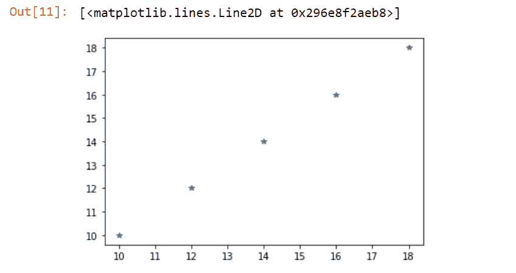

# Numpy linspace()方法

> 原文:# t0]https://www . aspython . com/python-modules/num py/numpy-linspace-python

在本文中，我们将看看 **`Numpy linspace()`** 功能。 **Python NumPy 模块**有不同的函数来操作数组并对其中的元素执行操作。

* * *

## NumPy linspace()入门

NumPy 的 **numpy.linspace()** 函数基本上是用来**在提供的**数范围之外生成一个线性序列。

通常， **`numpy.arange()`** 函数可以用来生成一定范围内的数列。numpy.arange()函数的问题是，如果向它提供一个浮点类型参数，它会导致结果的精度损失。

因此，numpy.linspace()函数可以优先于它。

**语法:**

```py
numpy.linspace(start, stop, num = value, endpoint = True/False, retstep = False/True, dtype = None)

```

*   **`start`** :该值表示序列的**起点**。默认值被视为零(0)。
*   **`stop`** :该值表示序列的**端点**。
*   **`num`** :表示开始和停止范围之间要产生的**步数或元素**。

**举例:**

```py
import numpy

inp = numpy.linspace(1, 3, 5)

print('Linear Sequence:\n',inp)
print('Length of the sequence:\n')
print(len(inp))

```

**输出:**

```py
Linear Sequence:
 [1\.  1.5 2\.  2.5 3\. ]
Length of the sequence:
5

```

* * *

### Numpy linspace()的 retstep 参数

**`retstep`** 参数基本上是一个**布尔值**。如果提供为 **True** ，则指定生成序列的每个元素之间的步长。然后，它产生一个作为**元组**的序列。

**举例:**

```py
import numpy 

inp = numpy.linspace(1, 3, num=5, retstep=True)
print(inp)
print("Length of the sequence:",len(inp))

```

如上所述，当 retstep = True 作为参数传递给 linspace()方法时，它会生成一个 tuple 作为输出。所以元组的**长度将是 **2，而不是 6** ！**

**输出:**

```py
(array([1\. , 1.5, 2\. , 2.5, 3\. ]), 0.5)
Length of the sequence: 2

```

* * *

### linspace()方法的端点参数

**`endpoint`** 参数是一个布尔值。如果设置为**假**，则排除结果中序列的最后一个数字。端点的默认值为**真**。

**举例**:

```py
import numpy

inp = numpy.linspace(1, 3, 5, endpoint=False)

print('Sequence from 1 to 3:', inp)

```

**输出:**

```py
Sequence from 1 to 3: [1\.  1.4 1.8 2.2 2.6]

```

* * *

### linspace()方法的轴参数

`**axis**`参数基本上允许用户向**提供一个轴，以便生成的序列沿着**存储。只有当数据的**起点**和**终点**为**数组**类型时，轴参数才适用。

**举例**:

```py
import numpy

inp1 = numpy.array([[10, 20, 30], [70, 40, 50]])
inp2 = numpy.array([[1, 3, 9], [5, 7, 11]])

op1 = numpy.linspace(inp1, inp2, 4, axis=0)
print(op1)

op2 = numpy.linspace(inp1, inp2, 2, axis=1)
print(op2)

```

当**轴= 0** 时，从第一个提供的轴获取序列限制。子阵列对 **`[10, 20, 30] and [1, 3, 9]`** 连同 **`[70, 40, 50] and [5, 7, 11]`** 被认为是从 **inp1** 到 **inp2** 导出序列的限制。

当**轴= 1** 时，使用**列序列**生成给定范围内的元素。

**输出:**

```py
[[[10\.         20\.         30\.        ]
  [70\.         40\.         50\.        ]]

 [[ 7\.         14.33333333 23\.        ]
  [48.33333333 29\.         37\.        ]]

 [[ 4\.          8.66666667 16\.        ]
  [26.66666667 18\.         24\.        ]]

 [[ 1\.          3\.          9\.        ]
  [ 5\.          7\.         11\.        ]]]

[[[10\. 20\. 30.]
  [ 1\.  3\.  9.]]

 [[70\. 40\. 50.]
  [ 5\.  7\. 11.]]]

```

* * *

## 带有 Python matplotlib.pylab 模块的 NumPy linspace()函数

**NumPy linspace()** 函数可以借助来自 [matplotlib 库](https://www.askpython.com/python-modules/matplotlib/python-matplotlib)的 **pylab** 来表示理解。

**举例:**

```py
import numpy 
import pylab 

inp1 = numpy.linspace(10, 20, 5, endpoint = False) 
inp2 = numpy.linspace(10, 20, 5, endpoint = False) 

pylab.plot(inp1, inp2, '*') 

```

**输出:**



NmpPy Linspace

* * *

## 结论

在本文中，我们已经了解了 **numpy.linspace()** 方法的工作原理。

* * *

## 参考

**Python numpy.linspace()方法**