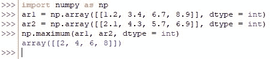
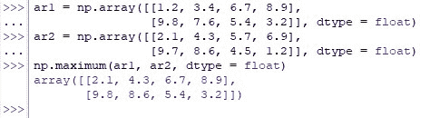
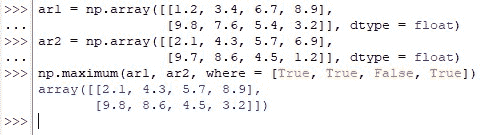

# 如何在数组上使用 Numpy Maximum？

> 原文：<https://www.askpython.com/python-modules/numpy/numpy-maximum-on-arrays>

更重要的事情！这些实体为偏向数据集的结果播下了种子，扭曲了它们的平均值，并给观众一种甚至不接近现实存在的幻觉。在本文中，我们将研究使用 Python 中的 *numpy* 库中的 *maximum( )* 函数从数组中的给定元素中找出最大值的一系列步骤。在开始之前，让我们从理解它的语法开始。

***也读作:[如何在数组上使用 Numpy 最小值？](https://www.askpython.com/python-modules/numpy/numpy-minimum-on-arrays)***

* * *

## ***最大值()*函数**的语法

下面是由强制和可选元素组成的基本构造，这些元素是为来自 *numpy* 库的 *maximum( )* 函数的有效运行而提供的。

```py
numpy.maximum(x1, x2, out=None, *, where=True, dtype=None)

```

在哪里，

*   ***x1，x2—***输入数组，保存要查找最大值的元素
*   ***out—***一个可选的构造，默认情况下设置为 *none* ，但可用于将结果存储在所需的数组中，该数组的长度与输出的长度相同
*   *****–**kwargs 或 keyword argument，这是一个可选结构，用于将关键字可变长度的参数传递给函数
*   ***其中—***一个可选构造，当设置为*真*(默认设置)时，用于计算给定位置的通用函数(ufunc ),当设置为*假*时，不计算
*   ***dtype—***可选结构，用于指定正在使用的数据类型

* * *

## **在一维数组上使用*最大值()***

让我们通过使用以下代码在 Python 中导入 *numpy* 库来开始。

```py
import numpy as np

```

现在让我们构造两个一维数组，确定它们的最大元素数。

```py
ar1 = np.array([[1.2, 3.4, 6.7, 8.9]], dtype = int)
ar2 = np.array([[2.1, 4.3, 5.7, 6.9]], dtype = int)

```

从上面可以注意到，考虑的数据类型是 *int* ，所以可以很好地期望输出去掉十进制数。现在是时候使用*最大值()*函数了！

```py
np.maximum(ar1, ar2, dtype = int)

```



Calculating the Maximum of One Dimensional Arrays

* * *

## **在 N 维数组上使用*maximum()***

现在我们已经处理了在一维数组的元素中寻找最大值的问题，让我们在本节中通过使用多维数组(如下所示)来扩展我们的探索，使用 *maximum( )* 函数返回它们的最大值元素。

```py
ar1 = np.array([[1.2, 3.4, 6.7, 8.9],
                [9.8, 7.6, 5.4, 3.2]], dtype = float)
ar2 = np.array([[2.1, 4.3, 5.7, 6.9],
                [9.7, 8.6, 4.5, 1.2]], dtype = float)
np.maximum(ar1, ar2, dtype = float)

```



Calculating the Maximum of N-Dimensional Arrays

受过训练的眼睛可以观察到与前一部分的输出数组的相似性，即两者都与它们的输入数组具有相同的维数。这给了我们一个如何构造输出数组的线索，如果我们想把结果存储在其他地方的话。

* * *

## **使用*中的*处的*最大值()*功能**

我们现在开始使用 *maximum( )* 函数，在这个函数中，我们还可以通过使用下面演示的 *where* 选项，有选择地查找限定在数组中特定位置的给定数组元素的最大值。

```py
ar1 = np.array([[1.2, 3.4, 6.7, 8.9],
                [9.8, 7.6, 5.4, 3.2]], dtype = float)
ar2 = np.array([[2.1, 4.3, 5.7, 6.9],
                [9.7, 8.6, 4.5, 1.2]], dtype = float)
np.maximum(ar1, ar2, where = [True, True, False, True])

```

上面的代码要求 *maximum( )* 函数只返回在所有位置进行比较的输入数组的最大值，除了第三个位置，在第三个位置它运行反向执行。



Results Using the *Where* Option

* * *

## **结论:**

既然我们已经到了这篇文章的结尾，希望它已经详细说明了如何使用 *numpy* 库的 *maximum( )* 函数找到数组元素的最大值。这里有另一篇文章解释了如何在 Python 中使用 *numpy* 找到数组元素的[最小值。AskPython](https://www.askpython.com/python-modules/numpy/numpy-minimum-on-arrays) 中还有许多其他有趣的&内容丰富的文章，可能对那些希望提高 Python 水平的人有很大帮助。当你享受这些的时候，再见！