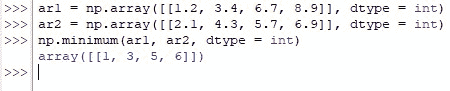
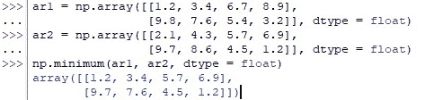
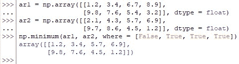

# 如何在数组上使用 Numpy 最小值？

> 原文：<https://www.askpython.com/python-modules/numpy/numpy-minimum-on-arrays>

很容易挑出一个奇怪的！但是当要挑选最小的一个时，特别是当有大量的数据要挑选时，麻烦就来了！为了让我们摆脱这种人类思维所需要的努力和时间的负担，我们在编程语言的计算能力中找到了慰藉。

在本文中，我们将研究使用 Python 中的 *numpy* 库中的 *minimum( )* 函数从数组中的给定元素中找出最小值的一系列步骤。让我们开始理解它的语法。

***也读作:[【NumPy 闵楠——忽略任何 NaNs 的沿轴数组的最小值](https://www.askpython.com/python-modules/numpy/numpy-nanmin)***

* * *

## ***最小值()*函数**的语法

下面是由强制和可选元素组成的基本构造，这些元素应该放在一起，以便来自 [*numpy* 库](https://www.askpython.com/python-modules/numpy/)的 *minimum( )* 函数能够有效运行。

```py
numpy.minimum(x1, x2, out=None, *, where=True, dtype=None)

```

在哪里，

*   ***x1，x2—***输入数组，保存要在其中找到最小值的元素
*   ***out—***一个可选的构造，默认情况下设置为 *none* ，但可用于将结果存储在所需的数组中，该数组的长度与输出的长度相同
*   *****–**kwargs 或 keyword argument，这是一个可选结构，用于将关键字可变长度的参数传递给函数
*   ***其中—***一个可选构造，当设置为*真*(默认设置)时，用于计算给定位置的通用函数(ufunc ),当设置为*假*时，不计算
*   ***dtype—***一个可选结构，用于指定正在使用的数据类型

* * *

## **在一维数组上使用*最小值()***

让我们通过使用以下代码在 Python 中导入 *numpy* 库来开始。

```py
import numpy as np

```

下面是一维数组，其中的最小元素将被确定。

```py
ar1 = np.array([[1.2, 3.4, 6.7, 8.9]], dtype = int)
ar2 = np.array([[2.1, 4.3, 5.7, 6.9]], dtype = int)

```

从上面可以注意到，考虑的数据类型是 *int* ，所以可以很好地期望输出去掉十进制数。现在是时候使用*最小值()*函数了！

```py
np.minimum(ar1, ar2, dtype = int)

```



Calculating The Minimum Of One Dimensional Arrays

* * *

## **在 N 维数组上使用 Numpy*minimum()***

现在让我们通过使用多维数组来扩展我们的 ask，如下所示，使用 *minimum( )* 函数返回它们的最小元素。

```py
ar1 = np.array([[1.2, 3.4, 6.7, 8.9],
                [9.8, 7.6, 5.4, 3.2]], dtype = float)
ar2 = np.array([[2.1, 4.3, 5.7, 6.9],
                [9.7, 8.6, 4.5, 1.2]], dtype = float)
np.minimum(ar1, ar2, dtype = float)

```



Calculating The Minimum Of N-Dimensional Arrays

类似于上一节的输出数组，这里输出数组的每个位置(与输入数组的维数相同)也用最小值替换。

* * *

## **使用*中的*处的*最小值()*功能**

还可以通过使用下面演示的 *minimum( )* 函数中的 *where* 选项，有选择地找到只限于数组中特定位置的给定数组元素的最小值。

```py
ar1 = np.array([[1.2, 3.4, 6.7, 8.9],
                [9.8, 7.6, 5.4, 3.2]], dtype = float)
ar2 = np.array([[2.1, 4.3, 5.7, 6.9],
                [9.7, 8.6, 4.5, 1.2]], dtype = float)
np.minimum(ar1, ar2, where = [False, True, True, True])

```

上面的代码将 *minimum( )* 函数限制为只返回输入数组中除第一个位置之外的所有位置的最小值。



Results Using The Where Option

* * *

## **结论**

既然我们已经到了这篇文章的结尾，希望它已经详细说明了如何使用来自 *numpy* 库的 *minimum( )* 函数找到数组元素的最小值。这里有另一篇文章解释了[如何在 Python](https://www.askpython.com/python-modules/numpy/numpy-divide) 中使用 *numpy* 来划分数组中的元素。AskPython 中还有许多其他有趣的&内容丰富的文章，可能对那些希望提高 Python 水平的人有很大帮助。当你享受这些的时候，再见！