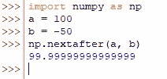

# Numpy Nextafter:如何在 Python 中使用 Numpy Nextafter？

> 原文:# t0]https://www . aspython . com/python-modules/num py/numpy-nextafter

寻找一个函数，返回一个给定数字在另一个数字方向的下一个浮点值？你想用一组数字而不是一个数字来实现同样的功能吗？

好了，不用再找了，numpy 库已经有了你正在寻找的东西——T2 next after()函数。在本文中，我们将展示上述函数的功能，并理解作为其功能输入的基本结构。

***也读作: [Numpy.kron():如何使用 Numpy 计算克罗内克积？](https://www.askpython.com/python-modules/numpy/numpy-kron)***

我们将首先使用下面的代码导入 *numpy* 库。

```py
import numpy as np

```

此后，我们将通过下面的每一节进一步探索 *nextafter( )* 函数。

*   ***next after()*函数**的语法
*   **在标量上使用 *nextafter( )***
*   **在 N 维数组上使用*next after()***

* * *

## ***next after()*函数**的语法

该函数依赖于下面给出的主要输入 x1 和 x2，其中，x1 是沿着 x2 方向找到下一个浮点值的实体。也可以在 *nextafter( )* 函数中使用的其他可选输入如下。

```py
numpy.nextafter(x1, x2, out=None, *, where=True, dtype=None)

```

在哪里，

*   ***x1—***N 维数组或标量，要查找其最近的浮点值
*   ***x2—***N 维数组或标量提供搜索方向
*   ***out—***一个可选的构造，默认情况下设置为 *none* ，但可用于将结果存储在所需的数组中，该数组的长度与输出的长度相同
*   *****–**kwargs 或 keyword argument，这是一个可选结构，用于将关键字可变长度的参数传递给函数
*   ***其中—***一个可选构造，当设置为*真*(默认设置)时，用于计算给定位置的通用函数(ufunc ),当设置为*假*时，不计算
*   ***dtype—***一个可选结构，用于指定正在使用的数据类型

* * *

## **在标量上使用 *nextafter( )***

在本节中，让我们使用几个标量部署到 *nextafter( )* 函数中，如下所示。

```py
a = 100
b = -50
np.nextafter(a, b)

```

一旦运行了上面的代码，在后端就会发生下面的计算，当在‘b’方向搜索时，返回下一个最接近‘a’的数字。

*   “b”被指定为“-50”，这意味着下一个最接近“a”的数字将被向左或在“100”之前搜索，而不是在“100”之后。
*   发现最接近“100”的数字是 99.9999999999999(Python 将浮点数返回到小数点后 14 位精度)。



Using *nextafter( )* On Scalars

从上面的解释可以推断，当第二个输入‘x2’大于第一个输入‘x1’时，搜索方向与向右搜索数字行中的数字(第一个输入，x1)是同义的，或者如果第二个输入‘x2’小于第一个输入‘x1’，则向左搜索。

即使使用正无穷大或负无穷大而不是其他数字作为“x2 ”,同样的逻辑也适用，我们将使用下面的代码来解决这个难题。

```py
c = -10
d = +np.inf
np.nextafter(c, d)

```


Using *nextafter*( ) on Scalars in the Direction of +Infinity

上面的结果证明，由于搜索方向是正无穷大，所以返回的最接近的浮点数在数字行中是朝着“-10”的右边。

* * *

## **在 N 维数组上使用*next after()***

当部署在数组上时，结果将四舍五入到数组中给定的小数之后的相同位数，而不是如下所示的 14 位整数。

```py
ar1 = np.array([[1.05, 3, 7],
                [2.9, 9, 4.3666667]])
ar2 = np.array([[-1, 0.3, +np.inf],
                [0, -np.inf, 10]])
np.nextafter(ar1, ar2)

```


Using *nextafter*( ) on Arrays

* * *

## **结论**

既然我们已经到了本文的结尾，希望它已经详细阐述了如何使用来自 *numpy* 库中的 *nextafter( )* 函数。这里有另一篇文章详细介绍了使用 numpy kron() 计算 [Kronecker 积。AskPython](https://www.askpython.com/python/how-to-calculate-kronecker-product-using-numpy) 中还有许多其他有趣且同样丰富的文章，可能对那些希望提高 Python 水平的人有很大帮助。*恭喜*！