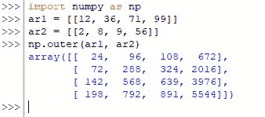
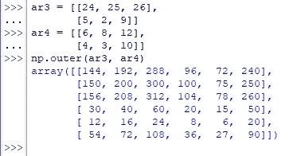
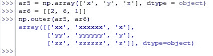
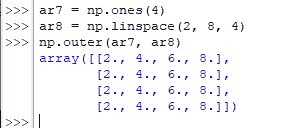

# Numpy.outer():完整指南

> 原文：<https://www.askpython.com/python-modules/numpy/numpy-outer>

向量是非常迷人的实体，构成了在数学领域中使用的不同空间和平面导航的本质。虽然向量可以执行无数的操作，但是在本文中，我们将使用 *numpy* 库中的内置函数—*outer()*函数来探索这样一种操作！

***还要检查:[熊猫 Dataframe 和 Numpy 数组的区别](https://www.askpython.com/python/pandas-dataframe-vs-numpy-arrays)***

让我们先导入 *numpy* 库，然后使用下面的代码部署 *outer( )* 函数。

```py
import numpy as np

```

我们将通过以下几节深入介绍 *outer( )* 函数。

*   ***outer()*函数**的语法
*   **计算一维数组的外积**
*   **计算 N 维数组的外积**
*   **计算字母的外积**
*   **用 *Numpy* 函数**计算外积

* * *

## outer()函数的语法

确定给定向量集的外积的基本机制是将一个向量的每个元素与其他每个元素相乘，并将每个相应的结果视为输出向量的一部分。这就是发生在 *outer( )* 函数中的所有内容，其语法如下:

```py
numpy.outer(a, b, out=None)

```

在哪里，

*   ***a-***n 维数组的第一个输入向量
*   ***b—***n 维数组的第二个输入向量
*   ***out—***一个可选的构造，默认情况下设置为 *none* ，但是可以用来将结果存储在一个适当长度的数组中

* * *

## 计算一维数组的外积

在导入了 *numpy* 库之后，让我们使用两个一维数组来寻找向量的外积，如下所示。

```py
ar1 = [[12, 36, 71, 99]]
ar2 = [[2, 8, 9, 56]]
np.outer(ar1, ar2)

```

输出数组也应该包含 4 列，但重要的变化是行数，应该是 4 而不是 1。这里发生的是第一个数组的第一个元素，' 12 '与第二个数组中的每个元素相乘，这解释了输出的第一行的结果。

输出数组“24”的第一个元素是 12×2 的乘积，第二个元素“96”是 12×8 的乘积，依此类推。如此反复，直到数组的最后一个元素乘以 12 &然后对下一个元素‘36’重复这个过程。现在结果被记录在新的一行中！



Outer Product Calculated For One-Dimensional Arrays

* * *

## 计算 N 维数组的外积

在本节中，让我们使用 3 列 2 行的数组来计算向量的外积。猜猜结果会是什么？

```py
ar3 = [[24, 25, 26],
       [5, 2, 9]]
ar4 = [[6, 8, 12],
       [4, 3, 10]]
np.outer(ar3, ar4)

```

一个 6×6 的阵列！



Outer Product Calculated For Two-Dimensional Arrays

* * *

## 计算字母的外积

向量的外积不仅限于数字，还可以通过将字母的数据类型指定为“对象”来使用字母，如下所示。

```py
ar5 = np.array(['x', 'y', 'z'], dtype = object)
ar6 = [[2, 6, 1]]
np.outer(ar5, ar6)

```

产生的输出数组应包含“ar5”中的字母，其重复次数与“ar6”的每个元素中指定的次数相同。



Outer Product Calculated For Letters

* * *

## 用 Numpy 函数计算外积

还可以使用组合*个 1()–*来计算向量的外积，这将根据指定的维度创建一个由“1”组成的数组&*linspace()–*通过将指定的范围划分为指定数量的部分来创建一组数字。

让我们使用 *linspace( )* 将 2 & 8 之间的范围划分为四个部分进行本节演示。

```py
ar7 = np.ones(4)
ar8 = np.linspace(2, 8, 4)
np.outer(ar7, ar8)

```



Outer Product Calculated With Numpy Functions

* * *

## 结论

既然我们已经到了本文的结尾，希望它已经详细阐述了如何使用来自 *numpy* 库的 *outer( )* 函数。这里有另一篇文章解释了[如何在 Python](https://www.askpython.com/python/how-to-calculate-square-root-using-numpy-in-python) 中使用 *numpy* 求平方根。AskPython 中还有许多其他有趣且信息量大的文章，可能对那些希望提高 Python 水平的人有很大帮助。当你享受这些的时候，再见！