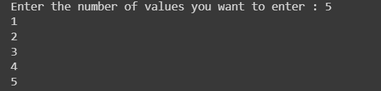

# Numpy 幂——将另一个数提高到的幂

> 原文：<https://www.askpython.com/python-modules/numpy/numpy-power>

我们今天要解决一个非常令人兴奋的问题！我们将取两个长度相同的数组。对于第一个数组的每个值，我们将把幂提升到与第二个数组的相应值相同的值。让我们从理论上理解这一点。

我们有两个数组

*   x=[1，2，3，4，5，6，8]
*   y=[5，4，3，2，1，9，3]

让我们得到从 0 到数组长度范围内所有 I 的值`x[i]^(y[i])`。

*   1⁵ = 1
*   2⁴ = 16
*   3³ = 27
*   4² = 16
*   5¹ = 5
*   6⁹ = 10077696
*   8³ = 512

我们希望我们的结果或输出在一个数组中，比如[1，16，27，16，5，10077696，512]。

## 使用 Numpy.power()方法

我们将继续解决这个问题，按顺序排列每一步，让你解释为合理的。今天我们将使用我们的 google collab 进行编码。你们一定知道 google collab 也提供了最好的 python 平台。不要迟到。让我们开始吧。

### 第一步:导入数字

我们将在第一步导入所需的模块。因为我们要使用`NumPy.power()`函数，我们需要导入依赖模块，即 [**Numpy 模块**](https://www.askpython.com/python-modules/numpy/python-numpy-module) 。

```py
import numpy

```

### 步骤 2:创建要乘幂的数组

让我们取或创建如下两个数组，由一些值组成。

```py
x=[1,2,3,4,5,6,8]
y=[5,4,3,2,1,9,3]

```

### 步骤 3:确认数组长度相同

在这一步，我们将检查两个数组的长度是否相等，如果相等，我们将进一步让我们的问题得到解决。否则，它将不会进一步移动。

```py
if len(x) == len(y):
  #logicc to get our Resulatant array
else :
 print("arrays are not of equal size. Plz review again")

```

### 第 4 步:对每个项目运行 numpy.power()方法

在这一步，我们将创建我们的逻辑和代码。我们正在循环解决我们的问题。在循环内部，我们使用 **`NumPy.power()`方法来获取结果并加载到`z`数组中。**快速浏览以便更好地理解。

```py
 for i in x:
    output = numpy.power(i,y[w])
    w = w + 1
    z.append(output)
 print(z)  

```

解决我们问题的整体代码如下。

```py
import numpy
x=[1,2,3,4,5,6,8]
y=[5,4,3,2,1,9,3]
z=[]
w = 0
if len(x) == len(y):
 for i in x:
    output = numpy.power(i,y[w])
    w = w + 1
    z.append(output)
 print(z)  
else :
 print("arrays are not of equal size. Plz review again")

```

上面的代码片段将给出如下。

```py
[1, 16, 27, 16, 5, 10077696, 512]

```

这次我们将传递两个带有`different shapes or different indices`的数组。让我们看看实现相同代码后的结果。

```py
import numpy
x=[1,2,3,4,5,6,8,8,9,4]  #index = 10
y=[5,4,3,2,1,9,3]          #index = 7
z=[]
w = 0
if len(x) == len(y):
 for i in x:
    output = numpy.power(i,y[w])
    w = w + 1
    z.append(output)
 print(z)  
else :
 print("arrays are not of equal size. Please review")

```

上面的代码片段将给出如下结果。

```py
arrays are not of equal size. Please review

```

## 接受用户输入以运行 numpy.power()

在这一步中，我们将让用户输入两个数组的值，而不是在程序或代码片段中创建数组。首先，我们需要定义一个空数组。并且让用户决定他将要输入多少输入。然后使用循环，他可以为数组输入所有需要的值。

```py
# creating an empty array
x = []

# number of elements as input
n = int(input("Enter the number of values you want to enter : "))

# using for loop to enter all the values
for i in range(0, n):
    value = int(input())
    x.append(value) 

```

上面的代码片段让我们将值输入到 x 数组中，如下所示。



像这样，您也可以输入 y 数组的值。最后用这些数组来实现。

```py
#importing required module
import numpy
# creating  x array
x = []
n = int(input("Enter the number of values you want to enter : "))
for i in range(0, n):
    value = int(input())
    x.append(value) 

#creating y array
y = []
m = int(input("Enter the number of values you want to enter : "))
for i in range(0, m):
    value = int(input())
    y.append(value) 

#implementing logic
z=[]
w = 0
if len(x) == len(y):
 for i in x:
    output = numpy.power(i,y[w])
    w = w + 1
    z.append(output)
 print(z)  
else :
 print("arrays are not of equal size. Plz review again")

```


您可以看到，我们已经为每个数组输入了值，并使用了两个数组来获得第一个数组的值的乘方，其乘方等于第二个数组的值。

## 摘要

就这样，我们解决了我们需要的问题。希望你们已经理解了我们的代码片段中的每一步。我们必须再次访问，再次为您解决一些独家的激动人心的问题。我们不会让你等的。谢谢你。