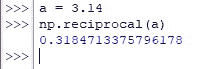

# Numpy.reciprocal():使用 Numpy 返回元素的倒数？

> 原文：<https://www.askpython.com/python-modules/numpy/numpy-reciprocal>

数字是需要处理的有趣的实体。他们有许多特殊的属性，可以在需要的时候使用。它们以多种形式存在，如小数、整数和整数，并且可以根据使用它们的人的需要而改变。

它们甚至存在于现实和想象的范例中。这些数字的一种形式是分数，它似乎存在于所有的整数中。

互易是分子和分母交换位置以确定结果数的一种性质。在本文中，我们将借助下面几节的内容，研究使用 Python 中的 *numpy* 库中的函数来往复处理数字和数组的不同方式。

*   **介意小数**！
*   **使用*倒数()*函数**
*   **以公式**往复运动

* * *

## **介意小数**！

让我们通过使用下面的代码在 Python 中导入 [*numpy* 库](https://www.askpython.com/python-modules/numpy/python-numpy-module)开始。

```py
import numpy as np

```

我们现在将展示在 Python 中使用 *numpy* 库中的*倒数()*函数时小数点扮演的重要角色。一个随机数被分配给一个变量，然后通过*倒数()*函数，如下面的代码所示。

```py
a = 3
r1 = np.reciprocal (a)

```

现在让我们看看使用 *print( )* 函数的结果。

```py
print (r1)

```


Incorrect Result For Reciprocating ‘3′

奇怪的是注意到‘3’的倒数被给定为零而不是 0.33！这可以用少了小数点来解释。让我们重复同样的操作，但这次使用一个带小数的数字，如下所示。

```py
a = 3.14
np.reciprocal(a)

```



Correct Result Of Reciprocating

因此，当使用 Python 中的 *numpy* 函数来计算数字的倒数时，一定要记住小数点的用法。上述演示的结果甚至适用于小数中只有零的数字，如“3.0”。

```py
a = 3\.                  
np.reciprocal(a)                  
0.3333333333333333

```


Result Of Reciprocating ‘3.’

* * *

## **使用 Numpy。*倒数()*功能**

这一次，让我们尝试将这种往复扩展到数组中的一串数字。因此，我们从构造一个数组并将其赋给一个变量开始，如下面的代码所示。

```py
ar = np.array([[2.5, 6.4, 3],
              [1, 5, 0.9]])

```


Constructing An Array

完成后，我们可以使用下面的代码来确定声明数组的倒数。

```py
r2 = np.reciprocal (ar)
print (r2)

```


Reciprocal Of An Array

在输入数组中可以很好地观察到，其中的某些数字条目不具有小数点，而其他条目具有小数点。这表明，如果在数组中的数字集合中至少指定一个小数点，Python 也会将所有其他实体识别为浮点型整数！

* * *

## **以公式**往复运动

这是一个非常简单的方法，通过构造一个公式将所有的数字发送到除数为“1”的分母，从而推翻一组给定的数组。做的比说的好！这是演示上述内容的代码。

```py
ar = np.array([[2.5, 6.4, 3],
              [1, 5, 0.9]])              
r3 = 1/ar                  
print (r3)

```


Result Of Reciprocating Using Formula

* * *

## **结论**

既然我们已经到了本文的结尾，希望它已经详细说明了如何使用 Python 中的 *numpy.reciprocal( )* 函数返回数组中元素的倒数。这里有另一篇文章详细介绍了[如何在 Python](https://www.askpython.com/python/numpy-fix) 中使用 *numpy* 对整数进行四舍五入。AskPython 中还有许多其他有趣的&同样信息丰富的文章，可能对那些希望提高 Python 水平的人有很大帮助。当你享受这些的时候，再见！