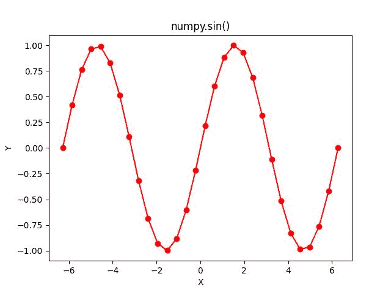

# Numpy Sin 完全指南

> 原文:# t0]https://www . aspython . com/python-modules/num py/numpy-sin

这是系列 [**NumPy 三角函数**](https://www.askpython.com/python/numpy-trigonometric-functions) 的第一个教程。在这门课中，我们将通过例子学习 NumPy 库提供的三角函数。

你一定计算过某个特定角度的**正弦**，并且得到的结果在 **[-1，1]** 范围内。正弦运算也可以在数组上执行。这就是 Python 的 [**NumPy** 库](https://www.askpython.com/python-modules/numpy/python-numpy-arrays)发挥重要作用的地方。

NumPy 提供了大量的高级数学函数来操作数组。

在本教程中，我们将学习如何使用 NumPy sin 函数，并通过示例帮助您更好地理解它。我们还将使用 **Matplotlib 库**绘制 sin 函数的图形。

让我们开始吧。

## 什么是 NumPy 罪？

NumPy 提供了许多可以在多维数组上执行的数学函数，而`numpy.sin`是 NumPy 库提供的三角函数之一。

注意:`numpy.sin`计算一个单一数字的三角正弦值以及角度的 Numpy 数组。

***建议阅读:**[NumPy 数组简介](https://www.askpython.com/python-modules/numpy/python-numpy-arrays)*

## 先决条件

*   您的系统必须安装最新版本的 python，可以从[https://www.python.org/downloads/](https://www.python.org/downloads/)安装
*   Numpy 必须安装在您的系统上，执行以下命令安装最新版本的 Numpy:

```py
pip install numpy

```

*   您可以使用自己选择的任何 IDE。我推荐使用 Jupyter Notebook，它可以通过执行以下命令来安装:

```py
pip install jupyter

```

## 设置环境

*   创建一个文件夹并在“终端”中打开它

*   执行以下命令打开 Jupyter 记事本:

```py
jupyter notebook

```

*   点击`New`按钮，选择 Python 3(ipykernel)


在 Jupyter 中创建了一个新的无标题笔记本，我们将在其中编写代码。


## Numpy Sin 函数的基本语法

Numpy sin 函数将一个以**弧度**为单位的角度作为参数。然而，角度在**度**中也可以作为自变量给出。

`**Syntax:** numpy.sin(input)`其中输入可以是单个数字，也可以是 NumPy 数组

## 使用 Numpy Sin 计算角度的正弦值

现在让我们开始使用 numpy sin 函数，以便更好地理解它的工作原理。

### 使用 Numpy Sin 函数计算

```py
import numpy as np

print("Sine of 0 is :",np.sin(0))

print("Sine of pi/2 radians is :",np.sin(np.pi/2))

print("Sine of 3pi/2 radians is :",np.sin(3*np.pi/2))

```

输出

```py
Sine of 0 is : 0.0
Sine of pi/2 radians is : 1.0
Sine of 3pi/2 radians is : -1.0

```

**注意:**在 Jupyter 笔记本的每个单元格中写完代码后，点击`shift + enter`以获得输出。

在上面的代码片段中，以弧度为单位的角度作为参数传递给 np.sin()。

现在，让我们看看如何将角度作为参数传递给 np.sin()函数。

### 将 Numpy Sin 与 deg2rad 函数相结合

为了计算正弦函数的自变量为**度**的角度的正弦值，使用函数`deg2rad`。

```py
import numpy as np

print("Sine of 45 degrees is :",np.sin(np.deg2rad(45)))

print("Sine of 60 degrees is :",np.sin(np.deg2rad(60)))

print("Sine of 90 degrees is :",np.sin(np.deg2rad(90)))

print("Sine of 270 degrees is :",np.sin(np.deg2rad(270)))

```

**输出**

```py
Sine of 45 degrees is : 0.7071067811865476
Sine of 60 degrees is : 0.8660254037844386
Sine of 90 degrees is : 1.0
Sine of 270 degrees is : -1.0

```

**注意:**把角度(以度为单位)转换成弧度真的很简单，只要把`numpy.pi/180`乘以角度(以度为单位)就行了。

现在，让我们了解如何对一组角度执行正弦运算。

## 计算角度数组的正弦值

s in 函数以弧度作为角度参数，因此在对 **[NumPy 数组](https://www.askpython.com/python/pandas-dataframe-vs-numpy-arrays)** 使用 sin 函数时，我们必须确保数组的元素被转换为弧度。

### 计算 Numpy 数组的正弦值

在这个代码片段中，使用`numpy.array`创建了一个 NumPy 数组。

```py
import numpy as np

a = np.array((0 , 30 , 45 , 60 , 90))

print("Sine Values :\n",np.sin(a*np.pi/180))

```

**输出**

```py
Sine Values :
 [0\.  ,  0.5  , 0.70710678 , 0.8660254 , 1\. ]

```

*   我们用 5 个元素初始化NumPy 数组。
*   然后，NumPy 数组的每个元素乘以作为参数传递给`np.sin()`的`np.pi/180`。
*   每个元素的正弦被计算并存储在一个 NumPy 数组中，我们得到这个数组作为输出。

### 计算均匀间隔的 NumPy 数组的正弦值

在这段代码中，我们将使用`NumPy.linspace`创建一个由 **10 个等间距的**值组成的 NumPy 数组。

```py
import numpy as np

b = np.linspace(-np.pi,np.pi,10) 

print("Printing the NumPy Array:",b)

print("\n")

print("Sine Values :",np.sin(b))

```

*   我们创建一个 NumPy 数组，从`-pi`到`pi`有 10 个均匀分布的值，并把它作为参数传递给`np.sin()`。
*   NumPy 数组中的值已经以弧度表示，因此每个值的正弦值都被计算并存储在 NumPy 数组中。

输出

```py
Printing the NumPy Array: [-3.14159265 -2.44346095 -1.74532925 -1.04719755 -0.34906585  0.34906585
  1.04719755  1.74532925  2.44346095  3.14159265]

Sine Values : [-1.22464680e-16 -6.42787610e-01 -9.84807753e-01 -8.66025404e-01
 -3.42020143e-01  3.42020143e-01  8.66025404e-01  9.84807753e-01
  6.42787610e-01  1.22464680e-16]

```

*   输出看起来很奇怪，因为所有计算出的正弦值都是用科学符号表示的。
*   例如，sin(pi)等于 0，在上述输出中，pi 的计算正弦值是一个非常大的量，其指数为 10^(-16) ，等于 0。

这就是使用 NumPy Sin 函数的全部内容，它使用一个数字作为参数，一个 NumPy 数组作为参数。我建议在阅读本教程的同时编写代码。

## 可视化正弦函数

第一步是安装 Matplotlib 库:

```py
pip install matplotlib

```

安装完成后，我们准备编码，让我们开始吧。

```py
import numpy as np

# Importing the Matplotlib Library
import matplotlib.pyplot as plt

# Creating a NumPy Array of 30 evenly-spaced elements
a = np.linspace((-2*np.pi),(2*np.pi),30)

# Storing the sine values in a NumPy Array
b = np.sin(a)

plt.plot(a, b, color = "red", marker = "o")
plt.title("numpy.sin()")
plt.xlabel("X")
plt.ylabel("Y")
plt.show()

```

**输出**



**Sine Plot**

`**plt.plot()**`函数用于绘制带四个参数的正弦函数。

*   第**个**参数是角度的 **NumPy 数组**(在第 7 行创建)，绘制在 X 轴(水平轴)上。
*   **第二个**参数是计算出的正弦值的 NumPy 数组，绘制在 Y 轴(垂直轴)上。
*   第三个参数是绘图的颜色。
*   **第四个**参数是标记值，用指定的标记强调每个点。有不同类型的标记可用于表示曲线上的点。

`**plt.title()**`功能用于设置地块的标题。

`**plt.xlabel()**`函数用来给图上的横轴命名。同样，`**plt.ylabel()**`函数用于给绘图上的垂直轴命名。

`**plt.show()**`用于显示曲线绘图。

您已经成功绘制了正弦曲线。

## 摘要

在本教程中，我们通过例子了解了如何使用 NumPy Sin 函数。如果你使用的是 Jupyter Notebook，那么在每个单元格中写完每一行代码后，按`shift+enter`来获得输出。**你的任务**是使用 NumPy Sin 函数来计算你选择的更多值的正弦。

在下一个教程中，我们将学习 NumPy Cos 函数。在此之前，继续学习并浏览两遍这篇文章，在浏览教程的同时练习这些代码。

## 参考

[num py documentation](https://numpy.org/doc/stable/reference/generated/numpy.sin.html)–num py sin

[Matplotlib–开始使用](https://matplotlib.org/stable/users/getting_started/)