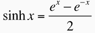
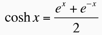
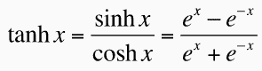
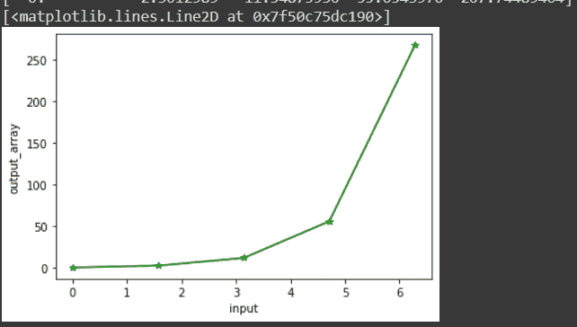

# numpy sinh–双曲正弦，基于元素

> 原文：<https://www.askpython.com/python-modules/numpy/numpy-sinh-hyperbolic-sine>

你一定听说过双曲函数。如果没有，你可能熟悉三角函数，比如正弦、[余弦](https://www.askpython.com/python-modules/numpy/numpy-cos)、[正切](https://www.askpython.com/python-modules/numpy/numpy-tan)、余切、割线和余割，以及其他像斜边、底和垂线。

***亦读:[【NumPy 谭——完全指南](https://www.askpython.com/python-modules/numpy/numpy-tan)***

今天我们将学习正弦双曲函数。在开始之前，让我们了解一下什么是双曲函数。

## 什么是双曲函数？

双曲线函数也有点类似于 [**三角函数**](https://www.askpython.com/python/numpy-trigonometric-functions) 。

普通三角函数和双曲函数之间的唯一区别是，三角函数定义圆(圆弧度或角度)内的值，而双曲函数定义双曲线而不是圆内的值。

这些点构成了单位双曲线的右半部分。下面描述了双曲函数的一些重要公式。让我们看看它们。



## 什么是双曲 sin 或 sinh？

这也是三个重要的双曲函数。今天我们要学习双曲正弦函数。

下面我们也可以用代码的形式来表示 sinh 函数。

```py
sinh (x) = 1/2 * (np.exp(x) - np.exp(-x))

```

## 使用 numpy.sinh()

在我们的代码片段中，我们不打算用上面的(我们不打算用公式来写)。python 中的 NumPy 库提供了一个预定义的双曲正弦函数 NumPy.sin()。我们将使用相同的。在本教程中，我们将学习如何找到弧度和复数值的双曲正弦函数**。**

### numpy.sinh()的语法

让我们快速看一下下面的语法。

```py
numpy.sinh(x, out=None, where=True, casting='same_kind', order='K', subok : [bool, datatype])

```

在上面的语法中，我们传递一些参数，如下所示:

*   x: 它可以是包含弧度值的变量，也可以是包含某个值的数组
*   **out:** 存储结果的位置。如果提供了，它必须具有与输入 x 相似的形状。如果没有提供或没有提供，则返回新的值或结果。这是可选的。
*   当条件为真时，我们必须得到我们的结果或输出；当条件为假时，我们将得不到任何结果。这是可选的。y 默认其值为真。
*   **casting='same_kind':** 表示只允许 float64 到 float32 的值或结果。该函数在此范围或数据类型中呼喊 cast 值。
*   **order = 'K':** 它总是以 K 排序的形式产生一个输出数组。(注意:有四种类型的订单:**{‘K’，‘C’，‘F’，‘A’}**)。这是可选的。
*   **subok**:【bool，datatype】**是否生成结果的子类**。如果为真，则提供子类的名称。它返回一个与给定数组具有相同形状和类型的数组。也是可选的。

现在，我们将在代码片段中实现相同的方法或功能。

### np.sinh()用于单输入

我们将**传递给 x 的单个输入(即`math.pi/3` )** 。将我们的结果加载到一个名为`**output**`的变量中并打印出来。

```py
#importing required modules
import numpy as np
import math

output = np.sinh(math.pi/3)
output

```

上面的代码应该给出如下输出。

```py
1.2493670505239751

```

### np.sinh()用于多输入或数组

我们要以数组的形式给 x 传递**五个输入(即`0, math.pi / 2, math.pi, 3 * math.pi/2, 2 * math.pi`)。并将我们的结果加载到一个名为`another_output`** 的变量中并打印出来。

```py
#providig multi input in the form of array
import numpy as np
import math
input = [0, math.pi / 2, math.pi, 3 * math.pi/2, 2 * math.pi]  
another_output = np.sinh(input)
another_output

```

上面的代码应该给出如下输出。

```py
array([  0\.        ,   2.3012989 ,  11.54873936,  55.6543976 ,
       267.74489404])

```

### 提供可选的输出变量

让我们回忆一件小事。当我们讨论我们的`NumPy.cosh()` 方法的语法和参数时。有一个参数是“out”。它是一个存储结果的位置。如果提供了，它必须具有与输入 x 相似的形状。如果没有提供或没有提供，则返回新的值或结果。是可选的*。*在这个方法中，我们将看到如何尝试这个参数。

在这个代码片段中，我们将提供一个可选的输出变量，输出/结果将被加载到这个变量中。看看下面是如何实现的。

```py
import numpy as np
import math

optional_output = np.array([0, 0, 0, 0, 0], dtype='d')
np.sinh(input, optional_output)
different_output = np.sinh(input)

```

您可以看到我们已经创建了一个名为“`optional_output`”的数组，它的形状与我们的输入数组相似。在我们的`numpy.sinh() method,`中，我们已经将这个数组作为“out”的值进行了传递。

得到的数组将被加载到这个数组中。通过打印相同的内容，我们可以得到我们的结果。

```py
print(optional_output)
print(different_output)

     [  0\.           2.3012989   11.54873936  55.6543976  267.74489404]
     [  0\.           2.3012989   11.54873936  55.6543976  267.74489404]

```

### np.sinh()用于复数输入

现在，在我们的最后一段代码中，我们将输入一个复数并得到双曲正弦结果。下面我们来快速看一下。

```py
import numpy as np
import math
import cmath

a = 2.0
b = 3.0
z = complex(a,b)
c = np.sinh(z)

```

为了使用一个复杂变量，我们需要导入一个名为`**cmath**`的库。然后使用 **`complex()`** 方法准备好我们的复数，并在我们的 **`numpy.sinh()`** 方法中传递相同的内容，我们将得到我们的结果。让我们打印我们的结果。

```py
print(z)
     (2+3j)

print(c)
     (-3.59056458998578+0.5309210862485197j)

```

### 在图表上绘制 Numpy.sinh()

```py
import numpy as np
import math
import matplotlib.pyplot as plt

input = [0, math.pi / 2, math.pi, 3 * math.pi/2, 2 * math.pi]  
output_array = np.sinh(input)

plt.xlabel("input")
plt.ylabel("output_array")
plt.plot(input, output_array, color = 'green', marker = "*")

```

众所周知，为了在图上绘制一些东西，我们需要**导入一个名为 Matplotlib** 的附加库。我们在函数实现中传递名为 input 的多值数组。我们把我们的输出加载到" **`output_array`** 中后，实现了我们的功能。毕竟，我们用输入和输出数组表示了我们的函数，并得到了下面的结果。



## 摘要

就这样，我们完成了今天的文章。我们学习了这个方法及其参数。我们通过传递各种值并获得预期的结果来练习我们的代码片段。这样，对于双曲余弦和双曲正切，我们也可以得到相同的结果。我们必须带着这些激动人心的话题再次造访。谢谢你。