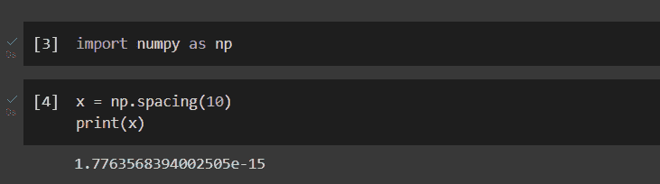
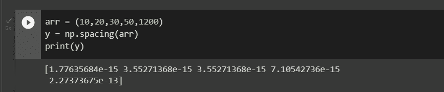

# Numpy 间距函数:完全指南

> 原文：<https://www.askpython.com/python-modules/numpy/numpy-spacing>

在本文中，我们将尝试理解 Python 的 NumPy 包中的间距函数。Python 包 NumPy 用于操作数组。使用 NumPy 可以在一个数组上执行许多数学运算。

它提供了一个庞大的高级数学函数库来处理这些数组和矩阵，并提供了强大的数据结构来确保使用数组和矩阵进行高效计算。2005 年，特拉维斯·奥列芬特开发了 NumPy。您可以免费使用它，因为它是一个开源项目。

## 为什么要用间距函数？

使用 NumPy 编程语言中的 NumPy.spacing()函数计算输入值 x 和最邻近整数之间的距离。它返回一个标量值，用于测量输入值 x 和最接近的相邻数字之间的距离。

## Numpy 间距的语法

```py
numpy.spacing(x, /, out=None, *, where=True)

```

**参数**

*   **x** :数组 _like
    *   需要
    *   要查找其间距的值。
*   **out:数组、None 或 n array 和 None 的元组，**
    *   可选择的
    *   一个保存结果的地方。如果提供的话，它必须有一个输入广播到的形式。在没有任何输入或没有输入的情况下，返回一个新分配的数组。元组的长度(仅作为关键字参数可用)必须与输出的数量相匹配。
*   **其中:array_like，**
    *   可选择的
    *   这种情况是通过输入宣布的。在条件为真的点上，ufunc 结果将被设置为 out 数组。外部数组将在所有其他地方保持其初始值。应该注意的是，如果条件为假，由缺省 out=None 形成的未初始化 out 数组中的位置将继续未初始化。
*   ****kwargs**
    *   可选择的
    *   对于其他仅包含关键字的参数，请参见 [ufunc 文档](https://numpy.org/doc/stable/reference/ufuncs.html#ufuncs-kwargs)。

## 实现 Numpy 间距

在实现间距函数之前，请确保在工作 IDE 中安装/导入 NumPy 包。下面一行代码用于导入 NumPy。

```py
import numpy as np

```

### 一位数的实现

```py
x = np.spacing(10)

print(x)

```



Implementation

### 在阵列上实现

```py
arr = (10,20,30,50,1200)

y = np.spacing(arr)
print(y)

```



Implementation

**输出**

代表输入值`x`(此处为 10 或值的元组)和最近的相邻数字之间距离的标量值。

## 摘要

在本文中，我们理解了 Python 中 Numpy 库的 spacing()函数的基本语法和实现。

## 参考

[https://numpy . org/doc/stable/reference/generated/numpy . spacing . html](https://numpy.org/doc/stable/reference/generated/numpy.spacing.html)