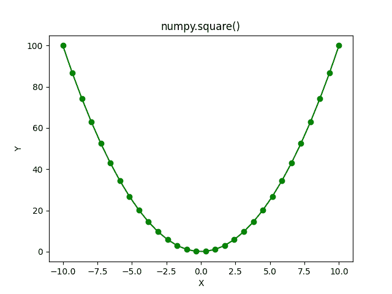

# numpy . square()-以简单的方式解释

> 原文：<https://www.askpython.com/python-modules/numpy/numpy-square>

大家好！在本教程中，我们将学习 NumPy square 函数。这是一个易于理解和使用的简单函数。那么，我们开始吧。

## 什么是 NumPy 广场？

`**NumPy square**`是 NumPy 库的数学函数之一，计算输入数字的**平方值**。是的，根据定义就是这么简单。它可以用于实数和复数。一个数的平方等于该数乘以它自己。

## NumPy 正方形的语法

让我们看看 NumPy square 函数的语法。

```py
numpy.square(input)

```

这里，输入可以是单个数字、数字的 NumPy 数组以及复数。让我们写代码来更好地理解函数。

## 使用 NumPy square

现在让我们开始研究 Numpy.square()方法，通过例子来理解它。

### 单个数的 NumPy 平方

```py
import numpy as np

print("Square of 5 is :",np.square(-5))
print("Square of 2.5 is :",np.square(2.5))
print("Square of 10 is :",np.square(10))
print("Square of 13.345 is :",np.square(13.345))
print("Square of -19.93 is :",np.square(-19.93))

```

**输出**

```py
Square of 5 is : 25
Square of 2.5 is : 6.25
Square of 10 is : 100
Square of 13.345 is : 178.08902500000002
Square of -19.93 is : 397.2049

```

上面的输出非常明显。在最后一个例子中，我们传递了一个负数作为函数的输入，输出是一个正数。

### 数字数组的数字平方

让我们看一些例子，在这些例子中，我们将使用 NumPy 数组和函数。

```py
import numpy as np 

# NumPy Array of Integral Values
a = np.array((3 , -4 , 5 , 12 , 499))

print("Input Array:\n",a)
print("Square Values:\n",np.square(a))

# NumPy Array of Floating Point Values
b = np.array((0.43 , -2.5 , 9.23 , 4.57 , 6.5))

print("Input Array:\n",b)
print("Square Values:\n",np.square(b))

```

**输出**

```py
Input Array:
 [  3  -4   5  12 499]
Square Values:
 [     9     16     25    144 249001]
Input Array:
 [ 0.43 -2.5   9.23  4.57  6.5 ]
Square Values:
 [ 0.1849  6.25   85.1929 20.8849 42.25  ]

```

你们只有一个任务，必须使用 NumPy square 函数和一个二维 NumPy 数组，并观察输出。

### 复数的 NumPy 平方

现在，让我们使用复数的 NumPy square 函数。

```py
import numpy as np

print("The square of 4+5j is:",np.square(4+5j))

print("The square of -1+0.5j is:",np.square(-1+0.5j))

```

**输出**

```py
The square of 4+5j is: (-9+40j)
The square of -1+0.5j is: (0.75-1j)

```

计算复数平方背后的数学真的很有趣。它使用复数的一些基本公式和简单恒等式。

## 数字正方形的图形表示

现在，让我们使用 Matplotlib 库绘制 NumPy 平方曲线。

```py
import numpy as np

import matplotlib.pyplot as plt

a = np.linspace(-10 , 10 , 30)

b = np.square(a)

plt.plot(a , b , color = "green" , marker = "o")
plt.title("numpy.square()")
plt.xlabel("X")
plt.ylabel("Y")
plt.show()

```

**输出**



**NumPy Square Plot**

好了，你画出了 NumPy 平方的曲线。至此，我们已经完成了 NumPy square 函数，执行了文章中给出的任务，并在阅读文章的同时练习了代码。

## 参考

[数字文件–数字广场](https://numpy.org/doc/stable/reference/generated/numpy.square.html)