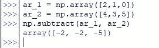

# Numpy . Subtract():Python 中如何用 NumPy 减去数字？

> 原文：<https://www.askpython.com/python-modules/numpy/numpy-subtract>

基本的算术运算之一是从一个实体中减去另一个实体。虽然这可能是一个不涉及编程语言(如 *Python、*等)计算能力的显而易见的问题，但在处理一次性数据时，人们可能会低估这个操作。

本文使用来自 *numpy* 库的 *subtract( )* 函数来研究不同的方差，如下所示。

*   减去两个标量
*   减去两个数组
*   减去一个数组&一个标量
*   减去不同大小的数组
*   选择性减法

***也读作:[【Numpy Dot()——矢量、Numpy、计算点积的完全指南](https://www.askpython.com/python-modules/numpy/numpy-dot)***

* * *

## **numpy . subtract()**的语法

在开始解决例子之前，让我们首先理解这个函数的语法。

```py
numpy.subtract(x1, x2, where=True, dtype=None)

```

在哪里，

*   *x1，x2*–是要进行减法运算的标量或一维数组或二维数组
*   *其中*–用于指定数组中的位置，该位置只需通过键入 TRUE 进行减法运算，而其他实体则无需进行减法运算
*   *dtype*–用于指定作为结果返回的数据类型

在开始减去实体之前，使用下面的代码导入 *numpy* 库。

```py
import numpy as np

```

* * *

## **使用 numpy.subtract()减去两个标量**

标量是那些没有任何方向的量(你们学校的物理有印象吗？)意味着它们只是一个数字，不像数组拥有一个数字集合。现在让我们使用 *subtract( )* 函数来减去两个数。

```py
a = 10
b = 5
np.subtract(a,b)

```


Subtracting Scalars

* * *

## **使用 numpy.subtract()减去两个数组**

现在我们将继续减去一对相同大小的一维数组。没错。为了让 *subtract( )* 函数按预期执行，接受减法运算的数组必须具有相同的大小。可以使用如下所示的 *array( )* 函数来输入数组。

```py
ar_1 = np.array([2,1,0])
ar_2 = np.array([4,3,5])

```

现在使用下面的代码从数组 1 中减去数组 2。

```py
np.subtract(ar_1, ar_2)

```



Subtracting One-Dimensional Arrays

减法也可以通过使用下面的代码使用减号运算符(-)来执行。

```py
ar_1-ar_2

```


Subtracting Using Minus Operator

* * *

## **使用 numpy.subtract()减去一个数组&一个标量:**

虽然检查应该被减去的两个数组的大小是否相同很重要，但是 *Python* 为我们提供了从数组中减去标量的灵活性。要理解这里发生了什么，人们应该知道这是如何执行的。

提供的标量将从数组的每个元素中删除，并将提供结果。让我们从创建一个数组开始，这次是二维的。

```py
ar_3 = np.array([[2,1,0],[3,4,5],[6,7,8]])

```

一旦完成， *subtract( )* 函数将被部署来从上述数组的每个元素中删除“10”。

```py
np.subtract(ar_3, 10)

```


Subtracting A Scalar From A 2D Array

* * *

## **使用 numpy.subtract()减去不同大小的数组**

这可能与本文前面给出的声明相矛盾，即使用 *subtract( )* 函数时，两个数组的大小应该相同。嗯，这仍然是真的，但有一个例外！

Python 允许减去两个不同大小的数组，前提是两个数组中的列数相等。因此，让我们创建两个符合这一要求的数组。

```py
ar_2 = np.array([4,3,5])
ar_3 = np.array([[2,1,0],[3,4,5],[6,7,8]])

```

现在可以调用 *subtract( )* 函数来完成它的任务。

```py
np.subtract(ar_3, ar_2)

```


Subtracting Arrays Of Different Sizes

* * *

## **使用 numpy.subtract()进行选择性减法**

在这种技术中，应该使用 *subtract( )* 函数的 *where* 组件。如前所述，这将选择性地只在函数被给定为真的地方进行减法，并用被减法的数组的实体替换其他地方。

```py
ar_3 = np.array([[2,1,0],[3,4,5],[6,7,8]])
ar_4 = np.array([[0,9,10],[11,3,9],[7,4,7]])
R = np.subtract(ar_3,ar_4,where=[False, True, False])

```


Selective Subtraction

很明显，结果数组的第一个和第三个位置的元素被替换为 ar_4 的元素，而减法是按照指示在第二个位置执行的。

* * *

## **结论:**

既然我们已经到了这篇文章的结尾，希望它已经详细阐述了如何使用 Python 编程减去实体。这里有另一篇文章详细介绍了如何在 Python 中乘实体。在 [AskPython](https://www.askpython.com/) 中还有许多其他有趣的&文章，这些文章可能对那些希望提高 Python 水平的人有很大帮助。当你享受这些的时候，*再见*！