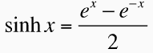
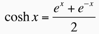
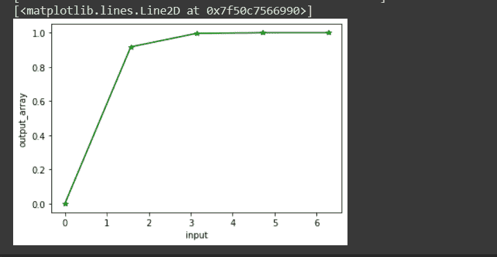

# numpy tanh–双曲正切元素。

> 原文：<https://www.askpython.com/python-modules/numpy/numpy-tanh-hyperbolic-tangent>

是时候使用元素级 Numpy 双曲正切函数了。我们将使用我们的谷歌协作来做同样的事情。我们大多数人都有过在谷歌协作室工作的经历，对吗？它为我们提供了一个更好的用户友好的平台来使用 python 语言。让我们开始吧。

***也读作:[Numpy cosh–双曲余弦，元素式](https://www.askpython.com/python-modules/numpy/numpy-cosh-hyperbolic-cosine)***

## 什么是双曲函数？

首先让我们了解一下什么是双曲函数。这与普通的 [**三角函数**](https://www.askpython.com/python/numpy-trigonometric-functions) 有何不同？

双曲函数也有点类似于三角函数。普通三角函数和双曲函数之间的唯一区别是，三角函数定义圆(圆弧度)内的值，而双曲函数定义双曲线而不是圆内的值。这些点构成了单位双曲线的右半部分。

下面描述了双曲函数的三个重要公式。让我们看看它们。



## 什么是双曲线谭？

这也是三个最有用的双曲函数。今天我们要学习其中的一个，就是双曲正切函数。下面我们也可以用代码的形式来表示这个函数。

```py
numpy.tanh(x) = np.sinh(x)/np.cosh(x)

```

但是在我们今天的代码片段中，我们不打算在今天的实现中使用上述代码。我们有一个预定义的双曲正切函数，它是由 NumPy 库提供的。我们将使用相同的。

## 使用双曲线 tan

在本教程中，我们将学习如何找到弧度和复数值的双曲正切函数。让我们快速看一下下面的语法。

```py
numpy.tanh(x, out=None, where=True, casting='same_kind', order='K', subok : [bool, datatype])

```

上述代码片段中使用的参数如下:

*   x: 它可以是包含弧度值的变量，也可以是包含某个值的数组
*   **out:** 存储结果的位置。如果提供了，它必须具有与输入 x 相似的形状。如果没有提供或没有提供，则返回新的值或结果。这是可选的。
*   当条件为真时，我们必须得到我们的结果或输出；当条件为假时，我们将得不到任何结果。这是可选的。y 默认其值为真。
*   **casting='same_kind':** 表示只允许 float64 到 float32 的值或结果。该函数在此范围或数据类型中呼喊 cast 值。
*   **order = 'K':** 它总是以 K 排序的形式产生一个输出数组。(注意:有四种类型的订单:**{‘K’，‘C’，‘F’，‘A’}**)。这是可选的。
*   **subok**:【bool，datatype】**是否生成结果的子类**。如果为真，则提供子类的名称。它返回一个与给定数组具有相同形状和类型的数组。也是可选的。

现在，我们将看到如何通过在不同的方法中传递不同的参数来实现这个函数。

### 方法 1:传递单值参数

我们将**为 x(即`math.pi/` 5)** 传递一个输入，并将结果加载到一个名为`**output**`的变量中。

```py
import numpy as np
import math

output = np.tanh(math.pi/5)

```

通过打印同样的内容，我们可以看到最终的输出。

```py
print(output)

    0.5568933069002107

```

### 方法 2:传递多值参数

在这个方法中，我们将以数组的形式传递 x 的多输入值(即`0, math.pi / 2, math.pi, 3 * math.pi/2, 2 * math.pi`)，并将结果加载到一个名为`another_output`的变量中。

```py
import numpy as np
import math
input = [0, math.pi / 2, math.pi, 3 * math.pi/2, 2 * math.pi]  
another_output = np.tanh(input)

```

您可以看到我们已经创建了一个名为 input 的弧度数组，并在我们的`Numpy.tanh()`方法中传递了相同的内容。我们将结果数组加载到变量 another_output 中。让我们打印相同的。

```py
print(another_output)

     [0\.         0.91715234 0.99627208 0.99983861 0.99999303]

```

### 方法 3:提供可选的输出变量

让我们回忆一件小事。当我们讨论我们的`NumPy.tanh() `方法的语法和参数时。有一个参数是“out”。*这是存储结果的位置。如果提供了，它必须具有与输入 x 相似的形状。如果没有提供或没有提供，则返回新的值或结果。这是可选的。*在这个方法中，我们将看到如何尝试这个参数。

在这个代码片段中，我们将提供一个"`optional output`"变量，输出/结果将被加载到这个变量中。看看下面是如何实现的。

```py
import numpy as np
import math

#passing our optional_output array where the result is to be loaded
optional_output = np.array([0, 0, 0, 0, 0], dtype='d')
np.tanh(input, optional_output)

#implementing the same and loading the result into the different_array
different_output = np.tanh(input)

```

您可以看到我们已经创建了一个名为“`optional_output`”的数组，它的形状与我们的输入数组相似。在我们的，`numpy.tanh() method,`我们曾经走过同一个地方。得到的数组将被加载到这个数组中。让我们打印出来，看看效果如何。

```py
print(optional_output)
print(different_output)

     [0\.         0.91715234 0.99627208 0.99983861 0.99999303]
     [0\.         0.91715234 0.99627208 0.99983861 0.99999303]

```

### 方法 4:将复杂变量作为参数传递

让我们传递一个复杂的变量作为参数，看看结果。

```py
import numpy as np
import math
import cmath

a = 2.0
b = 3.0
z = complex(a,b)
c = np.tanh(z)

```

要使用复杂变量，我们需要导入一个名为`cmath`的库。然后使用`complex()`方法准备好我们的复杂变量，并在我们的`numpy.tanh()`方法中传递相同的变量，我们将得到我们的结果。让我们打印我们的结果。

```py
print(z)
print(c)

     (2+3j)
     (0.965385879022133-0.009884375038322492j)

```

## Numpy.tanh()在图中的表示

```py
output_array = np.tanh(input)
print(output_array)

import matplotlib.pyplot as plt
plt.xlabel("input")
plt.ylabel("output_array")
plt.plot(input, output_array, color = 'green', marker = "*")

```

众所周知，为了在图上绘制一些东西，我们需要导入一个名为 Matplotlib 的附加库。我们导入了相同的内容，并传递了在方法 2 中创建的输入数组。在实现我们的函数之后，我们将输出加载到“`output_array`”中。毕竟，我们使用输入和输出数组来表示我们的函数，并得到如下结果。



## 结论

最后，我们今天报道了我们的文章。通过传递四种不同类型的参数，我们尝试了四种不同的方法。这样就可以实现其他双曲函数了。您可以通过使用相同的代码片段并用我们需要的双曲函数替换函数语法来尝试所有这些方法。否则，我们将再次访问相同的。谢谢你。