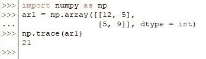
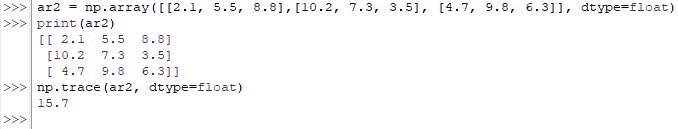
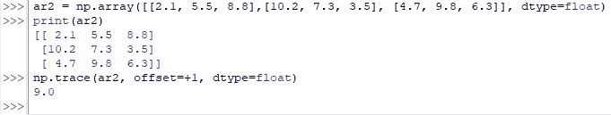

# Numpy 跟踪:使用 Python 中的 Numpy 计算跟踪的指南

> 原文：<https://www.askpython.com/python-modules/numpy/numpy-trace>

黑客帝国很好玩！不是电影，是数学的那个。在对矩阵的属性有了一个相当好的理解之后，一个人可以很好地挖掘它们的潜力&在广泛的应用中部署它们。数据加密和密码生成等等！

***也读: [Python 矩阵教程](https://www.askpython.com/python/python-matrix-tutorial)***

这篇文章将帮助你理解矩阵的众多属性之一——矩阵轨迹。*轨迹*有助于计算任何给定矩阵中对角元素的总和。让我们从使用下面的代码导入 *numpy* 库开始。

```py
import numpy as np

```

我们将通过下面的每一节进一步探索 *trace( )* 函数。

*   ***trace()*函数**的语法
*   **计算二维数组的轨迹**
*   **计算三维数组的轨迹**
*   **使用偏移量计算轨迹**

* * *

## trace()函数的语法

*trace( )* 函数对任意给定的 N 维数组的对角线上的所有元素求和，但事情并没有就此结束。它还附带了一些特性，比如下面的语法中给出的那些特性，

```py
numpy.trace(a, offset=0, axis1=0, axis2=1, dtype=None, out=None)

```

在哪里，

*   ***a—***要计算轨迹的 N 维数组
*   ***偏移-***一个可选的构造，用于从主对角线偏移轨迹计算。默认设置为零(0)，也可以使用'+1 '或'-1 '分别正或负偏移主对角线
*   ***axis 1—***一个可选的构造，用于指定二维子数组的第一个轴，从该轴开始取对角线。默认设置为零(0)。
*   ***axis 2—***一个可选的构造，用于指定二维子数组的第二个轴，从该轴开始取对角线。默认设置为一(1)。
*   ***dtype—***一个可选的构造，默认设置为 *none* ，但是可以用来指定正在使用的数据类型
*   ***out-***一个可选的构造，默认情况下设置为 *none* ，但是可以用来存储结果

* * *

## 计算二维数组的轨迹

在导入了 *numpy* 库之后，让我们使用下面给出的代码来寻找二维数组的轨迹。

```py
ar1 = np.array([[12, 5],
                [5, 9]], dtype = int)
np.trace(ar1)

```

一旦上面的代码运行，下面的计算将在后端发生，用于计算以数组形式给出的矩阵的轨迹。

*   对角线开始的第一行的第一个元素与对角线结束的第二行的第二个元素相加。
*   然后返回两个元素的和(即 12+9 = 21)作为给定输入数组的轨迹。

如上所述，在最后一步中推导出的最终答案也可以在下图中看到代码运行时的结果。



Trace Calculated For A Two-Dimensional Array

* * *

## 计算三维数组的轨迹

在计算三维数组(如下所示)的轨迹时，也可以使用相同的技术。

```py
ar2 = np.array([[2.1, 5.5, 8.8], [10.2, 7.3, 3.5], [4.7, 9.8, 6.3]], dtype=float)
np.trace(ar2, dtype=float)

```



Trace Calculated For A Three-Dimensional Array

因为已经指定了数据类型，所以添加了对角元素(2.1+7.3+6.3 = 15.7) &具有十进制值的结果已经作为给定输入数组的轨迹返回。

* * *

## 使用偏移计算轨迹

应为上述部分中使用的相同阵列计算轨迹，但对角线偏移'+1 '。

```py
ar2 = np.array([[2.1, 5.5, 8.8], [10.2, 7.3, 3.5], [4.7, 9.8, 6.3]], dtype=float) 
np.trace(ar2, offset=+1, dtype=float)

```



Trace Calculated With Offset

对角线元素现在是 5.5 & 3.5，其和 9.0 作为结果返回！

* * *

## 结论

既然我们已经到了本文的结尾，希望它已经详细阐述了如何使用来自 *numpy* 库中的 *trace( )* 函数来计算任何给定矩阵的对角元素之和。下面是另一篇解释 Python 中 *numpy* 的 [*vdot* ()函数的文章。AskPython](https://www.askpython.com/python/how-to-find-vector-dot-product-using-numpy) 中还有许多其他有趣且信息量大的文章，可能会对那些希望提高 Python 水平的人有很大帮助。当你享受这些的时候，再见！