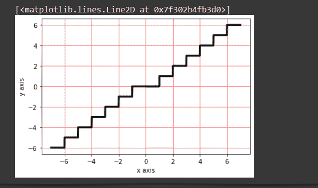

# numpy trunc()–按元素返回输入的截断值

> 原文:# t0]https://www . aspython . com/python-modules/num py/numpy-truc

今天，我们将学习如何使用 trunc()函数在我们的计算机上获得输入的截断值。该函数类似于天花板和地板函数，但是具有稍微不同的域和范围。要使用这个函数，我们需要导入 NumPy 模块。一旦导入了 NumPy，我们就可以使用 trunc()函数来获取任何输入的截断值。

**让我们先从理论上理解我们的`trunc`概念，然后再在今天的计算机上实现。**

## Numpy.trunc()方法是什么？

**标量 x** 的截断值是比 x 更接近零的**最近整数 y。请看下面的两个例子。**

*   **-2.35 的截断值为-2.0** 。最接近-2.35 的整数是-3 和-2。-2 比-3 更接近 0。所以-2.35 的截断值是-2.0。
*   **3.35 的截断值为 3** 。3.35 最接近的整数是 3 和 4。3 比 4 更接近 0。所以 3.35 的截断值是 3。
*   **0 的截断值为 0，对于-3 为-3，对于 5 为 5。**(整数的截断值与数字相同)

## 使用 Numpy.trun()

现在我们将看看如何在今天的代码片段中实现这个函数。让我们看看下面的语法。

```py
numpy.trunc(x, out=None, where=True, casting='same_kind', order='K', subok : [bool, datatype])

```

上述代码片段中使用的参数如下:

*   x: 它可以是包含弧度值的变量，也可以是包含某个值的数组
*   **out:** 存储结果的位置。如果提供了，它必须具有与输入 x 相似的形状。如果没有提供或没有提供，则返回新的值或结果。这是可选的。
*   当条件为真时，我们必须得到我们的结果或输出；当条件为假时，我们将得不到任何结果。这是可选的。y 默认其值为真。
*   **casting='same_kind':** 表示只允许 float64 到 float32 的值或结果。该函数在此范围或数据类型中呼喊 cast 值。
*   **order = 'K':** 它总是以 K 排序的形式产生一个输出数组。(注意:有四种类型的订单:**{‘K’，‘C’，‘F’，‘A’}**)。这是可选的。
*   **subok**:【bool，datatype】**是否生成结果的子类**。如果为真，则提供子类的名称。它返回一个与给定数组具有相同形状和类型的数组。也是可选的。

现在，我们将在下面的示例中实现这个函数。我们也应该尝试两个例子。最后，**我们将看到同样的图形表示。**

## 示例 1–使用两个值

在这个例子中，我们传递了两个值并接收了输出。在第二个实现中，我们为 out 参数传递了一个参数。默认情况下，out 参数格式化输出数组。因此，3.25 的截断值被加载到 c 数组中并打印出来。

```py
import numpy as np
b = np.trunc(-2.35)
print(b)

np.trunc(3.25, c)
print(c)

#output
    -2.0
    [3\. 3\. 3\. 3\. 3\. 3\. 3.]

```

## 示例 2–数值数组上的 Numpy.trunc()

在这个例子中，我们在函数中传递一组值。它将返回一个结果数组，该数组包含输入数组中所有值的所有相应截断值。

```py
import numpy as np
input = np.array([-2.35, -1,  -0.36, 0, 0.36, 1, 5.69])
d=np.trunc(input)
print(d)

#output
     [-2\. -1\. -0\.  0\.  0\.  1\.  5.]

```

## 在图形上绘制 numpy.trunc()

numpy.trunc()函数用于返回输入元素的截断值，即输入元素的整数部分。如果我们有一个输入数组，这个函数返回数组中每个元素的截断值。我们还可以使用 x-y 图以图形方式表示单个元素的截断值。

```py
import matplotlib.pyplot as plt
import numpy
x=[]
y=[]
i=-6.99
while (i<7.00):
    x.append(i)
    y.append(numpy.trunc(i))
    i=i+0.01

plt.xlabel("x axis")
plt.ylabel("y axis")
plt.grid(linestyle='-', linewidth=0.5,color='red')
plt.plot(x,y, linewidth=3, color = 'black')

```

上面的代码片段将给出如下输出。



## 结论

所以今天，我们用 python 在代码中介绍了 Numpy 截断函数的实现。我们看到了这个函数对于某些极限的图示。从这个图中，你可以分析这个函数以及它是如何工作的。通过这个，你可以更好地理解我们的话题。我们必须带着一些更令人兴奋的话题再次访问。