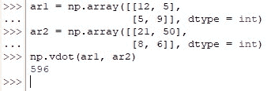
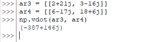

# 如何用 Numpy 求矢量点积？

> 原文：<https://www.askpython.com/python-modules/numpy/numpy-vector-dot>

矢量是在物体运动方向上既有大小又有方向的物理量。它们主要用于在数学领域的不同空间和平面中导航。虽然向量可以执行许多操作，但在本文中，我们将使用 *numpy* 库中的内置函数来探索一种这样的操作——向量点积！

***也读作:[【Numpy Dot()——矢量、Numpy、计算点积的完全指南](https://www.askpython.com/python-modules/numpy/numpy-dot)***

从 *numpy* 库中用于计算矢量点积的函数是 *vdot( )* 函数。让我们从使用下面的代码导入 *numpy* 库开始。

```py
import numpy as np

```

我们将通过下面的每一节进一步探讨 *vdot( )* 函数。

*   ***vdot()*函数**的语法
*   **计算 N 维数组的矢量点积**
*   **计算复数的矢量点积**

* * *

## vdot()函数的语法

有人可能会问，既然在 *numpy* 库中已经有一个 *dot( )* 函数可以达到同样的目的，为什么还要费心去使用 *vdot( )* 函数。虽然这些最初看起来是同义词，但细节决定成败。

如果所提供的输入本质上是复杂的，则 *vdot( )* 函数使用复共轭技术。该函数利用第一个输入参数的复共轭来计算给定两个向量的向量点积。

但是当 N 维数组出现时，真正的区别就出现了。 *dot( )* 函数使用矩阵乘法技术来计算 N 维数组的点积，而 *vdot( )* 函数将给定的 N 维数组展平成它们的一维等效值来计算点积。

所有这些都发生在 *vdot( )* 函数中，其语法如下:

```py
numpy.vdot(a, b)

```

在哪里，

*   ***a-***n 维数组或复数为第一个输入向量
*   ***b—***n 维数组或复数为第二个输入向量

* * *

## 计算 N 维数组的矢量点积

在导入了 *numpy* 库之后，让我们使用两个二维数组来寻找两个向量的点积，如下所示。

```py
ar1 = np.array([[12, 5],
                [5, 9]], dtype = int)
ar2 = np.array([[21, 50],
                [8, 6]], dtype = int)
np.vdot(ar1, ar2)

```

一旦上面的代码运行，下面的计算将在后端进行，用于计算给定的两个向量的点积。

*   第一个输入数组的第一个元素与第二个输入数组的第一个元素相乘，例如“12×21”。
*   重复上述步骤，直到第一个输入数组中的每个元素都与第二个输入数组中相应的元素相乘，例如“5×50”、“5×8”、“9×6”。
*   然后将所有这些乘积的结果相加，以打印给定的两个 N 维数组的矢量点积，即(12×21)+(5×50)+(5×8)+(9×6) = 596

如上所述，在最后一步中推导出的最终答案也可以在下图中看到代码运行时的结果。



Dot Product Calculated For N-Dimensional Arrays

* * *

## 计算复数的矢量点积

本节将通过 *vdot( )* 函数详细说明复数的用法。让我们分配几个变量&，然后用它们来计算矢量点积，如下面的代码所示。

```py
ar3 = [[2+21j, 3-16j]]
ar4 = [[6-17j, 18+6j]]
np.vdot(ar3, ar4)

```



Vector Dot Product Calculated For Complex Numbers

这里使用了语法一节中所述的相同技术，将复数的共轭相乘以推导出最终结果。

* * *

## 结论

既然我们已经到了这篇文章的结尾，希望它已经阐述了如何使用来自 *numpy* 库中的 *vdot( )* 函数来计算给定的两个向量的点积。这里有另一篇文章解释了[如何在 Python 中使用 *numpy*](https://www.askpython.com/python/how-to-use-numpy-outer) 找到给定向量的外积。AskPython 中还有许多其他有趣且信息量大的文章，可能会对那些希望提高 Python 水平的人有很大帮助。当你享受这些的时候，再见！