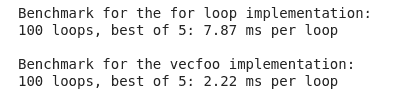
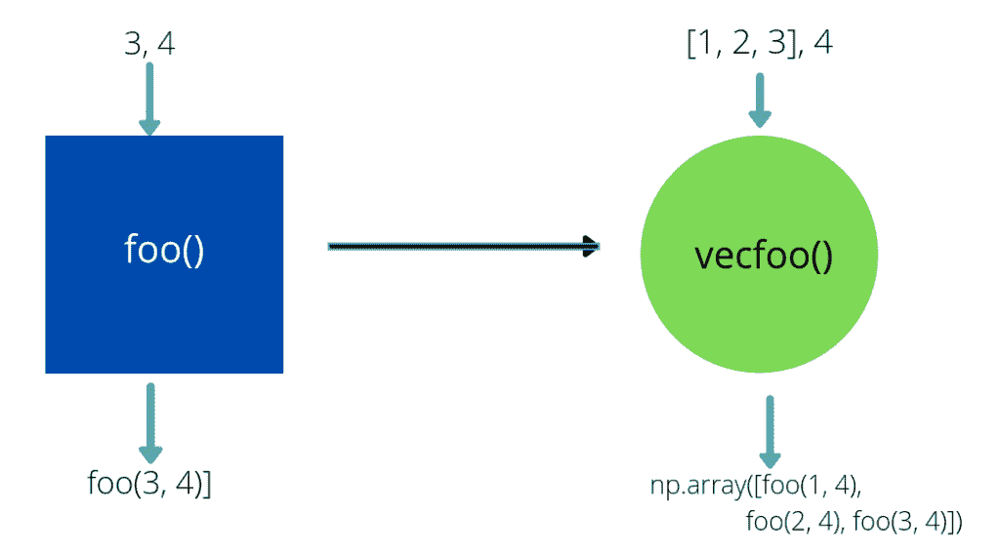

# Numpy 矢量化

> 原文：<https://www.askpython.com/python-modules/numpy/numpy-vectorization>

在本文中，我们将学习 Python 中的 Numpy 矢量化。Numpy 是 Python 中数组的 C 实现，在拥有相同的 Python 解释器的情况下速度相对较快。在本文中，我们将探讨如何使用 numpy.vectorize()将一个函数按元素应用于一个序列。

## 为什么 for 循环不是 Numpy 矢量化的最佳选择？

为了将一个函数应用于一个列表或元组的元素或者一个 [NumPy 数组](https://www.askpython.com/python-modules/numpy/python-numpy-arrays)，我们可以很容易地在 Python 中使用 [for 循环。但是 Python 是一种解释型语言，与 C 和 C++相比，大部分实现都很慢。这种缓慢计算的主要原因归结于 Python 的动态特性和编译器级优化的缺乏，这导致了内存开销。](https://www.askpython.com/python/python-for-loop)

对于使用 Python 进行大量计算的人来说，这不是一个理想的情况。虽然 NumPy 提供了更快的实现，但是 for 循环降低了 NumPy 提供的一些速度。为了解决这个瓶颈，NumPy 提供了矢量化功能，可以高效地将函数映射到序列上。

## numpy.vectorize()与 Python for loop–矢量化速度比较

让我们测试一下 python for 循环和矢量化版本的速度。我们将使用 [timeit 函数](https://www.askpython.com/python-modules/python-timeit-module)来获得精确的速度测试。

```py
# We use a large array for benchmarking our method
a = np.random.rand(10000)
b = 5

print("Benchmark for the for loop implementation: ")
%timeit [foo(i, b) for i in a]
print()
print("Benchmark for the vecfoo implementation: ")
%timeit vecfoo(a, b)

```



**我们看到，矢量化版本比 for 循环实现快 3 倍以上。**

## 用 numpy.vectorize()函数进行 Numpy 矢量化

Numpy 矢量化函数接受一个 python 函数(pyfunc ),并返回该函数的矢量化版本。

该函数的矢量化版本将一系列对象或 NumPy 数组作为输入，并在输入序列的每个元素上计算 Python 函数。Numpy 矢量化功能本质上类似于 [python map()](https://www.askpython.com/python/built-in-methods/map-method-in-python) ，但具有额外的功能—[NumPy 广播](https://www.askpython.com/python-modules/numpy/numpy-broadcasting)机制。

因此，让我们更详细地理解 numpy.vectorize()函数:

```py
numpy.vectorize(pyfunc, otypes=None, doc=None, excluded=None, cache=False, signature=None)

```

必需的参数:

**pyfunc** :我们希望应用于对象序列的函数

可选参数:

*   **otypes** :函数的输出类型可以指定为一个字符串或一列数据类型。如果没有提到 *otypes* 并且缓存设置为 *True* ，则通过调用输入的第一个元素来确定输出类型。
*   **doc** :指定创建的 docstring。如果没有提到，将使用函数的原始文档字符串(如果有)。
*   **缓存**:如果*为真*，那么如果没有提供 *otypes* ，则缓存决定输出数量的第一个函数调用。

### 向量化一个函数

```py
def foo(a, b):
    """
    If a > b return a + b,
    else return a - b.
    """
    if a >= b:
       return a + b
    else:
       return a - b

```

```py
# Create a vectorized version of foo
vecfoo = np.vectorize(foo)
vecfoo(np.arange(5), 5)

```

```py
array([-5, -4, -3, -2, -1])

```



Fig 1: Python version of foo() vs vectorized version of foo()

### 矢量化函数的输出类型

如果 *otypes* 参数设置为 false，Numpy 会自动评估函数的输出类型。这里有一个例子来展示它:

```py
a = np.array([1, 2, 3, 4])
b = 2

vecfoo =  np.vectorize(foo)
res = vecfoo(a, b)
print(type(res[0]))

```

```py
<class 'numpy.int64'>

```

我们还可以通过强制返回值的数据类型来控制矢量化函数的输出。这里有一个如何做的例子。

```py
a = np.array([1, 2, 3, 4])
b = 2

vecfoo = np.vectorize(foo, otypes=[float])
res = vecfoo(a, b)
print(type(res[0]))

```

```py
<class 'numpy.float64'>

```

### 缓存在 Numpy 矢量化中

我们已经看到，如果没有指定 *optypes* ，函数将调用输入的第一个参数来确定输入的数量。这个结果可以被缓存，从而防止函数一次又一次地运行相同的操作。但是，缓存实现会降低后续调用的速度，并且只有在函数计算开销很大的情况下才能使用。可以通过将参数*缓存*设置为*真*来设置缓存

## 最后备注

np.vectorize()并不是我们使用矢量化的唯一地方，我们一直在每天的 NumPy 操作中使用它。让我们另外举个例子:

```py
np.arange(5) + 4

```

```py
array([4, 5, 6, 7, 8])

```

同样的规则也适用于不同的原始函数，如减法、乘法、正弦、余弦等。这些函数具有内置的矢量化支持。但是我们自己的 Python 版本一般不支持这种矢量化，所以我们需要 numpy.vectorize()以快速有效的方式进行矢量化操作。

### 参考文献:

*   [Numpy 文档](https://numpy.org/doc/stable/reference/generated/numpy.vectorize.html)